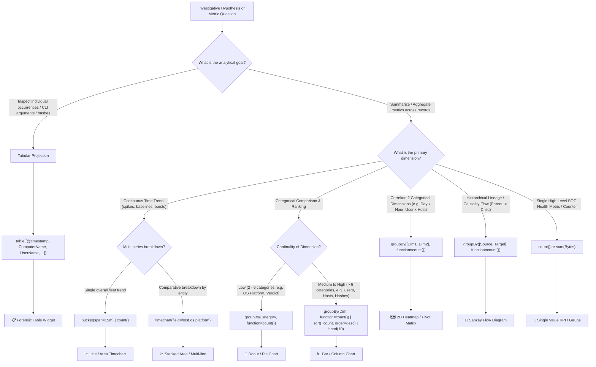

# CrowdStrike LogScale (CQL / FQL) Threat Hunting & Advanced Event Search Guide

[](#)
[](#)
[](#)
[](#)
[](#)

> A master-grade reference guide to **CrowdStrike Falcon Advanced Event Search (AES)** and **LogScale Query Language (CQL / FQL)**. This guide covers query fundamentals, a structured 4-tier Regular Expressions engineering masterclass, dedicated filtering methods for **every single telemetry field** (both Falcon Native and ECS/Next-Gen SIEM formats), 100 categorized hunting filters, and advanced multi-event correlation flows.

---

## Table of Contents

- [1. Core Architecture & Query Mechanics](#1-core-architecture--query-mechanics)
  - [The LogScale Pipeline Model](#the-logscale-pipeline-model)
  - [Key Operators & Syntax Table](#key-operators--syntax-table)
  - [High-Performance Indexed Tags (`#`)](#high-performance-indexed-tags-)
  - [1.2 The Master CrowdStrike Telemetry & Field Hierarchy Mind Map](#12-the-master-crowdstrike-telemetry--field-hierarchy-mind-map)
  - [1.3 Subsystem Field Lineage & Hunting Architecture](#13-subsystem-field-lineage--hunting-architecture)
  - [1.4 The Threat Hunter's 6-Step Command & Filter Construction Workflow](#14-the-threat-hunters-6-step-command--filter-construction-workflow)
  - [1.5 Master Guide to LogScale Query Construction: Mindset, 7-Stage Pipeline & Syntax Demystified](#15-master-guide-to-logscale-query-construction-mindset-7-stage-pipeline--syntax-demystified)
- [2. The CrowdStrike Falcon Regex Mastery Crash Course](#2-the-crowdstrike-falcon-regex-mastery-crash-course)
  - [2.1 The Master's Blueprint: Basic Syntax at a Glance](#21-the-masters-blueprint-basic-syntax-at-a-glance)
  - [2.2 The Master's Golden Rules: Key Do's and Don'ts](#22-the-masters-golden-rules-key-dos-and-donts)
  - [2.3 Three Ways LogScale Evaluates Text: Inline vs. Function vs. Glob](#23-three-ways-logscale-evaluates-text-inline-vs-function-vs-glob)
  - [2.4 Tier 1: Foundations — Simple Patterns, Anchors & Escaping](#24-tier-1-foundations--simple-patterns-anchors--escaping)
  - [2.5 Tier 2: Precision — Character Classes, Quantifiers & Alternation](#25-tier-2-precision--character-classes-quantifiers--alternation)
  - [2.6 Tier 3: Surgical Power — Lookarounds, Non-Capturing Groups & Dynamic Extraction](#26-tier-3-surgical-power--lookarounds-non-capturing-groups--dynamic-extraction)
  - [2.7 Tier 4: Weaponized Threat Detection Engineering (8 MITRE Scenarios)](#27-tier-4-weaponized-threat-detection-engineering-8-mitre-scenarios)
  - [2.8 Quick Reference Cheatsheet](#28-quick-reference-cheatsheet)
- [3. Log Index Schema & Ingest Telemetry Architecture (10 Tags & 5-Level Hierarchy)](#3-log-index-schema--ingest-telemetry-architecture-10-tags--5-level-hierarchy)
  - [3.1 The 10 Primary Ingest Index Tags & Physical Block Skipping](#31-the-10-primary-ingest-index-tags--physical-block-skipping)
  - [3.2 Query Execution Mindset: Which Index to Start From & Why](#32-query-execution-mindset-which-index-to-start-from--why)
  - [3.3 The 4-Tier Field Hierarchy: 77 Fields per Event](#33-the-4-tier-field-hierarchy-77-fields-per-event)
  - [3.4 The 5-Level Deep Telemetry Hierarchy Tree](#34-the-5-level-deep-telemetry-hierarchy-tree)
  - [Category A: High-Speed Index Tags (`#`)](#category-a-high-speed-index-tags-)
  - [Category B: Ingestion, Pipeline & Latency Telemetry (`@`)](#category-b-ingestion-pipeline--latency-telemetry-)
  - [Category C: Host, Agent & Identity Telemetry](#category-c-host-agent--identity-telemetry)
  - [Category D: POSIX Privilege & User IDs (Linux/macOS Hunting)](#category-d-posix-privilege--user-ids-linuxmacos-hunting)
  - [Category E: Process Execution, Threads & Lineage (Native + ECS)](#category-e-process-execution-threads--lineage-native--ecs)
  - [Category F: File System, Target Paths & Removable Media](#category-f-file-system-target-paths--removable-media)
  - [Category G: Cryptographic Hash Intelligence](#category-g-cryptographic-hash-intelligence)
  - [Category H: Network Communication & Sockets](#category-h-network-communication--sockets)
  - [Category I: Authentication & Logon Telemetry](#category-i-authentication--logon-telemetry)
  - [Category J: Threat Intelligence, Detections & MITRE ATT&CK](#category-j-threat-intelligence-detections--mitre-attck)
- [4. Level 1: Simple & Core Filtering (Filters 1–20)](#4-level-1-simple--core-filtering-filters-120)
- [5. Level 2: Intermediate Filtering & Transformation (Filters 21–50)](#5-level-2-intermediate-filtering--transformation-filters-2150)
- [6. Level 3: High-End Analytics & Dynamic Extraction (Filters 51–80)](#6-level-3-high-end-analytics--dynamic-extraction-filters-5180)
- [7. Level 4: Flow Logic & Process Ancestry Trees (Filters 81–100)](#7-level-4-flow-logic--process-ancestry-trees-filters-81100)
- [8. Cross-Field Threat Hunting Recipes](#8-cross-field-threat-hunting-recipes)
- [9. Visualizations, Tables, Graphs, Sorting & Analytics](#9-visualizations-tables-graphs-sorting--analytics)
  - [9.1 Visualization Architecture & Widget Types in Falcon](#91-visualization-architecture--widget-types-in-falcon)
  - [9.2 The Master's Operation Order & Pipeline Execution Logic](#92-the-masters-operation-order--pipeline-execution-logic)
  - [9.3 Universal Visualization Decision Tree: When to Use What](#93-universal-visualization-decision-tree-when-to-use-what)
  - [9.4 Tier 1: Basic — Tables, Projections & Elementary Sorting](#94-tier-1-basic--tables-projections--elementary-sorting)
  - [9.5 Tier 2: Medium — Grouping, Time Bucketing & Multi-Axis Graphs](#95-tier-2-medium--grouping-time-bucketing--multi-axis-graphs)
  - [9.6 Tier 3: High — Multi-Metric Stats, Heatmaps & GeoIP Visualizations](#96-tier-3-high--multi-metric-stats-heatmaps--geoip-visualizations)
  - [9.7 Tier 4: Advanced — Statistical Outliers, Ratios, Sankey & Correlated Dashboards](#97-tier-4-advanced--statistical-outliers-ratios-sankey--correlated-dashboards)
  - [9.8 Quick Syntax Cheatsheet for Visual Commands](#98-quick-syntax-cheatsheet-for-visual-commands)

---

## 1. Core Architecture & Query Mechanics

### The LogScale Pipeline Model

CrowdStrike Advanced Event Search (AES) runs on the **Humio/LogScale engine**. Events stream from left to right through pipeline stages connected by the pipe (`|`) operator.

```
┌─────────────────────────────────┐      ┌─────────────────────────┐      ┌─────────────────────────┐
│     1. Pre-Filter & Scoping     │      │   2. Extract / Enrich   │      │ 3. Aggregate / Display  │
│  #event_simpleName="Process..." │ ───► │   | regex(...)          │ ───► │   | groupBy(...)        │
│  ComputerName="MACN-*"          │      │   | eval(...)           │      │   | table(...)          │
└─────────────────────────────────┘      └─────────────────────────┘      └─────────────────────────┘
```

1. **Pre-Filter Stage (Before first pipe)**: Evaluated directly at the storage block layer. Uses index tags (`#`) and exact tokens to discard non-matching blocks without decompressing them.
2. **Transformation / In-flight Extraction**: Manipulates records in memory using regex, string parsing, type casting, and conditionals.
3. **Aggregation / Presentation**: Reduces events into summaries, tables, charts, or correlated self-joins.

### Key Operators & Syntax Table

| Operator | Syntax Example | Behavior | Best Use Case |
| :--- | :--- | :--- | :--- |
| **Exact Equality (`=`)** | `UserName="bhupender"` | Exact literal case-sensitive match | Filtering on exact IDs, hosts, hashes |
| **Regex Match (`=~` or `/.../`)** | `UserName=/^admin/i` | Evaluates PCRE pattern against field | Pattern matching, prefix/suffix searches |
| **Exact Negation (`!=`)** | `UserName!="SYSTEM"` | Excludes exact matches | Dropping noise accounts or noisy binaries |
| **Regex Negation (`!~` or `!=/.../`)**| `FilePath!=/^C:\\Windows/i` | Excludes lines matching pattern | Excluding standard OS paths |
| **Set Membership (`IN`)** | `#event_simpleName IN ["A","B"]` | Checks if field matches any list value | Replacing long chains of `OR` statements |
| **Wildcards (`*`, `?`)** | `FileName="net*.exe"` | `*` = 0+ chars; `?` = exactly 1 char | Quick fuzzy matching |
| **Pipeline (`\|`)** | `Stage1 \| Stage2` | Output of stage 1 feeds stage 2 | Sequential data transformations |
| **Assignment (`:=`)** | `CmdLen := length(CommandLine)` | Dynamically defines a new field | Enrichments and custom calculations |
| **Field Exists (`=*`)** | `CommandLine=*` | Returns records where field is not null | Ensuring target telemetry is present |
| **Field Missing (`!field=*`)** | `!ParentProcessId=*` | Returns records where field is omitted | Finding orphaned processes |

### High-Performance Indexed Tags (`#`)

Fields starting with `#` are **indexed tags**. These are pre-computed indices stored in block headers.

> [!IMPORTANT]
> **Cardinal Performance Rule**: Always place `#` tags at the **very beginning** of the query before any pipe (`|`). Filtering on `#event_simpleName`, `#event.module`, `#Vendor`, or `#repo` reduces scanned data volume by up to 99%, keeping searches blazing fast and well under query timeout limits.

---

### 1.2 The Master CrowdStrike Telemetry & Field Hierarchy Mind Map

CrowdStrike Falcon is engineered around an operating system kernel sensor that intercepts low-level syscalls across Windows (`ntoskrnl`), Linux (`eBPF`/`auditd`), and macOS (`EndpointSecurity` framework). Every endpoint transaction is categorized into a strongly typed telemetry subsystem and indexed by `#event_simpleName`.

```
                                  ┌────────────────────────────────────────────────────────────────────────────┐
                                  │                     OPERATING SYSTEM KERNEL SYSCALLS                       │
                                  │      Windows (NTOSKRNL), Linux (Kernel eBPF/Auditd), macOS (EndpointSec)   │
                                  └─────────────────────────────────────┬──────────────────────────────────────┘
                                                                        │ Intercepted by Falcon Sensor Engine
                                                                        ▼
                 ┌───────────────────────────────────────┬───────────────────────────────────────┬───────────────────────────────────────┐
                 │       PROCESS & EXECUTION             │          FILESYSTEM & I/O             │        NETWORK & SOCKETS              │
                 │   Process Spawns, CLI, Lineage        │   Creation, Writes, Renames, USB      │   TCP/UDP Connections, DNS Lookups    │
                 └──────────────────┬────────────────────┘└──────────────────┬────────────────────┘└──────────────────┬────────────────────┘
                                    │                                        │                                        │
                 ┌──────────────────┴────────────────────┐┌──────────────────┴────────────────────┐┌──────────────────┴────────────────────┐
                 ▼                                       ▼▼                                       ▼▼                                       ▼
         ProcessRollup2                     SyntheticProcessRollup2FileCreateForce             FileRenameInfo NetworkConnectIP4               DnsRequest
         Primary process spawn              Long-lived / Pre-boot Filesystem write / drop     Ransomware renames Outbound socket open            DNS query resolution
                 │                                                        │                                        │
                 ├─ GrandParentBaseFileName ⭐                            ├─ TargetFileName ⭐                     ├─ RemoteAddressIP4 ⭐
                 ├─ ParentBaseFileName ⭐                                 ├─ FilePath ⭐                           ├─ RemotePort ⭐
                 ├─ FileName ⭐                                           ├─ Size ⭐                               ├─ DomainName ⭐
                 ├─ CommandLine ⭐                                        ├─ IsOnRemovableDisk ⭐                  ├─ ContextBaseFileName ⭐
                 ├─ TargetProcessId / ROCId                               ├─ ContextBaseFileName ⭐                ├─ LocalAddressIP4 / LocalPort
                 ├─ SHA256HashData ⭐                                     ├─ FileIdentifier                        └─ ComputerName ⭐ / aip
                 └─ UserName ⭐ / ComputerName ⭐                         └─ UserName ⭐ / ComputerName ⭐

                 ┌───────────────────────────────────────┬───────────────────────────────────────┬───────────────────────────────────────┐
                 │       IDENTITY & AUTHENTICATION       │        PERSISTENCE & REGISTRY         │       IN-MEMORY & SCRIPTING           │
                 │   Logons, Token Elevations, Kerberos  │   ASEP Run Keys, Services, Drivers    │   AMSI Interception, Code Injection   │
                 └──────────────────┬────────────────────┘└──────────────────┬────────────────────┘└──────────────────┬────────────────────┘
                                    │                                        │                                        │
                 ┌──────────────────┴────────────────────┐┌──────────────────┴────────────────────┐┌──────────────────┴────────────────────┐
                 ▼                                       ▼▼                                       ▼▼                                       ▼
         UserLogon                              UserLogonFailed2  AsepValueUpdate          RegKeyCreate    ScriptControl                   InjectedThread
         Successful interactive / net logons    Failed logon / BF Auto-start Run key mods  Registry changesAMSI PowerShell/VBS scripts     Cross-process injection
                 │                                                        │                                        │
                 ├─ UserName ⭐ / UserSid ⭐                              ├─ TargetValueName ⭐                    ├─ ScriptContent ⭐
                 ├─ LogonType ⭐ (2=Local, 3=Net, 10=RDP)                 ├─ TargetValueData ⭐                    ├─ ScriptPath ⭐
                 ├─ aip ⭐ (Remote Source IP)                             ├─ RegObjectName ⭐                      ├─ HashData / ByteCount
                 ├─ ComputerName ⭐ / aid ⭐                              ├─ ContextBaseFileName ⭐                ├─ SourceProcessId
                 └─ AuthenticationPackage / LogonServer                   └─ UserName ⭐ / ComputerName ⭐         └─ TargetProcessId / CallStack
```

> **Legend**:
> - `⭐ High-Value Field`: Primary hunting key used in 90%+ of SOC detection rules and investigations.
> - `# Indexed Tag`: Pre-computed block header index (`#event_simpleName`, `#event.module`). Always filter on these first to bypass 99% of scanned disk data.
> - `Context*`: Links non-process events (network, filesystem, registry) back to the originating process that triggered the syscall.

---

### 1.3 Subsystem Field Lineage & Hunting Architecture

#### 1. Process Execution & Lineage Sub-System
- **Core Events**: `ProcessRollup2` (new process creation), `SyntheticProcessRollup2` (processes running prior to sensor boot), `CommandHistory` (shell terminal history).
- **Process Lineage Hierarchy**:
  ```
  GrandParentBaseFileName  [e.g. explorer.exe / winword.exe / w3wp.exe]
           │
           ▼
    ParentBaseFileName     [e.g. cmd.exe / outlook.exe / powershell.exe]
           │
           ▼
        FileName           [e.g. whoami.exe / certutil.exe / curl.exe] (Target Process)
           │
           └─ CommandLine   [Full CLI arguments, switches, flags, and payloads]
  ```
- **Primary Hunting Keys**:
  - `GrandParentBaseFileName` ⭐: Root initiator (e.g. `winword.exe` launching a payload).
  - `ParentBaseFileName` ⭐: Direct spawning parent. Invaluable for spotting anomalous parent-child execution (e.g. `sqlservr.exe` spawning `powershell.exe`).
  - `FileName` ⭐: The spawned target executable.
  - `CommandLine` ⭐: Full command-line text string containing decoded switches, URLs, or script blocks.
  - `SHA256HashData` ⭐: Cryptographic hash of the executable for threat intelligence matching.
  - `TargetProcessId` & `ROCId`: Unique 64-bit Falcon identifiers connecting the process across multi-event joins.
- **Production Hunter Example (Suspicious Process Lineage)**:
  ```cql
  #event_simpleName="ProcessRollup2"
  AND GrandParentBaseFileName=/(winword|excel|powerpnt|outlook)\.exe$/i
  AND ParentBaseFileName=/(cmd|powershell|wscript|cscript)\.exe$/i
  AND FileName=/(whoami|certutil|bitsadmin|curl|powershell)\.exe$/i
  | table([@timestamp, ComputerName, UserName, GrandParentBaseFileName, ParentBaseFileName, FileName, CommandLine])
  | sort(@timestamp, order=desc)
  ```

#### 2. Filesystem & Disk I/O Sub-System
- **Core Events**: `FileCreateForce` (file dropped/created), `FileWrite` (data appended/modified), `FileRenameInfo` (file renamed/extension modified), `FileDeleteInfo` (file deleted).
- **Primary Hunting Keys**:
  - `TargetFileName` ⭐: Name of the file written or modified (e.g. `payload.ps1`, `ransom.locked`).
  - `FilePath` ⭐: Absolute directory location (e.g. `C:\Users\*\AppData\Local\Temp`).
  - `Size` ⭐: File size in bytes (crucial for detecting large exfiltration staging or small 0-byte drops).
  - `IsOnRemovableDisk` ⭐: Boolean (`1` = USB flash drive / external media, `0` = Fixed local disk).
  - `ContextBaseFileName` ⭐: The process that executed the file write (e.g. `explorer.exe` vs `powershell.exe`).
- **Production Hunter Example (USB Staging / Exfiltration)**:
  ```cql
  (#event_simpleName="FileCreateForce" OR #event_simpleName="FileWrite")
  | IsOnRemovableDisk=1
  | TargetFileName=/\.(?:zip|7z|rar|kdbx|docx|xlsx|pdf|csv)$/i
  | FileSizeMB := Size / (1024 * 1024)
  | FileSizeMB > 5
  | table([@timestamp, ComputerName, UserName, ContextBaseFileName, TargetFileName, FileSizeMB])
  | sort(FileSizeMB, order=desc)
  ```

#### 3. Network & Communications Sub-System
- **Core Events**: `NetworkConnectIP4` (outbound IPv4 TCP/UDP socket), `NetworkListenIP4` (local listening port bound), `DnsRequest` (DNS query initiated by endpoint).
- **Primary Hunting Keys**:
  - `RemoteAddressIP4` ⭐: Remote destination IPv4 address.
  - `RemotePort` ⭐: Remote TCP/UDP port (e.g. `4444`, `1337`, `8080`).
  - `DomainName` ⭐: FQDN requested by endpoint (essential for DGA and fast-flux hunting).
  - `ContextBaseFileName` ⭐: Executable making the network socket connection (e.g. `powershell.exe` connecting directly to an external IP).
- **Production Hunter Example (LOLBin Non-Standard Port Egress)**:
  ```cql
  #event_simpleName="NetworkConnectIP4"
  | ContextBaseFileName=/(powershell|cmd|rundll32|mshta|certutil|regsvr32)\.exe$/i
  | !in(field=RemotePort, values=[80, 443, 8080, 8443])
  | groupBy([ContextBaseFileName, RemoteAddressIP4, RemotePort], function=count())
  | sort(_count, order=desc)
  | head(25)
  ```

#### 4. Authentication, Identity & Access Sub-System
- **Core Events**: `UserLogon` (successful authentication), `UserLogonFailed2` (failed logon / brute force), `UserIdentity` (domain user profile mapping).
- **Primary Hunting Keys**:
  - `UserName` ⭐: The account authenticating (e.g. `SYSTEM`, `Administrator`, `bhupender`).
  - `UserSid` ⭐: Windows Security Identifier.
  - `LogonType` ⭐: Critical numerical indicator:
    - `2` = Interactive / Console (user physically typed password at keyboard).
    - `3` = Network (SMB, file share, RPC, lateral movement).
    - `7` = Screen Unlock.
    - `9` = NewCredentials (Pass-the-Hash / `RunAs /netonly`).
    - `10` = RemoteInteractive (Remote Desktop Protocol / RDP).
    - `11` = CachedInteractive.
  - `aip` ⭐: IP address of the remote originating device.
- **Production Hunter Example (RDP & Pass-the-Hash Lateral Movement Hunt)**:
  ```cql
  #event_simpleName="UserLogon"
  | in(field=LogonType, values=[9, 10])
  | case {
    LogonType=9          | LogonMechanism := "Pass-the-Hash (Type 9)" ;
    LogonType=10         | LogonMechanism := "Remote Desktop (Type 10 RDP)" ;
    *                    | LogonMechanism := format("Type-%s", field=[LogonType]) ;
  }
  | groupBy([ComputerName, UserName, LogonMechanism, aip], function=count(as=Sessions))
  | sort(Sessions, order=desc)
  | table([ComputerName, UserName, LogonMechanism, aip, Sessions])
  ```

#### 5. Registry & Persistence (ASEP) Sub-System
- **Core Events**: `AsepValueUpdate` (Auto-Start Extensibility Point modified), `RegKeyCreate` (new key created), `RegValueSetValue` (registry data written).
- **Primary Hunting Keys**:
  - `TargetValueName` ⭐: Registry value name (e.g. `Run`, `RunOnce`, `Debugger`).
  - `TargetValueData` ⭐: The payload path or CLI configured to run at boot.
  - `RegObjectName` ⭐: Full registry hive path (e.g. `\REGISTRY\MACHINE\SOFTWARE\Microsoft\Windows\CurrentVersion\Run`).
  - `ContextBaseFileName` ⭐: Executable that performed the registry edit.
- **Production Hunter Example (Run Key Persistence Inspection)**:
  ```cql
  #event_simpleName="AsepValueUpdate"
  | RegObjectName=/CurrentVersion\\(?:Run|RunOnce|Policies\\Explorer\\Run)/i
  | table([@timestamp, ComputerName, UserName, ContextBaseFileName, TargetValueName, TargetValueData, RegObjectName])
  | sort(@timestamp, order=desc)
  ```

---

### 1.4 The Threat Hunter's 6-Step Command & Filter Construction Workflow

The primary obstacle for security analysts in CrowdStrike AES is knowing **how to logically construct the query from scratch** without getting lost in syntax or causing query timeouts. Follow this deterministic 6-step framework:

```
┌─────────────────────────────────────────────────────────────────────────────────────────────────────────────┐
│                               THE 6-STEP COGNITIVE THREAT HUNTING WORKFLOW                                 │
└─────────────────────────────────────────────────────────────────────────────────────────────────────────────┘
  Step 1: HYPOTHESIS           "What physical OS action did the adversary perform?"
          ▼                     Select starting #event_simpleName (ProcessRollup2, FileCreate, NetworkConnect)
  Step 2: SCOPING              "Where am I looking and how do I prevent query timeouts?"
          ▼                     Always place indexed tags (#) and host/user scopes BEFORE the first pipe (|)
  Step 3: FILTERING            "What indicates malicious or anomalous activity?"
          ▼                     Apply regex patterns, exclusions (LOLBins, non-standard ports, strange paths)
  Step 4: AGGREGATING          "Do I need raw incident evidence or macro summary patterns?"
          ▼                     Use groupBy([Keys], function=count()) or bucket(span=15m)
  Step 5: SORTING              "Is the adversary loud or stealthy?"
          ▼                     Loud/Brute-Force: sort(desc) | Rare Long-Tail Outlier: sort(asc)
  Step 6: VISUALIZING          "How should the output be consumed?"
                                Forensic Table (table()), Timeline (timechart()), or Matrix (heatmap)
```

#### Step-by-Step Construction Guide with Concrete Query Evolution

##### Step 1: Formulate the Hypothesis & Select the Starting `#event_simpleName`
Ask: *What is the adversary trying to accomplish on the host?*
- Spawning a shell or payload $\rightarrow$ `#event_simpleName="ProcessRollup2"`
- Writing or dropping a file $\rightarrow$ `#event_simpleName="FileCreateForce"`
- Connecting to external infrastructure $\rightarrow$ `#event_simpleName="NetworkConnectIP4"`
- Authenticating or spraying passwords $\rightarrow$ `#event_simpleName="UserLogon"`
- Registering persistence $\rightarrow$ `#event_simpleName="AsepValueUpdate"`

##### Step 2: Apply High-Performance Header Scoping (`#` Tags)
*Cardinal Performance Rule*: Filter on indexed tags **before** the first pipe (`|`). Never put `#event_simpleName` inside a pipe.
```cql
// GOOD: Blazing fast, scans only ProcessRollup2 blocks
#event_simpleName="ProcessRollup2" ComputerName="MACN-*"

// BAD: Scans terabytes of raw blocks across every event type before filtering
* | #event_simpleName="ProcessRollup2"
```

##### Step 3: Filter & Dissect Forensic Fields
Narrow down to anomalous indicators using PCRE regex, case-insensitivity (`/i`), or field exclusions:
```cql
#event_simpleName="ProcessRollup2"
AND FileName=/(powershell|pwsh|cmd)\.exe$/i
AND CommandLine=/(bypass|-nop|-enc|downloadstring|invoke-)/i
AND ParentBaseFileName!="explorer.exe"
```

##### Step 4: Aggregate Data (Macro vs Micro)
- **Micro (Incident Forensics)**: Skip aggregation. Output individual chronological records using `table()`.
- **Macro (Fleet Pattern Hunting)**: Aggregate using `groupBy()`:
```cql
#event_simpleName="ProcessRollup2"
AND FileName=/(powershell|pwsh|cmd)\.exe$/i
AND CommandLine=/(bypass|-nop|-enc|downloadstring|invoke-)/i
| groupBy([ComputerName, UserName, ParentBaseFileName, FileName], function=count(as=ExecutionCount))
```

##### Step 5: Sort to Surface Threats (Loud vs Stealthy)
- **Top Talkers (Loud Attacks, Scanners, Floods)**: `sort(ExecutionCount, order=desc) | head(10)`
- **Rare Outliers (Stealthy LOLBins, Single-host Persistence)**: `sort(ExecutionCount, order=asc) | head(10)`
- **Compound Hierarchical Sorting**: `sort([ComputerName, ExecutionCount], order=[asc, desc])`

##### Step 6: Visual Presentation & Column Formatting
Project the final columns cleanly using `table()` or format for dashboards:
```cql
#event_simpleName="ProcessRollup2"
AND FileName=/(powershell|pwsh|cmd)\.exe$/i
AND CommandLine=/(bypass|-nop|-enc|downloadstring|invoke-)/i
| groupBy([ComputerName, UserName, ParentBaseFileName, FileName], function=count(as=ExecutionCount))
| sort(ExecutionCount, order=desc)
| table([ComputerName, UserName, ParentBaseFileName, FileName, ExecutionCount])
```

---

#### The Event Selection Decision Matrix: What to Use, When, and How

Use this matrix to determine your starting point based on the **investigative hypothesis** or alert scenario:

| Investigative Question / Attack Vector | Starting `#event_simpleName` | Critical Fields to Inspect | When to Use & Hunting Rationale | Production Hunting Query Example |
| :--- | :--- | :--- | :--- | :--- |
| **"Did an attacker run code, execute a shell, or launch malware?"** | `ProcessRollup2` | `FileName`, `CommandLine`, `ParentBaseFileName` | Primary process spawn event. Captures CLI arguments, parent trees, and hashes. | `#event_simpleName="ProcessRollup2"`<br>`AND FileName=/(powershell\|cmd\|bash\|zsh)\.exe$/i`<br>`\| table([@timestamp, ComputerName, UserName, ParentBaseFileName, FileName, CommandLine])` |
| **"Did an attacker download, drop, or plant files on disk?"** | `FileCreateForce` | `TargetFileName`, `FilePath`, `Size`, `IsOnRemovableDisk` | Filesystem driver interception for new files written to disk. | `#event_simpleName="FileCreateForce"`<br>`AND TargetFileName=/\.(exe\|dll\|ps1\|bat\|vbs\|hta\|scr)$/i`<br>`\| table([@timestamp, ComputerName, UserName, TargetFileName, FilePath, Size])` |
| **"Is ransomware actively encrypting or renaming files?"** | `FileRenameInfo` | `TargetFileName`, `Size`, `FileIdentifier` | Fires whenever extensions change (e.g. `.docx` to `.docx.locked`). | `#event_simpleName="FileRenameInfo"`<br>`\| regex("\.(?<Extension>[^.]+)$", field=TargetFileName)`<br>`\| groupBy([ComputerName, Extension], function=count())`<br>`\| _count > 50 \| sort(_count, order=desc)` |
| **"Did an infected endpoint connect out to Command & Control?"** | `NetworkConnectIP4` | `RemoteAddressIP4`, `RemotePort`, `ContextBaseFileName` | Outbound TCP/UDP socket telemetry bound to the originating process. | `#event_simpleName="NetworkConnectIP4"`<br>`AND !in(field=RemotePort, values=[80, 443])`<br>`AND ContextBaseFileName=/(powershell\|rundll32\|mshta)\.exe$/i`<br>`\| table([@timestamp, ComputerName, ContextBaseFileName, RemoteAddressIP4, RemotePort])` |
| **"Did malware resolve suspicious C2 domains?"** | `DnsRequest` | `DomainName`, `ContextBaseFileName` | Endpoint DNS resolver logs. Catches DGAs and DNS tunnelling. | `#event_simpleName="DnsRequest"`<br>`AND DomainName=/(\.xyz\|\.top\|\.tk\|\.pw\|\.cc)$/i`<br>`\| groupBy([DomainName, ContextBaseFileName], function=count())`<br>`\| sort(_count, order=desc)` |
| **"Did an attacker spray credentials or move laterally?"** | `UserLogon` | `UserName`, `LogonType`, `aip`, `UserSid` | Authentication event capturing interactive, network, and remote desktop logins. | `#event_simpleName="UserLogon"`<br>`AND in(field=LogonType, values=[3, 9, 10])`<br>`\| groupBy([UserName, ComputerName, LogonType], function=count())`<br>`\| sort(_count, order=desc)` |
| **"Did an attacker establish Registry persistence?"** | `AsepValueUpdate` | `TargetValueName`, `TargetValueData`, `RegObjectName` | Auto-Start Extensibility Points (ASEP) tracking Run keys and startup hooks. | `#event_simpleName="AsepValueUpdate"`<br>`AND RegObjectName=/CurrentVersion\Run/i`<br>`\| table([@timestamp, ComputerName, TargetValueName, TargetValueData, RegObjectName])` |

---

#### The Scoping Funnel: Where to Start and How to Narrow Down

1. **Broad Fleet Hunt** (`#event_simpleName="ProcessRollup2"`):
   - **When to use**: Threat hunting across the entire organization without a specific suspect machine.
   - **Cost**: Scans all endpoints. Requires fast, selective regex to avoid query timeouts.
2. **Host-Scoped Hunt** (`#event_simpleName="ProcessRollup2" ComputerName="MACN-BHBHA-SB"`):
   - **When to use**: You received an alert on a specific laptop or server, or an employee reported suspicious behavior.
   - **Cost**: Extremely fast; index isolates only blocks from `MACN-BHBHA-SB`.
3. **User + Host Laser Hunt** (`#event_simpleName="ProcessRollup2" ComputerName="MACN-BHBHA-SB" UserName="bhupender"`):
   - **When to use**: Deep-dive triage of an insider threat or compromised user identity.
4. **Correlated Multi-Event Hunt** (`selfJoinFilter`):
   - **When to use**: Connecting process execution (`ProcessRollup2`) with subsequent network egress (`NetworkConnectIP4`) sharing the exact same `TargetProcessId`.

---

### 1.5 Master Guide to LogScale Query Construction: Mindset, 7-Stage Pipeline & Syntax Demystified

Threat hunting and incident response in CrowdStrike Falcon Advanced Event Search (LogScale CQL) requires a structured **data pipeline mindset**. A query is not a single monolith; it is an assembly line that processes raw events from left to right.

```
┌─────────────────────────────────────────────────────────────────────────────────────────────────────────────┐
│                                   THE 7-STAGE LOGSCALE PIPELINE MENTAL MODEL                                │
└─────────────────────────────────────────────────────────────────────────────────────────────────────────────┘
  Raw Events ──► 1. FILTER ──► 2. ENRICH ──► 3. TRANSFORM ──► 4. AGGREGATE ──► 5. POST-PROCESS ──► 6. FORMAT ──► 7. SORT
   (Billions)     (Narrow)     (Context)      (Normalize)       (Summarize)       (Threshold)       (Display)     (Order)
```

---

#### 1. The 7-Stage Logical Blueprint

##### Stage 1: FILTER FIRST (Aggressively Narrow the Dataset)
*The Golden Rule of Performance*: Filter early and aggressively. Every event discarded in Stage 1 saves CPU cycles, memory, and prevents query timeouts.
- **Rule**: Indexed tags (`#event_simpleName`, `#repo`, `#event.module`) must be placed **before the first pipe (`|`)**.
- **Field Filters**: Place specific host, user, or platform criteria right after the tags.
```cql
// GOOD: Blazing fast, block headers indexed
#event_simpleName="ProcessRollup2" ComputerName="MACN-*"
| FileName=/(powershell|pwsh)\.exe$/i

// BAD: Scans all sensor data before filtering
* | #event_simpleName="ProcessRollup2"
```

##### Stage 2: ENRICH (Add External Context Before Processing)
Incorporate network location, threat intelligence, or organization context into raw rows:
- `ipLocation(field)`: Adds geolocation (`.country`, `.city`, `.lat`, `.lon`).
- `asn(field)`: Adds Autonomous System Number and ISP information (`.asn`, `.org`).
- `lookup(file=..., key=...)`: Enriches against threat lists or asset registries.
```cql
#event_simpleName="NetworkConnectIP4"
| !in(field=RemotePort, values=[80, 443])
| ipLocation(RemoteAddressIP4)
| asn(RemoteAddressIP4)
```

##### Stage 3: TRANSFORM & MUTATE (Modify, Create & Normalize Fields)
Format strings, calculate unit sizes, decode parameters, or normalize disparate attributes:
- **Field Creation (`:=`)**: Calculate MB: `FileSizeMB := Size / (1024 * 1024)`.
- **String Normalization**: `ProcLower := lower(FileName)`.
- **Null Fallbacks**: `UserAccount := coalesce([UserName, UserSid])`.
- **Conditional Flags**: `is_suspicious := if(RemotePort == 4444, then=1, else=0)`.

##### Stage 4: AGGREGATE (Summarize & Group)
Condense thousands or millions of raw syscalls into actionable metrics:
- Use `groupBy([keys], function=[...])` for entity frequencies.
- **Multi-Metric Array Syntax**: You can execute multiple aggregation functions inside a single bracketed list `[...]`:
```cql
#event_simpleName="UserLogon"
| groupBy([UserName, ComputerName], function=[
    count(as="TotalLogons"),
    sum(is_failure, as=FailedLogons),
    collect(aip)
  ])
```

##### Stage 5: POST-PROCESS (Thresholding on Aggregated Metrics)
Filter **after** aggregation to surface anomalies, brute-force attempts, and outliers:
- **Rule**: Metrics calculated in Stage 4 (like `TotalLogons` or `_count`) can only be filtered **downstream** of `groupBy()`.
```cql
// Thresholding: Only show users with 5 or more failed logins
| FailedLogons >= 5
```

##### Stage 6: FORMAT & PROJECT (Display Preparation)
Prepare the final columns and clean up raw clutter:
- **Tabular Projection**: `table([ComputerName, UserName, FailedLogons, TotalLogons])`.
- **Time Formatting**: `_timestamp := formatTime("%Y-%m-%d %H:%M:%S", field=@timestamp)`.
- **Column Aliasing**: `rename(field=FailedLogons, as="Failed Attempts")`.

##### Stage 7: SORT & SLICE (Final Ordering)
Sorting is computationally expensive and should almost always be the **final stage**:
- **Loud Attacks / Scanners**: `sort(FailedLogons, order=desc) | head(25)`.
- **Stealthy Rare Outliers**: `sort(TotalLogons, order=asc) | head(25)`.
- **Compound Sorting**: `sort([ComputerName, FailedLogons], order=[asc, desc])`.

---

#### 2. Syntax Demystified: Clearing the "Missing Manual" Pitfalls

Many analysts hit syntax errors in LogScale due to subtle operator rules. Here is the definitive reference:

| Syntax Element | Correct Usage | What It Does | Common Fatal Mistake |
| :--- | :--- | :--- | :--- |
| `=` | `FileName = "powershell.exe"` | Equality comparison inside filters. | Using `:=` inside a boolean filter. |
| `:=` | `FileSizeMB := Size / (1024 * 1024)` | Assignment / Mutation (creates new field). | Using `=` to assign a new calculated variable. |
| `as="..."` | `count(as="ExecCount")` | Output column renaming within functions. | Writing `count() := ExecCount` (syntax error). |
| `IN [...]` | `RemotePort IN [80, 443, 8080]` | Set membership check (SQL style). | Writing `RemotePort in [80, 443]` with lowercase `in`. |
| `in(...)` | `in(RemotePort, values=[80, 443])` | Function-style set membership check. | Omitting `values=` parameter inside function call. |
| `NOT IN` | `RemotePort NOT IN [80, 443]` | Set exclusion. | Writing `RemotePort != [80, 443]` (array inequality invalid). |
| `@timestamp` | `_time := @timestamp \| collect(_time)` | Special internal millisecond epoch field. | Passing `@timestamp` directly into `collect()` without aliasing. |
| `*` (Glob) | `CommandLine = "*-enc*"` | Fast substring wildcard. | Using `*` when regex syntax like `\d+` is required. |
| `/.../i` | `FileName = /^(cmd\|powershell)\.exe$/i` | PCRE Regular Expression with case-insensitivity flag. | Omitting `/i` causing missed detections due to capitalization. |

---

#### 3. Conditional Logic: `if()` vs `case` (eval)

##### Simple Binary Logic: `if(condition, then=..., else=...)`
Use `if()` when evaluating a single true/false condition:
```cql
// Flag executions outside of business hours
| case {
    HourOfDay < 8 OR HourOfDay > 18 | is_after_hours := "Yes" ;
    *                               | is_after_hours := "No" ;
  }
```

##### Multi-Branch Evaluation: Pipeline `case { ... }`
In LogScale CQL, use the top-level pipeline operator `case { ... }` (never nested inside `eval()`):
```cql
| case {
    LogonType = 2        | LogonMechanism := "Interactive (Console)" ;
    LogonType = 3        | LogonMechanism := "Network (SMB / Share)" ;
    LogonType = 9        | LogonMechanism := "NewCredentials (Pass-the-Hash)" ;
    LogonType = 10       | LogonMechanism := "Remote Desktop (RDP)" ;
    *                    | LogonMechanism := format("Type-%s", field=[LogonType]) ;
  }
```

---

#### 4. Regex Engineering: Substring "Contains" vs. Exact Match & Two Regex Usages

In LogScale CQL, regular expressions serve two fundamentally different architectural purposes: **event filtering** (keeping/dropping rows) and **stream mutation** (extracting patterns to create new fields). Understanding this distinction prevents silent event loss and query failures.

##### 4.1 Keyword Substring "Contains" vs. Precision Boundaries (e.g. `naukri`)

When hunting for an organization, user, or domain keyword (e.g., `naukri`), analysts must choose between raw substring matching and boundary-anchored domain matching:

1. **Basic Substring "Contains" (Broad Case-Insensitive Search)**:
   ```cql
   CommandLine = /naukri/i
   ```
   * **Behavior**: Matches the keyword `naukri` anywhere inside the target field regardless of case (`Naukri`, `NAUKRI`, `naukri.com`, `export_naukri_resumes.xlsx`).
   * **When to Use**: Broad command-line searches, process arguments, or finding script names.

2. **Subdomain-Aware Precision Domain Anchor**:
   ```cql
   DomainName = /(?:^|\.)naukri\.com$/i
   ```
   * **Anatomy Breakdown**:
     - `(?:^|\.)`: Non-capturing group matching either the start of the string `^` (`naukri.com`) OR an immediate sub-domain dot boundary `\.` (`www.naukri.com`, `api.s1.naukri.com`).
     - `naukri\.com`: Matches the literal domain label, escaping the dot `\.`.
     - `$`: Anchored strictly to the end of the string.
     - `/i`: Case-insensitivity flag.
   * **Security Advantage**: Prevents deceptive domain spoofing and typosquatting:
     - ✅ **Matches**: `naukri.com`, `www.naukri.com`, `sub.naukri.com`.
     - ❌ **Safely Rejects**: `evilnaukri.com` (typosquatting prefix) and `naukri.com.attacker.net` (subdomain spoofing suffix).

---

##### 4.2 The Fundamental Architectural Difference: Inline Regex Filter vs. `regex()` Extraction Function

| Comparison Dimension | Inline Regex Filter / Predicate (`DomainName = /(?:^\|\.)naukri\.com$/i`) | Extraction / Mutation Function (`regex("(?<FullURI>...)", field=CommandLine, strict=false)`) |
| :--- | :--- | :--- |
| **Pipeline Role** | **Boolean Filter Gate** | **Stream Transformer / Field Extractor** |
| **Syntax** | `Field = /pattern/flags` or `Field != /pattern/flags` | `regex("(?<NamedGroup>pattern)", field=TargetField, strict=false)` |
| **Primary Goal** | Determine whether an event should continue downstream or be dropped. | Parse unstructured text to extract substrings and create **new dynamic fields**. |
| **Field Creation** | **No new fields created**. Evaluates to boolean `true`/`false`. | **Creates new fields** named after the capture group (`?<FullURI>`). |
| **Handling Non-Matches** | Discards non-matching events from the stream. | **`strict=false` keeps all events**; unpopulated fields remain null. (`strict=true` drops them). |
| **Where to Place** | Stage 1 (Pre-Filter) or Stage 3 (Filter gates). | Stage 3 (Transform & Normalize) before `groupBy()` or `table()`. |

> [!WARNING]
> **The `strict=false` Trap in `regex()`**:
> By default in LogScale, `regex(...)` runs in `strict=true` mode. This means **any event whose field does not match the regex pattern is permanently dropped from the search results!**
> Always include `strict=false` when extracting optional values (such as URLs or IPs from `CommandLine`), so that legitimate events without a URL are preserved for downstream analysis and fallback handling via `coalesce()`.

---

#### 5. LogScale Operator Deep-Dive: When, Why & How

##### 5.1 `function=` inside `groupBy()`
* **Why & When to Use**: By default, `groupBy(Key)` merely collapses events into unique key combinations. To calculate summary statistics per bucket without running separate queries, `function=[...]` accepts an array of aggregation metrics evaluated in a single streaming pass.
* **Syntax & Mechanics**:
  ```cql
  | groupBy([aid, UserName], function=[
      count(as=TotalAttempts),
      min(@timestamp, as=FirstSeenEpoch),
      max(@timestamp, as=LastSeenEpoch),
      collect([ComputerName, FileName])
    ])
  ```
* **Performance Benefit**: Computes counts, timelines, and sample lists simultaneously in memory, eliminating multi-pipeline bottlenecks.

##### 5.2 `join()` (Cross-Telemetry Correlation)
* **Why & When to Use**: CrowdStrike sensor telemetry splits process executions (`ProcessRollup2`), network connections (`NetworkConnectIP4`), DNS lookups (`DnsRequest`), and user identities (`UserIdentity`) into discrete events. `join()` stitches these silos together.
* **Modes**:
  - `mode=left` (**Standard SOC Practice**): Preserves all primary events even if the lookup in the subquery returns null (e.g. process rollup without corresponding network socket).
  - `mode=inner`: Keeps only events that exist in **both** datasets (e.g., DNS queries that resulted in confirmed outbound socket connections).
* **Key Bindings**:
  ```cql
  | join({
      #event_simpleName = UserIdentity
    }, field=[aid, AuthenticationId], key=[aid, AuthenticationId], include=[UserName, user.name], mode=left)
  ```
  - `field=[...]`: Keys on the incoming (outer) event stream.
  - `key=[...]`: Matching keys in the subquery (inner) dataset.
  - `include=[...]`: Explicit columns to graft from the subquery onto the main event.

##### 5.3 `collect()` (Preserving Evidence Across Aggregations)
* **Why & When to Use**: If you group by `[ComputerName, UserName]`, adding `CommandLine` to the group keys would shatter the aggregation into thousands of rows. `collect()` gathers discrete values into a compact array per grouped entity.
* **Syntax & Best Practices**:
  ```cql
  | groupBy(ComputerName, function=[
      count(as=AlertCount),
      collect([FileName, CommandLine], limit=100)
    ])
  ```
  - **Memory Safeguard**: Always specify `limit=100` or `limit=1000`.
  - **Epoch Gotcha**: Never run `collect(@timestamp)` directly because `@timestamp` is a protected internal timestamp. Assign it to an alias first: `_ts := @timestamp | collect(_ts)`.

##### 5.4 `count()` (Volume vs. Cardinality)
* **Why & When to Use**: Frequency analysis, brute-force thresholding, and measuring blast radius.
* **Total Rows vs. Distinct Entities**:
  - **Event Frequency**: `count()` or `count(as=TotalEvents)` (counts every raw event).
  - **Distinct Entity Cardinality**: `count(aid, distinct=true, as=ImpactedHosts)` (counts unique endpoints).
* **Hunter Example (Password Spraying)**:
  ```cql
  #event_simpleName = UserLogonFailed2
  | groupBy(UserName, function=[
      count(as=TotalFailures),
      count(aid, distinct=true, as=TargetedEndpoints)
    ])
  | TargetedEndpoints >= 10 // Surfaces multi-endpoint spray attacks
  ```

##### 5.5 `min()` & `max()` (Incident Timeline & Dwell Time)
* **Why & When to Use**: Establishing initial compromise (`FirstSeen`) and most recent adversary presence (`LastSeen`), and calculating total operational dwell time.
* **Syntax & UTC Conversion**:
  ```cql
  | groupBy([aid, UserAccount, DetectedTool], function=[
      min(@timestamp, as=FirstSeenEpoch),
      max(@timestamp, as=LastSeenEpoch)
    ])
  | DwellMinutes := (LastSeenEpoch - FirstSeenEpoch) / 60000
  | FirstSeen := formatTime("%Y-%m-%d %H:%M:%S", field=FirstSeenEpoch, timezone="Asia/Kolkata")
  | LastSeen := formatTime("%Y-%m-%d %H:%M:%S", field=LastSeenEpoch, timezone="Asia/Kolkata")
  | drop([FirstSeenEpoch, LastSeenEpoch])
  ```

##### 5.6 `in()` (Set Membership & Cross-Platform Normalization)
* **Deconstructing the Statement**:
  ```cql
  in(field="fileName", values=[chrome.exe, firefox.exe, msedge.exe], ignoreCase=true)
  ```
  - `field="fileName"`: The event attribute to evaluate.
  - `values=[...]`: Array of allowable match strings. Replaces cumbersome chained `OR` statements (`FileName="chrome.exe" OR FileName="firefox.exe" OR FileName="msedge.exe"`).
  - `ignoreCase=true`: **Crucial Flag!** Eliminates case sensitivity misses across operating systems, correctly matching `CHROME.EXE`, `Chrome.exe`, and `chrome.exe`.
* **Negation & Baseline Exclusion (`!in`)**:
  ```cql
  #event_simpleName = NetworkConnectIP4
  | !in(field=RemotePort, values=[80, 443, 8080], ignoreCase=false) // Isolate non-standard ports
  ```

---

#### 6. Top 7 Deadly Query Mistakes & Instant Fixes

1. **Sorting Before Aggregating**:
   - *Wrong*: `#event_simpleName="ProcessRollup2" | sort(@timestamp, order=desc) | groupBy(UserName, count())`
   - *Fix*: Aggregate first to collapse millions of rows into a few dozen, then sort.
2. **Putting Indexed Tags After a Pipe**:
   - *Wrong*: `* | #event_simpleName="ProcessRollup2"`
   - *Fix*: `#event_simpleName="ProcessRollup2"` (place before first pipe `|`).
3. **Filtering on Calculated Fields Before `groupBy()`**:
   - *Wrong*: `#event_simpleName="UserLogon" | _count > 5 | groupBy(UserName, count())`
   - *Fix*: Group first, then filter on the resulting count: `| groupBy(UserName, function=count()) | _count > 5`.
4. **Grouping by Unique High-Cardinality Fields**:
   - *Wrong*: `| groupBy([@timestamp, TargetProcessId], function=count())`
   - *Fix*: Never group by microsecond timestamps or unique GUIDs; group by entity attributes (`ComputerName`, `UserName`).
5. **Invoking UI Chart Types in CQL Query**:
   - *Wrong*: `| pieChart()` or `| barChart()` (These functions do not exist in LogScale CQL).
   - *Fix*: Use `groupBy()` + `sort()` or `timechart()` and let the UI dashboard widget render the chart.
6. **Case Sensitivity Blindspots**:
   - *Wrong*: `FileName = "powershell.exe"` (misses `POWERSHELL.EXE` or `PowerShell.exe`).
   - *Fix*: Use `FileName = /powershell\.exe$/i` or `lower(FileName) == "powershell.exe"`.
7. **Neglecting Null / Missing Values**:
   - *Wrong*: `| User := UserName` (produces empty fields on machine accounts).
   - *Fix*: `| User := coalesce([UserName, UserSid, ComputerName])`.

---

#### 7. End-to-End Query Construction Walkthrough: Brute-Force & Lateral Movement

Let's build a production-grade detection query following the 7 stages step-by-step:

##### Step 1: Start with Specific Filters (Indexed Tags First)
```cql
// Stage 1: Filter to network and RDP logons on Windows hosts
#event_simpleName="UserLogon"
| event_platform="Win"
| in(field=LogonType, values=[3, 10])
```

##### Step 2: Enrich with Geolocation
```cql
#event_simpleName="UserLogon"
| event_platform="Win"
| in(field=LogonType, values=[3, 10])
// Stage 2: Enrich source IP with Geolocation
| ipLocation(aip)
```

##### Step 3: Transform & Categorize Logon Mechanism
```cql
#event_simpleName="UserLogon"
| event_platform="Win"
| in(field=LogonType, values=[3, 10])
| ipLocation(aip)
// Stage 3: Transform numerical LogonType into readable string
| case {
    LogonType = 3        | LogonMechanism := "Network SMB" ;
    LogonType = 10       | LogonMechanism := "Remote Desktop RDP" ;
    *                    | LogonMechanism := "Other" ;
  }
```

##### Step 4: Aggregate by Entity & Source
```cql
#event_simpleName="UserLogon"
| event_platform="Win"
| in(field=LogonType, values=[3, 10])
| ipLocation(aip)
| case {
    LogonType = 3        | LogonMechanism := "Network SMB" ;
    LogonType = 10       | LogonMechanism := "Remote Desktop RDP" ;
    *                    | LogonMechanism := "Other" ;
  }
// Stage 4: Calculate total sessions and collect targets
| groupBy([UserName, aip, aip.country, LogonMechanism], function=[
    count(as="TotalSessions"),
    collect([ComputerName])
  ])
```

##### Step 5: Post-Process with Threshold
```cql
#event_simpleName="UserLogon"
| event_platform="Win"
| in(field=LogonType, values=[3, 10])
| ipLocation(aip)
| case {
    LogonType = 3        | LogonMechanism := "Network SMB" ;
    LogonType = 10       | LogonMechanism := "Remote Desktop RDP" ;
    *                    | LogonMechanism := "Other" ;
  }
| groupBy([UserName, aip, aip.country, LogonMechanism], function=[
    count(as="TotalSessions"),
    collect([ComputerName])
  ])
// Stage 5: Flag high-frequency source IPs (> 10 sessions)
| TotalSessions >= 10
```

##### Step 6 & 7: Format Columns and Sort
```cql
#event_simpleName="UserLogon"
| event_platform="Win"
| in(field=LogonType, values=[3, 10])
| ipLocation(aip)
| case {
    LogonType = 3        | LogonMechanism := "Network SMB" ;
    LogonType = 10       | LogonMechanism := "Remote Desktop RDP" ;
    *                    | LogonMechanism := "Other" ;
  }
| groupBy([UserName, aip, aip.country, LogonMechanism], function=[
    count(as="TotalSessions"),
    collect([ComputerName])
  ])
| TotalSessions >= 10
// Stage 6: Format clean tabular view
| table([UserName, aip, aip.country, LogonMechanism, TotalSessions, ComputerName])
// Stage 7: Sort by highest session volume
| sort(TotalSessions, order=desc, limit=50)
```


---

## 2. The CrowdStrike Falcon Regex Mastery Crash Course

> *"Listen closely, apprentice. In threat hunting, an analyst who cannot wield regular expressions is blind to subtle adversary tradecraft. But an analyst who writes reckless, unanchored expressions will exhaust query memory on multi-terabyte datasets. Learn the core syntax, master the golden rules, and wield regex with surgical discipline."*

---

### 2.1 The Master's Blueprint: Basic Syntax at a Glance

Every regular expression in LogScale serves one of two operational purposes: filtering events in stream, or extracting values into dynamic fields.

| Syntax Element | Pattern Construction | Practical Hunting Example | Purpose & Operational Behavior |
| :--- | :--- | :--- | :--- |
| **Inline Match Filter** | `field = /pattern/flags` | `FileName = /^(?:powershell\|pwsh)\.exe$/i` | Fastest in-memory filter. Append `/i` for Windows case insensitivity. |
| **Dynamic Extraction** | `\| regex("pattern", field=Field)` | `\| regex("\.(?<Ext>[^.]+)$", field=TargetFileName)` | Extracts named capture `(?<Ext>...)` into queryable fields for `groupBy()`. |
| **Boundary Anchors** | `^` (Start) &nbsp;\|&nbsp; `$` (End) | `FilePath = /^C:\\\\Windows\\\\System32\\\\/i` | Aborts scan on byte 1 if prefix fails. Saves massive CPU scan time. |
| **Escaping Reserved Chars** | `\.` (dot) &nbsp;\|&nbsp; `\\\\` (backslash) | `TargetFileName = /\.(?:exe\|dll\|sys)$/i` | Treats syntax characters (`.`, `\`, `*`, `+`) as literal characters. |
| **Character Classes** | `\d` (digit), `\w` (word), `\s` (space) | `CommandLine = /-\w+\s+\d{2,5}/` | Matches broad character types without verbose ranges. |
| **Non-Capturing Group** | `(?:a\|b)` | `FileName = /^(?:cmd\|powershell)\.exe$/i` | Groups alternation without allocating memory for captured tokens. |
| **Quantifiers (Non-Greedy)**| `.*?`, `+?`, `{min,max}` | `CommandLine = /powershell.*?-enc/i` | Matches lazily to avoid catastrophic backtracking on long command lines. |

---

### 2.2 The Master's Golden Rules: Key Do's and Don'ts

| # | ✅ The Master's DO's (Best Practices) | ❌ The Traps to AVOID (DON'Ts) |
|---|---|---|
| **1** | **Filter by Index Tag First**: Scope `#event_simpleName` before piping into regex. | **Don't Regex the Unfiltered Fleet**: Never run regex across raw, unindexed event streams. |
| **2** | **Anchor String Boundaries (`^`, `$`)**: Fails on byte 1 if text does not match prefix. | **Don't Leave Suffixes Unanchored**: `/cmd\.exe/` matches `mycmd.exe.tmp` mid-string. |
| **3** | **Append Case-Insensitive Flag (`/i`)**: Windows paths and commands are always case-insensitive. | **Don't Rely on Exact Case**: Missing `/i` misses `CMD.EXE` or `PowerShell.exe`. |
| **4** | **Use Non-Capturing Groups (`(?:...)`)**: Saves memory buffers for stream filtering. | **Don't Capture Needless Tokens**: `(cmd\|pwsh)` needlessly allocates capture memory. |
| **5** | **Double Escape Path Slashes (`\\\\`)**: Windows paths require `\\\\` in regex literals. | **Don't Single Escape Slashes**: `/\windows/` causes syntax parse errors. |
| **6** | **Use Non-Greedy or Negated Quantifiers**: Use `.*?` or `[^\s]*` on command lines. | **Don't Use Greedy `.*` on Large CLIs**: Causes catastrophic backtracking on 8KB Base64 blobs. |

---

### 2.3 Three Ways LogScale Evaluates Text: Inline vs. Function vs. Glob

Before building complex logic, select the correct evaluation model for your pipeline:

```
┌─────────────────────────────────┬──────────────────────────────────┬─────────────────────────────────┐
│       1. INLINE REGEX           │       2. REGEX() FUNCTION        │      3. WILDCARD FUNCTION       │
│    field=/pattern/flags         │   | regex("pattern", field=...)  │   field="*glob*" / wildcard()   │
├─────────────────────────────────┼──────────────────────────────────┼─────────────────────────────────┤
│ • Primary choice for filtering  │ • Used for dynamic extraction    │ • Simplest and fastest          │
│ • Blazing execution speed       │ • Named capture groups (?<Name>) │ • Substring and prefix checks   │
│ • Flags: /i (case), /s (dotall) │ • Can target any extracted field │ • No regex engine overhead      │
└─────────────────────────────────┴──────────────────────────────────┴─────────────────────────────────┘
```

#### Syntax Options:
1. **Inline Regex (Fastest & Most Common)**:
   ```cql
   #event_simpleName="ProcessRollup2"
   | FileName=/^(?:powershell|pwsh)\.exe$/i
   ```
   - `/i` = Case-insensitive (essential for Windows where `cmd.exe` and `CMD.EXE` are identical).
   - `/s` = Dot-all mode (`.` matches newline characters).
   - `/m` = Multiline mode (`^` and `$` match start/end of each line).
2. **The `regex()` Function (Surgical Extraction)**:
   ```cql
   #event_simpleName="ProcessRollup2"
   | regex("\.(?<Extension>[^.]+)$", field=TargetFileName)
   ```
   - Extracts matches into new, first-class fields (`Extension`) for downstream grouping and analytics.
3. **The `wildcard()` Function (Simple Substring Globbing)**:
   ```cql
   #event_simpleName="ProcessRollup2"
   | wildcard(field=CommandLine, pattern="*-enc*", ignoreCase=true)
   ```

---

### 2.4 Tier 1: Foundations — Simple Patterns, Anchors & Escaping

#### 1. Literal Strings & The Case-Insensitive Flag (`/i`)
Windows file paths and process names are case-insensitive. Always append `/i`:
```cql
// Matches "powershell.exe", "PowerShell.exe", and "POWERSHELL.EXE"
#event_simpleName="ProcessRollup2"
| FileName=/powershell\.exe/i
```

#### 2. Anchors (`^` and `$`) — The Speed Multiplier
- `^` anchors to the **very start** of the text.
- `$` anchors to the **very end** of the text.
- **The Performance Rule**: Unanchored patterns force LogScale to evaluate every character offset in the string. Anchored patterns fail fast on byte 1.

```cql
// ❌ SLOW: Scans entire CommandLine for "admin" anywhere
| UserName=/admin/i

// ✅ FAST: Fails immediately if string doesn't start with "admin"
| UserName=/^admin/i

// ✅ EXACT MATCH: Fails unless the string is precisely "cmd.exe"
| FileName=/^cmd\.exe$/i
```

#### 3. Escaping Special Characters
Characters that have syntactic meaning in PCRE must be escaped with a backslash (`\`):
`\` `. * + ? ^ $ { } [ ] ( ) | /`

```cql
// Literal dot matching
#event_simpleName="ProcessRollup2"
| FileName=/script\.ps1/i

// Windows path backslash matching (double-escaped)
#event_simpleName="ProcessRollup2"
| FilePath=/^C:\\Windows\\System32\\/i
```

---

### 2.5 Tier 2: Precision — Character Classes, Quantifiers & Alternation

#### 1. Predefined & Custom Classes
- `\d` = Digit `[0-9]` &nbsp;|&nbsp; `\D` = Non-digit
- `\w` = Word character `[a-zA-Z0-9_]` &nbsp;|&nbsp; `\W` = Non-word character
- `\s` = Whitespace (space, tab, newline) &nbsp;|&nbsp; `\S` = Non-whitespace

```cql
// Extract high TCP ephemeral ports
#event_simpleName="NetworkConnectIP4"
| RemotePort=/^[4-6]\d{4}$/

// Match 64-character SHA256 hex string
| SHA256HashData=/^[0-9a-fA-F]{64}$/
```

#### 2. Quantifiers: Greedy vs. Non-Greedy
- `*` = 0 or more (greedy) &nbsp;|&nbsp; `*?` = 0 or more (lazy / non-greedy)
- `+` = 1 or more (greedy) &nbsp;|&nbsp; `+?` = 1 or more (lazy / non-greedy)
- `?` = 0 or 1 (optional)
- `{n}` = exactly n times &nbsp;|&nbsp; `{n,}` = n or more times &nbsp;|&nbsp; `{n,m}` = between n and m times

```cql
// Match Base64 encoded payload variations
#event_simpleName="ProcessRollup2"
| CommandLine=/-(?:e|enc|encodedcommand)\s+[A-Za-z0-9+/=]{20,}/i
```

#### 3. Alternation & Non-Capturing Groups (`(?:...)`)
Always wrap alternatives in `(?:...)` so the engine evaluates them as a single token without allocating memory for captured sub-matches:

```cql
// Group alternatives without capture overhead
#event_simpleName="ProcessRollup2"
| FileName=/^(?:cmd|powershell|pwsh|cscript|wscript)\.exe$/i
```

---

### 2.6 Tier 3: Surgical Power — Lookarounds, Non-Capturing Groups & Dynamic Extraction

#### 1. Lookahead Assertions (Match ahead without consuming text)
- **Positive Lookahead `(?=...)`**: Asserts condition matches ahead.
  ```cql
  // Matches "password" only when immediately followed by = or :
  #event_simpleName="ProcessRollup2"
  | CommandLine=/password(?=[=:\s])/i
  ```
- **Negative Lookahead `(?!...)`**: Asserts condition does *not* match ahead.
  ```cql
  // Matches "powershell" when not followed by ".exe"
  #event_simpleName="ProcessRollup2"
  | CommandLine=/powershell(?!\.exe)/i
  ```

#### 2. Lookbehind Assertions (Match behind without consuming text)
- **Positive Lookbehind `(?<=...)`**: Asserts condition matches behind.
  ```cql
  // Matches domain string immediately following an @ character
  #event_simpleName="ProcessRollup2"
  | CommandLine=/(?<=@)[a-z0-9.-]+\.[a-z]{2,}/i
  ```
- **Negative Lookbehind `(?<!...)`**: Asserts condition does *not* match behind.
  ```cql
  // Matches .exe files not preceded by cmd or powershell
  #event_simpleName="ProcessRollup2"
  | FileName=/(?<!cmd|powershell)\.exe$/i
  ```

#### 3. Dynamic Field Extraction with `regex()`
Promote matches into new, first-class fields using named capture groups `(?<FieldName>...)`:

```cql
// Dynamically extract the file extension and count occurrences
#event_simpleName="FileCreateForce"
| regex("\.(?<FileExtension>[a-zA-Z0-9]{2,5})$", field=TargetFileName)
| groupBy([ComputerName, FileExtension], function=count(as=ExtCount))
| sort(ExtCount, order=desc)
```

---

### 2.7 Tier 4: Weaponized Threat Detection Engineering (8 MITRE Scenarios)

#### Use Case 1: Living-Off-the-Land Binaries (LOLBins)
```cql
// Detect certutil, bitsadmin, mshta, regsvr32 abuse
#event_simpleName="ProcessRollup2"
| (FileName=/certutil\.exe$/i AND CommandLine=/-(?:urlcache|f|ping)/i)
  OR (FileName=/bitsadmin\.exe$/i AND CommandLine=/(?:transfer|addfile|download)/i)
  OR (FileName=/mshta\.exe$/i AND CommandLine=/(?:javascript|vbscript|https?):/i)
  OR (FileName=/regsvr32\.exe$/i AND CommandLine=/(?:scrobj\.dll|https?)/i)
  OR (FileName=/wmic\.exe$/i AND CommandLine=/(?:process call create|\/node:)/i)
| table([@timestamp, ComputerName, UserName, FileName, CommandLine])
```

#### Use Case 2: Credential Dumping & LSASS Access
```cql
// Detect Mimikatz, ProcDump on LSASS, Comsvcs MiniDump, and Taskmgr dumps
#event_simpleName="ProcessRollup2"
| FileName=/^(?:mimikatz|procdump)\.exe$/i 
  OR CommandLine=/(?:sekurlsa|lsadump|privilege::debug|golden)/i 
  OR CommandLine=/comsvcs(?:\.dll)?[\s,]+(?:#24|MiniDump)/i 
  OR CommandLine=/taskmgr.*lsass/i
| table([@timestamp, ComputerName, UserName, FileName, CommandLine])
```

#### Use Case 3: Lateral Movement (PsExec, WMI & Remote Admin Shares)
```cql
// Detect PsExec, administrative share attachments, WMI nodes, and remote service control
#event_simpleName="ProcessRollup2"
| FileName=/^psexec(?:\.exe)?$/i
  OR CommandLine=/(?:admin\$|c\$|ipc\$)/i
  OR CommandLine=/wmic(?:\.exe)?\s+\/node:/i
  OR CommandLine=/(?:Enter-PSSession|Invoke-Command)\s+.*-ComputerName/i
  OR CommandLine=/sc(?:\.exe)?\s+\\[^\s]+\s+create/i
| table([@timestamp, ComputerName, UserName, FileName, CommandLine])
```

#### Use Case 4: Persistence Mechanisms (Run Keys, Startup & Tasks)
```cql
// Catches Registry Run/RunOnce injection, scheduled task creation, and startup folder staging
#event_simpleName="ProcessRollup2"
| case {
    CommandLine=/reg(?:\.exe)?\s+add.*\(?:Run|RunOnce|Winlogon)/i         | Technique := "Run Key Persistence" ;
    CommandLine=/schtasks(?:\.exe)?\s+\/create/i                         | Technique := "Scheduled Task Creation" ;
    CommandLine=/sc(?:\.exe)?\s+create/i                                 | Technique := "Service Installation" ;
    CommandLine=/\(?:Start Menu|Startup)/i                              | Technique := "Startup Folder Staging" ;
    *                                                                    | Technique := "Other" ;
  }
| Technique != "Other"
| table([@timestamp, ComputerName, UserName, Technique, CommandLine])
```

#### Use Case 5: Network Discovery & Reconnaissance
```cql
// Flags port scanners, net domain enumeration, nltest trust discovery, and ARP sweep tools
#event_simpleName="ProcessRollup2"
| FileName=/^(?:nmap|masscan|zmap)\.exe$/i 
  OR (FileName=/^(?:net|net1)\.exe$/i AND CommandLine=/(?:view|user|group|localgroup)/i)
  OR (FileName=/^nltest\.exe$/i AND CommandLine=/(?:dclist|dsgetdc|domain_trusts)/i)
  OR (FileName=/^arp\.exe$/i AND CommandLine=/-a/i)
| groupBy([ComputerName, UserName], function=[count(as="ReconCount"), collect(CommandLine)])
| ReconCount >= 4
| table([ComputerName, UserName, ReconCount, CommandLine])
```

#### Use Case 6: Suspicious DNS & DGAs
```cql
// Catches excessive subdomain length, high-entropy DGAs, and suspicious TLDs
#event_simpleName="DnsRequest"
| case {
    DomainName=/^[a-z0-9]{30,}\./i                           | AnomalyType := "Excessive Subdomain Length" ;
    DomainName=/^[a-z]{4}[0-9]{4}[a-z]{4}\./i                | AnomalyType := "Algorithmic DGA Pattern" ;
    DomainName=/\.(?:xyz|top|pw|cc|tk|ml|ga|cf|click|work)$/i | AnomalyType := "Suspicious TLD" ;
    DomainName=/^[A-Za-z0-9+\/=]{20,}\./                     | AnomalyType := "Base64 Subdomain" ;
    *                                                        | AnomalyType := "Standard" ;
  }
| AnomalyType != "Standard"
| groupBy([DomainName, ContextBaseFileName, AnomalyType], function=count(as=Queries))
| Queries >= 3
| table([DomainName, ContextBaseFileName, AnomalyType, Queries])
| sort(Queries, order=desc)
```

#### Use Case 7: Sensitive Data Staging & Archive Exfiltration
```cql
// Detects archiving utilities staging sensitive documents, databases, or keys
#event_simpleName="ProcessRollup2"
| CommandLine=/(?:7z|rar|zip|tar|makecab|compress-archive)\b/i
| CommandLine=/\.(?:docx?|xlsx?|pptx?|pdf|kdbx|sql|csv|vmdk|key|pem)\b/i
| table([@timestamp, ComputerName, UserName, ParentBaseFileName, FileName, CommandLine])
| sort(@timestamp, order=desc)
```

#### Use Case 8: Ransomware Indicators & Shadow Copy Destruction
```cql
// Detects volume shadow copy deletion, catalog wiping, and recovery disabling
#event_simpleName="ProcessRollup2"
| case {
    CommandLine=/vssadmin(?:\.exe)?\s+delete\s+shadows/i                   | RansomwareIndicator := "Shadow Copy Deletion (vssadmin)" ;
    CommandLine=/wmic(?:\.exe)?\s+shadowcopy\s+delete/i                    | RansomwareIndicator := "Shadow Copy Deletion (wmic)" ;
    CommandLine=/wbadmin(?:\.exe)?\s+delete\s+catalog/i                    | RansomwareIndicator := "Backup Catalog Deletion" ;
    CommandLine=/bcdedit(?:\.exe)?.*recoveryenabled\s+no/i                 | RansomwareIndicator := "Recovery Disabled (bcdedit)" ;
    CommandLine=/(?:README|DECRYPT|RESTORE|RECOVERY|LOCKED).*\.(?:txt|html)/i | RansomwareIndicator := "Ransom Note Creation" ;
    *                                                                      | RansomwareIndicator := "None" ;
  }
| RansomwareIndicator != "None"
| table([@timestamp, ComputerName, UserName, RansomwareIndicator, FileName, CommandLine])
| sort(@timestamp, order=desc)
```

---

### 2.8 Quick Reference Cheatsheet

| Token | Meaning | Practical Hunting Example |
|---|---|---|
| `.` | Any character except newline | `a.c` matches `abc`, `a1c` |
| `^` | Beginning of string anchor | `^C:\\Windows` matches path start |
| `$` | End of string anchor | `\.exe$` matches executable ending |
| `\b` | Word boundary | `\bnet\b` matches word `net`, not `internet` |
| `\d` | Digit `[0-9]` | `:\d{2,5}$` matches network port |
| `\w` | Word character `[a-zA-Z0-9_]` | `\w+\.ps1` matches script name |
| `\s` | Whitespace (spaces, tabs) | `\s+-enc` matches switch with space |
| `[abc]` | Any character in bracket set | `[0-9a-fA-F]` matches hex values |
| `[^abc]` | Any character NOT in set | `[^.]+$` matches trailing extension |
| `(a\|b)` | Alternation (OR) | `(cmd\|powershell)\.exe` |
| `(?:...)` | Non-capturing group | `(?:http\|https)://` (saves CPU memory) |
| `(?=...)` | Positive lookahead | `password(?==)` (matches password before `=`) |
| `(?!...)` | Negative lookahead | `powershell(?!\.exe)` (matches non-exe powershell) |
| `(?<=...)` | Positive lookbehind | `(?<=@)[a-z0-9.-]+` (matches domain after `@`) |
| `/i` | Case-insensitive flag | `/powershell/i` (matches any casing) |

---\n\n---\n\n## 3. Log Index Schema & Ingest Telemetry Architecture (10 Tags & 5-Level Hierarchy)

CrowdStrike Falcon Next-Gen SIEM & Advanced Event Search (built upon the LogScale engine) are engineered to process petabytes of endpoint security telemetry with sub-second response times. Achieving this performance requires an understanding of **physical ingestion index tags**, **storage segment block-skipping**, the **4-tier field hierarchy**, and the **5-level telemetry tree**.

---

### 3.1 The 10 Primary Ingest Index Tags & Physical Block Skipping

In LogScale, fields prefixed with a hash (`#`) are **physical ingest index tags**. These tags are extracted and evaluated during stream ingestion and stored directly in the metadata headers of immutable, compressed storage blocks on high-speed NVMe and S3 object tiers.

| Index Tag (`#`) | Standard Value | Ingestion Scope & Operational Meaning |
| :--- | :--- | :--- |
| `#event_simpleName` | `UserLogon`, `ProcessRollup2`, `NetworkConnectIP4` | Primary event action verb. Categorizes process execution, socket opens, logons, or disk I/O. |
| `#Vendor` | `crowdstrike` | Source vendor. Restricts NGSIEM queries to native Falcon sensor data vs. ingested third-party feeds (Okta, AWS, Zeek). |
| `#event.module` | `falcon` (or `sensor`) | Originating module. Differentiates core EDR sensor streams from identity protection, cloud, or FDR feeds. |
| `#event.dataset` | `falcon.sensor` | ECS dataset categorization. Scopes endpoint sensor data vs. cloud security posture or audit feeds. |
| `#event.kind` | `event` | ECS high-level category. Separates structured transaction telemetry (`event`) from behavioral alerts (`alert`). |
| `#repo` | `base_sensor` | Physical LogScale storage repository. Directs searches to the endpoint sensor raw storage partition. |
| `#repo.cid` | `6617fd9cdaed403ab...` | 32-character hexadecimal Customer ID. Enforces cryptographically strict multi-tenant customer isolation. |
| `#type` | `falcon-raw-data` | Data stream descriptor. Identifies binary-parsed raw Falcon sensor events vs. unstructured syslog. |
| `#Cps.version` | `1.2.0` | CrowdStrike Parser Service version. Enforces pipeline schema transformation contracts across releases. |
| `#ecs.version` | `9.3.0` | Elastic Common Schema release version. Validates standardized dotted-field specifications. |

---

### 3.2 Query Execution Mindset: Which Index to Start From & Why

#### ⚡ The Golden Hunting Law: Block Skipping vs. Full Scan Penalty

When you write a query in Falcon LogScale, the query engine determines whether it can skip reading data from disk by inspecting the segment header metadata:

1. **When you anchor with `#` index tags:**
   ```cql
   #repo="base_sensor" #Vendor="crowdstrike" #event_simpleName="UserLogon"
   ```
   The storage engine evaluates the segment headers. If a segment does not contain `UserLogon` events, **the engine completely skips reading, decompressing, and scanning that segment block**. Over **99% of total cluster data is discarded at zero CPU and I/O cost**, allowing multi-million event searches to complete in milliseconds.

2. **When you start with an unindexed field:**
   ```cql
   // ❌ CRITICAL PERFORMANCE ANTI-PATTERN: Full-Cluster Brute Force Scan
   UserName="admin" | CommandLine=/powershell/i
   ```
   Because `UserName` and `CommandLine` are not block-level index tags, the engine cannot skip segments. It is forced to decompress and scan **every single gigabyte across all endpoints and event types**, saturating cluster memory and resulting in search timeouts.

#### Universal 5-Stage Query Anchor Pipeline

Always build your search pipeline in this precise sequence:
```
┌────────────────────────────────────────────────────────────────────────┐
│  STAGE 1: Physical Repository Partition                                │
│  #repo="base_sensor" #Vendor="crowdstrike"                             │
├────────────────────────────────────────────────────────────────────────┤
│  STAGE 2: Telemetry Event Verb (Index Tag)                             │
│  #event_simpleName="ProcessRollup2"                                    │
├────────────────────────────────────────────────────────────────────────┤
│  STAGE 3: Host / Identity / Scope Pruning                              │
│  | aid="a1b2c3..." OR ComputerName=/FIN-W10/i                          │
├────────────────────────────────────────────────────────────────────────┤
│  STAGE 4: Deep Predicates & Regex Filtering (Native / ECS)             │
│  | FileName=/powershell\.exe$/i | CommandLine=/-enc/i                  │
├────────────────────────────────────────────────────────────────────────┤
│  STAGE 5: Pipeline Transformation & Visualization                      │
│  | groupBy([UserName, ParentBaseFileName], function=count())           │
└────────────────────────────────────────────────────────────────────────┘
```

---

### 3.3 The 4-Tier Field Hierarchy: 77 Fields per Event

Every single Falcon sensor record contains up to 77 distinct fields organized in 4 architectural tiers:

```
┌────────────────────────────────────────────────────────────────────────┐
│                       4-TIER FIELD HIERARCHY ARCHITECTURE              │
├────────────────────────────────────────────────────────────────────────┤
│  TIER 1: SYSTEM FIELDS (@) - 7 Fields                                  │
│  @timestamp, @ingesttimestamp, @rawstring, @id, @timezone,             │
│  BoundingLimitCount, BoundingLimitDuration                             │
├────────────────────────────────────────────────────────────────────────┤
│  TIER 2: INGESTION INDEX TAGS (#) - 10 Tags                            │
│  #event_simpleName, #Vendor, #event.module, #event.dataset,            │
│  #event.kind, #repo, #repo.cid, #type, #Cps.version, #ecs.version      │
├────────────────────────────────────────────────────────────────────────┤
│  TIER 3: ECS STANDARD FIELDS (Dotted) - 25+ Fields                     │
│  event.action, event.category, event.type, user.name, user.id,         │
│  host.hostname, host.os.platform, source.ip, process.entity_id         │
├────────────────────────────────────────────────────────────────────────┤
│  TIER 4: CROWDSTRIKE NATIVE FIELDS (CamelCase) - 35+ Fields            │
│  UserName, LogonDomain, LogonType, AuthenticationId, UserSid,          │
│  CommandLine, FileName, ParentBaseFileName, RemoteAddressIP4           │
├────────────────────────────────────────────────────────────────────────┤
│  THREAT INTELLIGENCE: MITRE ATT&CK MAPPINGS - 10 Fields                │
│  threat.technique.id, threat.technique.name, threat.tactic.name        │
└────────────────────────────────────────────────────────────────────────┘
```

---

### 3.4 The 5-Level Deep Telemetry Hierarchy Tree

Below is the complete 5-level deep architecture mapping the root index tags to event subsystems, field categories, concrete attributes, sample values, enum decodings, and starter queries:

```
Level 1: Root Ingest Index Tags (#)
├── 1. #event_simpleName
│   ├── Level 2: Top Event Subsystems
│   │   ├── A. UserLogon (Authentication & Session Establishments)
│   │   │   ├── Level 3: Field Categories
│   │   │   │   ├── System Fields (@): @timestamp, @ingesttimestamp, @timezone, BoundingLimitCount
│   │   │   │   ├── ECS Fields: event.action, event.category, user.name, user.id, host.hostname
│   │   │   │   ├── Falcon Native Fields: LogonType, UserName, LogonDomain, UserSid, RemoteAddressIP4
│   │   │   │   └── MITRE ATT&CK Fields: threat.technique.id, threat.tactic.name
│   │   │   │
│   │   │   ├── Level 4: Telemetry Attributes & Fields
│   │   │   │   ├── LogonType: Windows Logon Type integer code
│   │   │   │   ├── UserName: Logging-on user account string
│   │   │   │   ├── LogonDomain: Domain or NetBIOS authority
│   │   │   │   ├── RemoteAddressIP4: Inbound connecting IP address
│   │   │   │   └── threat.technique.id: MITRE Technique identifier
│   │   │   │
│   │   │   └── Level 5: Concrete Sample Values & Value Decodings
│   │   │       ├── LogonType Decodings:
│   │   │       │   ├── 2 = Interactive (Direct console / physical keyboard logon)
│   │   │       │   ├── 3 = Network (SMB share mapping, PsExec, RPC lateral movement) ⭐
│   │   │       │   ├── 4 = Batch (Scheduled Task execution)
│   │   │       │   ├── 5 = Service (Service Control Manager starting a service)
│   │   │       │   ├── 7 = Unlock (Workstation screen unlocked)
│   │   │       │   ├── 8 = NetworkCleartext (Basic authentication, cleartext IIS)
│   │   │       │   ├── 9 = NewCredentials (RunAs / Mimikatz Overpass-the-Hash) ⭐
│   │   │       │   ├── 10 = RemoteInteractive (Remote Desktop Protocol / RDP) ⭐
│   │   │       │   └── 11 = CachedInteractive (Offline domain logon with cached credentials)
│   │   │       ├── threat.technique.id: "T1078.002" (Domain Accounts), "T1133" (External Remote Services)
│   │   │       └── Starter Query:
│   │   │           #repo="base_sensor" #event_simpleName="UserLogon" | in(field=LogonType, values=[3, 9, 10])
│   │   │           | groupBy([UserName, LogonType, RemoteAddressIP4], function=count())
│   │   │
│   │   ├── B. ProcessRollup2 (Process Spawns & Execution Lineage)
│   │   │   ├── Level 3: Field Categories
│   │   │   │   ├── Process Lineage: FileName, ParentBaseFileName, GrandParentBaseFileName, CommandLine
│   │   │   │   ├── Process Identifiers: TargetProcessId, ParentProcessId, SessionId, IntegrityLevel
│   │   │   │   ├── Cryptographic Hashes: SHA256HashData, MD5HashData, SignerInfo
│   │   │   │   └── MITRE ATT&CK: threat.technique.id ("T1059.001", "T1059.003", "T1218")
│   │   │   │
│   │   │   ├── Level 4: Telemetry Attributes & Fields
│   │   │   │   ├── FileName: Launched executable file name
│   │   │   │   ├── ParentBaseFileName: Spawning parent binary name
│   │   │   │   ├── CommandLine: Complete command line arguments string
│   │   │   │   └── IntegrityLevel: Token elevation level (16384=System, 12288=High, 8192=Medium)
│   │   │   │
│   │   │   └── Level 5: High-Risk Living-Off-the-Land (LOLBin) Lineage Chains
│   │   │       ├── winword.exe → powershell.exe (Weaponized Office Macro dropper)
│   │   │       ├── wmiprvse.exe → cmd.exe (WMI lateral remote execution)
│   │   │       ├── w3wp.exe → cmd.exe / powershell.exe (IIS Web Shell invocation)
│   │   │       ├── sqlservr.exe → cmd.exe (SQL Server xp_cmdshell execution)
│   │   │       └── Starter Query:
│   │   │           #repo="base_sensor" #event_simpleName="ProcessRollup2"
│   │   │           ParentBaseFileName=/(winword|excel|w3wp|wmiprvse|sqlservr)\.exe$/i
│   │   │           FileName=/(cmd|powershell|cscript|wscript)\.exe$/i
│   │   │           | table([@timestamp, ComputerName, ParentBaseFileName, FileName, CommandLine])
│   │   │
│   │   ├── C. NetworkConnectIP4 (IPv4 Sockets & Network Traffic)
│   │   │   ├── Level 3: Field Categories
│   │   │   │   ├── Socket Endpoints: RemoteAddressIP4, RemotePort, LocalAddressIP4, LocalPort, Protocol
│   │   │   │   ├── Process Binding: ContextProcessId, ContextImageFileName, TargetProcessId
│   │   │   │   └── Flow Metadata: ConnectionDirection (1=Outbound, 2=Inbound), NetworkType
│   │   │   │
│   │   │   ├── Level 4: Telemetry Attributes & Fields
│   │   │   │   ├── RemotePort: Destination TCP/UDP port
│   │   │   │   ├── RemoteAddressIP4: Remote server or peer IP
│   │   │   │   └── ContextImageFileName: Executable opening the socket
│   │   │   │
│   │   │   └── Level 5: High-Risk Ports & Lateral Movement Hunting
│   │   │       ├── Port 445 = SMB (Lateral movement, PsExec, IPC$ admin shares) ⭐
│   │   │       ├── Port 3389 = RDP (Remote Desktop Protocol GUI sessions) ⭐
│   │   │       ├── Port 22 = SSH (Terminal remote shells)
│   │   │       ├── Port 53 = DNS (Data exfiltration, C2 tunneling)
│   │   │       ├── Port 443 / 8080 = HTTPS / Alt Web (C2 beaconing)
│   │   │       └── Starter Query:
│   │   │           #repo="base_sensor" #event_simpleName="NetworkConnectIP4" | in(field=RemotePort, values=[445, 3389])
│   │   │           | groupBy([ContextImageFileName, RemoteAddressIP4, RemotePort], function=count())
│   │   │           | sort(_count, order=desc)
│   │   │
│   │   ├── D. FileCreateForce (Filesystem Writes, Droppers & Removable Media)
│   │   │   ├── Level 3: Field Categories
│   │   │   │   ├── Disk Attributes: TargetFileName, FilePath, IsOnRemovableDisk, Size
│   │   │   │   ├── Cryptography: SHA256HashData, MD5HashData
│   │   │   │   └── Context: ContextProcessId, ParentBaseFileName
│   │   │   │
│   │   │   ├── Level 4: Telemetry Attributes & Fields
│   │   │   │   ├── TargetFileName: Name of newly created file on disk
│   │   │   │   ├── IsOnRemovableDisk: USB drive indicator flag (1=Removable USB, 0=Fixed disk)
│   │   │   │   └── FilePath: Full target path on filesystem
│   │   │   │
│   │   │   └── Level 5: USB Exfiltration & Double-Extension Dropper Hunting
│   │   │       ├── IsOnRemovableDisk=1 (Data exfiltration to USB or dropper execution from USB)
│   │   │       ├── TargetFileName=/\.(exe|zip|rar|7z|docx|xlsx|pdf)$/i
│   │   │       └── Starter Query:
│   │   │           #repo="base_sensor" #event_simpleName="FileCreateForce" IsOnRemovableDisk=1
│   │   │           TargetFileName=/\.(exe|zip|rar|7z|vbs|bat|ps1|docx|xlsx|pdf)$/i
│   │   │           | table([@timestamp, ComputerName, UserName, TargetFileName, FilePath, Size])
│   │   │
│   │   └── E. DnsRequest (DNS Domain Resolution & C2 Lookups)
│   │       ├── Level 3: Field Categories
│   │       │   ├── Resolution: DomainName, IPv4Records, DualRequest
│   │       │   └── Process Context: ContextProcessId, aid, ComputerName
│   │       │
│   │       ├── Level 4: Telemetry Attributes & Fields
│   │       │   ├── DomainName: FQDN query requested by resolver
│   │       │   └── IPv4Records: Array of resolved IP addresses
│   │       │
│   │       └── Level 5: High-Entropy & Suspicious TLD Hunting
│   │           ├── Dynamic DNS & Risky TLDs: .tk, .top, .xyz, .pw, .cc
│   │           └── Starter Query:
│   │               #repo="base_sensor" #event_simpleName="DnsRequest"
│   │               DomainName=/(\.tk|\.top|\.xyz|\.pw|\.cc)$/i
│   │               | groupBy(DomainName, function=count()) | sort(_count, order=desc)
│   │
├── 2. #Vendor: "crowdstrike" (Sensor data) vs Third-Party NGSIEM Feeds
├── 3. #event.module: "falcon" (Core EDR) vs "identity" / "cloud"
├── 4. #event.dataset: "falcon.sensor" (Endpoint streams)
├── 5. #event.kind: "event" (Standard telemetry) vs "alert" (Detections)
├── 6. #repo: "base_sensor" (Primary endpoint raw repository)
├── 7. #repo.cid: 32-character customer tenant hash
├── 8. #type: "falcon-raw-data" (Binary-parsed sensor stream)
├── 9. #Cps.version: "1.2.0" (Parser Service specification contract)
└── 10. #ecs.version: "9.3.0" (Elastic Common Schema specification)
```

---

This section provides targeted hunt queries, syntax definitions, and filtering patterns for **every single telemetry field** present in your environment, covering both Falcon Sensor native schema and the normalized ECS / Next-Gen SIEM schema.

```
┌────────────────────────────────────────────────────────────────────────┐
│                        CROWDSTRIKE TELEMETRY UNIVERSE                  │
│                                                                        │
│   INDEX TAGS (#)            PIPELINE METADATA (@)       IDENTIFIERS    │
│   #event_simpleName         @timestamp                  aid / agent.id │
│   #event.module             @ingesttimestamp            cid / #repo.cid│
│   #Vendor                   @timezone                   ComputerName   │
│                                                                        │
│   PROCESS TELEMETRY         FILE / DISK                 NETWORK / AUTH │
│   CommandLine / process.*   TargetFileName / file.*     LocalAddressIP4│
│   ImageFileName             FilePath / file.target_path source.ip      │
│   ParentProcessId           IsOnRemovableDisk           LogonType      │
│                                                                        │
│   POSIX ATTRIBUTES          CRYPTOGRAPHIC HASHES        ATT&CK / INTEL │
│   RUID / RGID / SVUID       SHA256HashData              Tactic         │
│   process.real_user.id      file.hash.sha256            TechniqueId    │
└────────────────────────────────────────────────────────────────────────┘
```

---

### Category A: High-Speed Index Tags (`#`)

These fields reside in the index catalog and must be filtered **first**.

| Field Name | Type | Description | Hunting Utility |
| :--- | :--- | :--- | :--- |
| `#event_simpleName` | String | Native Falcon sensor event type | Primary scoping tag (e.g., `ProcessRollup2`, `UserLogon`) |
| `#event.dataset` | String | ECS dataset categorization | Scopes data in Next-Gen SIEM (`crowdstrike.falcon`, `windows.events`) |
| `#event.module` | String | Originating collection module | Separates `sensor` logs from cloud, FDR, or audit sources |
| `#event.kind` | String | ECS high-level category | `event`, `alert`, `pipeline_status` |
| `#repo` | String | Target repository partition | Queries specific LogScale repositories |
| `#repo.cid` | String | Falcon Customer ID index | Multi-tenant customer isolation |
| `#type` | String | Log type descriptor | Differentiates unstructured syslog from structured sensor data |
| `#Vendor` | String | Source vendor | Restricts queries to `CrowdStrike` vs third-party ingested logs |
| `#Cps.version` | String | CrowdStrike Parser Service version | Tracks telemetry ingestion pipeline versions |
| `#ecs.version` | String | Elastic Common Schema release | Validates schema conformance (e.g., `1.12.0`) |
| `#humioAutoShard` | String | Underlying storage shard identifier | Shard diagnostics and distribution analysis |

#### Hunting Methods & Syntax

```cql
// 1. Primary Scoping: Sensor Process Events on CrowdStrike Repository
#Vendor="CrowdStrike" #event.module="sensor" #event_simpleName="ProcessRollup2"

// 2. Query Multiple High-Fidelity Threat Events
(#event_simpleName="ProcessRollup2" OR #event_simpleName="NetworkConnectIP4" OR #event_simpleName="DnsRequest" OR #event_simpleName="FileRenameInfo")

// 3. Multi-Tenant Scoping by Customer Repository
#repo="falcon-events" #repo.cid="1a2b3c4d5e6f*"
```

---

### Category B: Ingestion, Pipeline & Latency Telemetry (`@`)

Pipeline fields enable analysts to diagnose ingestion lag, sensor delivery delays, and timezone anomalies.

| Field Name | Description | Hunting Utility |
| :--- | :--- | :--- |
| `@timestamp` | Event generation time on the endpoint | Core forensic timeline correlation |
| `@timestamp.nanos` | Sub-millisecond nanosecond timestamp precision | Resolving race conditions in microsecond process chains |
| `@ingesttimestamp` | Time the event was received by CrowdStrike cloud | Detecting sensor queuing or network blackout delays |
| `@timezone` | Local timezone offset configured on the host | Identifying anomalous geographic work hours |
| `@id` | Globally unique record ID in LogScale | Precise event deduplication and referencing |
| `@rawstring` | Unparsed, raw JSON/text string | Searching unindexed fields or unstructured tags |
| `@source` / `@sourcetype` | Ingestion input stream descriptor | Differentiating filebeat, syslog, or API streaming inputs |
| `BoundingLimitCount` | Sensor internal event buffer throttle counter | Identifies endpoints dropping events due to extreme volume |
| `BoundingLimitDuration`| Time duration sensor spent in throttling state | Evaluates telemetry blindspot windows |
| `ConfigBuild` | Sensor operational configuration build ID | Tracks configuration rollouts across fleet |
| `ConfigStateHash` | SHA-256 hash of active host sensor policy | Detects policy tampering or drift across hosts |
| `Description_id` | Sensor internal parser descriptor | Diagnostic event grouping |
| `Parser.version` | Active LogScale parsing script build | Parser troubleshooting |
| `Timeout` | Pipeline processing timeout flag | Diagnosing partial search errors |

#### Hunting Methods & Syntax

```cql
// 1. Hunt for Sensor Delay / Queuing Latency (Difference > 30 minutes)
#event_simpleName="ProcessRollup2"
| IngestionDelayMin := (@ingesttimestamp - @timestamp) / 1000 / 60
| IngestionDelayMin > 30
| table([@timestamp, @ingesttimestamp, ComputerName, IngestionDelayMin])
| sort(IngestionDelayMin, order=desc)

// 2. Detect Sensor Throttling / Telemetry Blindspots
#event_module="sensor"
| BoundingLimitCount > 0
| table([@timestamp, ComputerName, aid, BoundingLimitCount, BoundingLimitDuration])

// 3. Identify Out-of-Sync Host Timezones
| groupBy([ComputerName, @timezone], function=count())
| selectDistinct(ComputerName)
```

---

### Category C: Host, Agent & Identity Telemetry

Correlates machine identity and credentials across traditional hostnames, sensor agent IDs (`aid`), and ECS agent models.

| Field Name | Schema Origin | Description | Hunting Utility |
| :--- | :--- | :--- | :--- |
| `aid` | Falcon Sensor | 32-character hexadecimal Agent ID | Unique endpoint anchor invariant to hostname changes |
| `agent.id` | ECS Normalized | Normalized Agent ID equivalent to `aid` | Used in ECS / Next-Gen SIEM queries |
| `Agent IP` / `aip` | Falcon Sensor | External public IP observed by CrowdStrike cloud | Identifies ISP, external NAT, and roaming locations |
| `cid` | Falcon Sensor | Customer ID (32-character hex) | Tenant boundary verification |
| `ComputerName` | Falcon Sensor | NetBIOS / Local hostname of the endpoint | Human-readable system identification |
| `host.hostname` | ECS Normalized | Fully qualified or base hostname | Cross-SIEM hostname matching |
| `host.os.platform` | ECS Normalized | Operating system family (`windows`, `macos`, `linux`)| OS-specific hunting pipelines |
| `event_platform` | Falcon Sensor | Sensor platform tag (`Win`, `Mac`, `Lin`) | Fast OS scoping |
| `EventOrigin` | Falcon Sensor | Sensor driver vs userland generation point | Validates kernel vs userland telemetry integrity |
| `UserName` | Falcon Sensor | Account executing the activity | User behavior analytics and credential hunting |
| `groups` | Falcon Sensor | User security group memberships | Surfaces executions by privileged security groups |
| `AuthenticationId` | Falcon Sensor | Logon session LUID (e.g., `0x3e7`) | Binds distinct processes to a single user logon session |
| `PasswordLastSet` | Falcon Sensor | Timestamp of last user password change | Hunts for rapid action post-password reset |

#### Hunting Methods & Syntax

```cql
// 1. Track Single Agent across Hostname and IP Changes
aid="a1b2c3d4e5f678901234567890abcdef"
| table([@timestamp, ComputerName, aip, UserName])
| sort(@timestamp, order=asc)

// 2. Identify Roaming Endpoints Connecting from Anomalous External IPs
#event_simpleName="UserLogon"
| groupBy([aid, ComputerName, aip], function=count())
| groupBy(aid, function=selectDistinct(aip) as IPCount)
| IPCount > 2

// 3. Hunt for Cross-Platform Privilege / OS Scoping
host.os.platform="macos" OR event_platform="Mac"
| CommandLine=/sudo\s+/i
```

---

### Category D: POSIX Privilege & User IDs (Linux/macOS Hunting)

Essential for hunting Unix/Linux privilege escalation, SUID abuse, and identity switching.

| Field Name | Description | Threat Hunting Value |
| :--- | :--- | :--- |
| `RUID` / `process.real_user.id` | Real User ID (Account that launched process) | Tracks who originally executed the command |
| `RGID` / `process.real_group.id` | Real Group ID | Baseline group privileges |
| `SVUID` / `process.saved_user.id`| Saved User ID | Critical for hunting SUID binaries executing as root |
| `SVGID` / `process.saved_group.id`| Saved Group ID | SGID privilege escalation tracking |
| `GID` / `process.group.id` | Effective Group ID | Effective security rights in POSIX kernel |
| `process.user.id` | Active user ID executing instructions | Standard user numeric ID (`0` = root) |

#### Hunting Methods & Syntax

```cql
// 1. Detect SUID Privilege Escalation (Real UID is non-root, Saved UID is root)
#event_simpleName="ProcessRollup2" (event_platform="Lin" OR event_platform="Mac")
| RUID != 0 | (SVUID == 0 OR process.saved_user.id == 0)
| table([@timestamp, ComputerName, FileName, CommandLine, RUID, SVUID])

// 2. Identify Non-Root Users Spawning Root Shells
event_platform="Lin" #event_simpleName="ProcessRollup2"
| in(field=FileName, values=["sh", "bash", "zsh", "dash"])
| process.real_user.id != 0 AND process.user.id == 0
| table([@timestamp, ComputerName, ParentBaseFileName, FileName, CommandLine, process.real_user.id])
```

---

### Category E: Process Execution, Threads & Lineage (Native + ECS)

Tracks process trees, thread injections, and execution lifecycles across both Falcon sensor tags and ECS models.

| Field Name | Schema | Description | Hunting Utility |
| :--- | :--- | :--- | :--- |
| `CommandLine` | Native | Full raw command line with arguments | Primary field for script payload hunting |
| `process.command_line` | ECS | Normalized command line | Cross-platform command analysis |
| `ImageFileName` | Native | Full disk path to executed binary | Path spoofing and masquerading detection |
| `process.executable` | ECS | Normalized binary path | ECS process path hunting |
| `FileName` / `file.name` | Both | Base binary name without path | Quick process matching (e.g., `cmd.exe`) |
| `ContextBaseFileName` | Native | Contextual binary name in action stream | Verifies which process triggered an event |
| `ContextProcessId` | Native | Process ID in whose context action occurred | Correlates file/network actions to a process |
| `ContextThreadId` | Native | Thread ID performing the operation | Detecting reflective DLL and thread injection |
| `ContextTimeStamp` | Native | Microsecond timestamp of process context | High-precision sequential event ordering |
| `ParentProcessId` | Native | OS PID of the parent process | Parentage tree linking |
| `process.parent.entity_id`| ECS | Unique GUID of parent process | Falcon-unique immutable parent pointer |
| `process.entity_id` | ECS | Unique GUID of current process | Prevents PID reuse collision issues |
| `process.pid` / `RawProcessId`| Both | Operating system numerical Process ID | Local OS PID tracking |
| `ProcessGroupId` | Native | Tree grouping identifier | Connects all descendant processes |
| `SessionProcessId` | Native | Interactive Windows session PID | Identifies user desktop session boundaries |
| `SourceProcessId` | Native | Initiating process in cross-process actions | Process injection source tracking |
| `SourceThreadId` | Native | Initiating thread in cross-process actions | API hooking and hollow process analysis |
| `TargetProcessId` | Native | Target process being manipulated | Used with `selfJoinFilter` correlation |
| `ProcessStartTime` | Native | Process initialization epoch | Validates execution longevity |
| `process.start` | ECS | ISO 8601 process launch timestamp | Timeline sequencing |
| `ProcessCount` | Native | Count of active sub-processes | Surfaces fork-bomb or process-storm activity |
| `SyntheticPR2Flags` | Native | Flags indicating synthetic event reconstitution | Distinguishes sensor real-time vs backfilled PR2 |

#### Hunting Methods & Syntax

```cql
// 1. Process Injection Detection (Source Process injecting into Target Process)
#event_simpleName="ProcessRollup2"
| SourceProcessId=* AND TargetProcessId=*
| SourceProcessId != TargetProcessId
| table([@timestamp, ComputerName, SourceProcessId, TargetProcessId, FileName])

// 2. Correlate Immutable Process Entity IDs to Eliminate PID Reuse Errors
(#event_simpleName="ProcessRollup2" OR #event_simpleName="NetworkConnectIP4")
| selfJoinFilter(
    field=process.entity_id, 
    where=[
      { #event_simpleName="ProcessRollup2" AND process.executable=/powershell/i },
      { #event_simpleName="NetworkConnectIP4" }
    ]
  )

// 3. Detect Anomalous Process Group Spawning (>50 Child Processes)
#event_simpleName="ProcessRollup2"
| groupBy([ComputerName, ParentBaseFileName, ProcessGroupId], function=count(as=ChildrenSpawned))
| ChildrenSpawned > 50
| sort(ChildrenSpawned, order=desc)
```

---

### Category F: File System, Target Paths & Removable Media

Analyzes file creation, destruction, modification, and data exfiltration to external storage.

| Field Name | Description | Threat Hunting Utility |
| :--- | :--- | :--- |
| `FilePath` | Directory path containing target file | Identifying executions from writable paths |
| `file.target_path` | ECS normalized full file destination path | Staging and drop location hunting |
| `TargetFileName` | File being written, renamed, or deleted | Ransomware extensions, sensitive file access |
| `FileCategory` | Falcon numerical category of file type | Categorizes PE binaries, scripts, or archives |
| `FileIdentifier` | Sensor internal file object tracking ID | Tracks file across renames and moves |
| `file.size` / `Size` | File size in bytes | Detects 0-byte wipe files or massive exfil archives |
| `IsOnRemovableDisk` | Boolean flag (1 = True, 0 = False) | **High-Fidelity USB Data Exfiltration hunting** |

#### Hunting Methods & Syntax

```cql
// 1. Hunt for Data Stolen to USB / Removable Drives
(#event_simpleName="FileCreateForce" OR #event_simpleName="FileCreate" OR #event_simpleName="FileWrite")
| IsOnRemovableDisk=1
| TargetFileName=/\.(zip|7z|rar|kdbx|pdf|docx|xlsx)$/i
| table([@timestamp, ComputerName, UserName, TargetFileName, Size, FilePath])

// 2. Detect Suspicious Hidden / Double Extension Files
#event_simpleName="FileCreateForce"
| TargetFileName=/\.(pdf|docx|txt|xlsx)\.(exe|scr|vbs|bat|ps1)$/i
| table([@timestamp, ComputerName, UserName, TargetFileName, FilePath])

// 3. Hunt for Mass File Wiping (0-Byte Truncation)
#event_simpleName="FileWrite"
| Size == 0
| groupBy([ComputerName, FilePath], function=count(as=ZeroByteCount))
| ZeroByteCount > 20
```

---

### Category G: Cryptographic Hash Intelligence

Utilized for IOC matching, malware family tracking, and integrity verification.

| Field Name | Algorithm | Schema | Threat Hunting Utility |
| :--- | :--- | :--- | :--- |
| `MD5HashData` | MD5 | Native | Legacy hash lookups & external sandbox matching |
| `process.hash.md5` | MD5 | ECS | Normalized process MD5 matching |
| `SHA1HashData` | SHA-1 | Native | Historical threat intel lists |
| `process.hash.sha1`| SHA-1 | ECS | Normalized process SHA-1 matching |
| `SHA256HashData` | SHA-256 | Native | **Gold standard** for modern threat intel IOCs |
| `file.hash.sha256` | SHA-256 | ECS | Normalized file modification SHA-256 |
| `process.hash.sha256`| SHA-256 | ECS | Normalized process binary SHA-256 |

#### Hunting Methods & Syntax

```cql
// 1. Hunt for Known Malicious SHA256 Hashes
#event_simpleName="ProcessRollup2"
| in(field=SHA256HashData, values=[
    "e3b0c44298fc1c149afbf4c8996fb92427ae41e4649b934ca495991b7852b855",
    "275a021bbfb6489e54d471899f7db9d1663fc695ec2fe2a2c4538aabf651fd0f"
  ])
| table([@timestamp, ComputerName, UserName, FileName, CommandLine, SHA256HashData])

// 2. Identify Renamed System Binaries (Known cmd.exe hash with different name)
#event_simpleName="ProcessRollup2"
| SHA256HashData="b9f427083a75e3a89047b4d1c4b4f0b2f5670868f7605d8f6d7a5b3a4e9b9c9f" // Known cmd.exe SHA256
| FileName != "cmd.exe"
| table([@timestamp, ComputerName, FileName, CommandLine, FilePath])
```

---

### Category H: Network Communication & Sockets

Tracks network beaconing, Command and Control (C2), and internal reconnaissance.

| Field Name | Schema | Description | Hunting Utility |
| :--- | :--- | :--- | :--- |
| `LocalAddressIP4` / `LocalIP`| Native | Local IPv4 address binding | Identifies internal interface used |
| `source.address` / `source.ip`| ECS | Outbound source connection address | Validates source network segment |
| `network.type` | ECS | Network category (`ipv4`, `ipv6`, `loopback`) | Protocol filtering |

#### Hunting Methods & Syntax

```cql
// 1. Detect Living-Off-The-Land Binaries Initiating Direct External Sockets
#event_simpleName="NetworkConnectIP4"
| in(field=ContextBaseFileName, values=["powershell.exe", "cmd.exe", "rundll32.exe", "certutil.exe", "mshta.exe"])
| !test(RemoteAddressIP4=/^(?:10\.|192\.168\.|172\.(?:1[6-9]|2[0-9]|3[01])\.)/)
| table([@timestamp, ComputerName, ContextBaseFileName, RemoteAddressIP4, RemotePort])

// 2. Identify Non-Standard Network Protocol Activity
#event_dataset="crowdstrike.falcon"
| network.type="ipv6"
| groupBy([host.hostname, source.address], function=count())
```

---

### Category I: Authentication & Logon Telemetry

Audits user access, credential theft, and suspicious remote sessions.

| Field Name | Description | Threat Hunting Utility |
| :--- | :--- | :--- |
| `LogonType` | Windows numerical logon category | Identifies access vector (Interactive, Network, RDP) |
| `LogonTime` | Timestamp when session was established | Correlating logon session duration |

#### Windows LogonType Cheat Sheet for Falcon

| LogonType Value | Type Name | Security Context & Threat Hunting Value |
| :--- | :--- | :--- |
| `2` | Interactive | Physical keyboard/console login |
| `3` | Network | SMB, RPC, PsExec, Pass-the-Hash lateral movement |
| `4` | Batch | Scheduled tasks, automated batch scripts |
| `5` | Service | Service startup (persistence verification) |
| `7` | Unlock | Workstation unlock |
| `8` | NetworkCleartext| IIS basic auth or cleartext network credential |
| `9` | NewCredentials | **Pass-the-Hash / Mimikatz / Runas /netonly** |
| `10`| RemoteInteractive| RDP (Remote Desktop Protocol) sessions |

#### Hunting Methods & Syntax

```cql
// 1. Hunt for Pass-the-Hash Activity (LogonType 9 Burst)
#event_simpleName="UserLogon" AND LogonType=9
| groupBy([ComputerName, UserName, UserSid], function=count(as=PtHCount))
| PtHCount > 5
| sort(PtHCount, order=desc)

// 2. Identify Remote Interactive (RDP) Access by Service Accounts
#event_simpleName="UserLogon" AND LogonType=10
| UserName=/(svc_|service|sql|backup)/i
| table([@timestamp, ComputerName, UserName, aip, AuthenticationId])
```

---

### Category J: Threat Intelligence, Detections & MITRE ATT&CK

CrowdStrike Next-Gen SIEM automatically populates detection events and MITRE tactics/techniques.

| Field Name | Format | Description | Hunting Utility |
| :--- | :--- | :--- | :--- |
| `Tactic` / `threat.tactic.name[0]` | String | MITRE ATT&CK Tactic name | High-level threat stage filtering (`Persistence`, `Execution`) |
| `Technique` / `threat.technique.name` | String | MITRE ATT&CK Technique name | Specific mechanism (`PowerShell`, `Process Injection`) |
| `TechniqueId` / `threat.technique.id[0]`| String | MITRE ATT&CK ID (e.g., `T1059.001`) | Standardized matrix correlation across SIEMs |
| `event.action` | String | Sensor detection or prevention action | `blocked`, `detected`, `quarantined` |
| `event.category[0]` / `[1]` | String Array| High-level ECS category | `malware`, `intrusion_detection`, `process` |
| `event.type[0]` | String Array| Specific event classification | `start`, `connection`, `change` |
| `name` | String | Human-readable Falcon detection name | Specific detection signature review |

#### Hunting Methods & Syntax

```cql
// 1. Group Prevented vs Non-Prevented Detections by MITRE Technique
#Vendor="CrowdStrike"
| TechniqueId=*
| groupBy([TechniqueId, Technique, event.action], function=count(as=TotalEvents))
| sort(TotalEvents, order=desc)

// 2. Hunt for Defense Evasion Detections (Tactic ID TA0005)
threat.tactic.name[0]=/defense evasion/i OR Tactic=/defense evasion/i
| table([@timestamp, ComputerName, UserName, name, threat.technique.name, event.action])
```

---

## 4. Level 1: Simple & Core Filtering (Filters 1–20)

### Entity Lookups & Wildcards (1–7)

#### 1. Exact User Match & Regex User-Prefix Projection
```cql
UserName="bhupender"
```
*Exact case-sensitive lookup for a specific username.*

**User-Targeted Forensic Projection**:
```cql
#event_simpleName="ProcessRollup2" and user.name=~/^bhupender/i
| table([@timestamp, ComputerName, UserName, FileName, CommandLine])
```
*Filters process executions by case-insensitive user prefix and formats into a clean forensic table.*

#### 2. Exact Host Match
```cql
ComputerName="MACN-BHBHA-SB"
```
*Filters logs strictly to a single hostname.*

#### 3. Tagged Event Filter (Process Execution)
```cql
#event_simpleName="ProcessRollup2"
```
*Targets Falcon's primary process launch telemetry event.*

#### 4. Multiple Event Types (Inclusion List)
```cql
(#event_simpleName="UserLogon" OR #event_simpleName="ProcessRollup2" OR #event_simpleName="NetworkConnectIP4")
```
*Leverages set membership to query multiple event streams simultaneously.*

#### 5. Wildcard User Prefix
```cql
UserName="bhupender*"
```
*Matches any account starting with `bhupender` (e.g., `bhupender.b`, `bhupender_admin`).*

#### 6. Wildcard Host Suffix
```cql
ComputerName="*-SB"
```
*Matches all systems ending in `-SB` (e.g., sandbox or branch office naming conventions).*

#### 7. Single-Character Wildcard
```cql
ComputerName="MACN-BHBH?-SB"
```
*Matches fixed-character schema variants where one character changes.*

---

### Exclusions & Value Checks (8–13)

#### 8. Basic Field Exclusion
```cql
UserName!="SYSTEM"
```
*Filters out background Windows LocalSystem activity.*

#### 9. Multiple Field Exclusion (Service & Machine Accounts)
```cql
UserName!=/*\$$/ AND UserName!="LOCAL SERVICE" AND UserName!="NETWORK SERVICE"
```
*Excludes standard service accounts and Active Directory machine accounts (ending with `$`).*

#### 10. Numeric Threshold (Port Filtering)
```cql
RemotePort > 1024
```
*Identifies outbound connections targeting non-privileged ephemeral high ports.*

#### 11. Numeric Port Range (Standard Web Ports)
```cql
RemotePort >= 80 AND RemotePort <= 443
```
*Filters for network traffic traversing standard HTTP and HTTPS boundaries.*

#### 12. Non-Empty Field Check (Field Exists)
```cql
UserName=*
```
*Returns only events where the `UserName` attribute is populated.*

#### 13. Null / Missing Field Check
```cql
!UserName=*
```
*Identifies anomalies or unauthenticated events where `UserName` is null or omitted.*

---

### Boolean Logic & Scoping (14–20)

#### 14. Simple Boolean AND
```cql
ComputerName="MACN-BHBHA-SB" AND UserName="bhupender"
```
*Restricts search to activities executed by a specific user on a specific endpoint.*

#### 15. Simple Boolean OR
```cql
UserName="admin" OR UserName="root"
```
*Captures administrative logins across Windows or POSIX environments.*

#### 16. Grouped Logic with Precedence & Multi-User Threat Hunting
```cql
(UserName="admin" OR UserName="root") AND ComputerName="MACN-*"
```
*Uses parentheses to isolate OR evaluations before applying host containment.*

**Multi-User Targeted Scope with Table Output**:
```cql
#event_simpleName="ProcessRollup2" and (user.name=~/^bhupender/i or user.name=~/^nayan/i or user.name=~/^monika/i or user.name=~/^afreed/i or user.name=~/^deepak/i or user.name=~/^tanuj/i or user.name=~/^ashwin/i or user.name=~/^anushka/i or user.name=~/^avneet/i or user.name=~/^jatin/i)
| table([@timestamp, ComputerName, UserName, host.os.platform])
```

**Optimized PCRE Non-Capturing Alternation (10x Faster Scan)**:
```cql
#event_simpleName="ProcessRollup2" AND user.name=/^(?:bhupender|nayan|monika|afreed|deepak|tanuj|ashwin|anushka|avneet|jatin)/i
| table([@timestamp, ComputerName, UserName, host.os.platform])
```

**User Logon Frequency: Which User Logged In From Which Computer, and How Many Times (`UserLogon`)**:
> [!IMPORTANT]
> To see **actual user logons** (authentication sessions), listen to `#event_simpleName="UserLogon"` instead of `ProcessRollup2` (which counts executable spawns).
```cql
#event_simpleName="UserLogon" 
AND UserName=/^(?:admin|service|operator|analyst|user)/i
| case {
    LogonType=2          | LogonTypeName := "Interactive (Console/Direct)" ;
    LogonType=3          | LogonTypeName := "Network (SMB/RPC Share)" ;
    LogonType=7          | LogonTypeName := "Screen Unlock" ;
    LogonType=9          | LogonTypeName := "NewCredentials (PtH / RunAs)" ;
    LogonType=10         | LogonTypeName := "Remote Desktop (RDP)" ;
    LogonType=11         | LogonTypeName := "Cached Interactive" ;
    *                    | LogonTypeName := format("Type-%s", field=[LogonType]) ;
  }
| groupBy([UserName, ComputerName, LogonTypeName, host.os.platform], function=count(as=LoginCount))
| sort([UserName, LoginCount], order=[asc, desc])
| table([UserName, ComputerName, LogonTypeName, host.os.platform, LoginCount])
```

**Process Execution Frequency Matrix per User and Computer (`ProcessRollup2`)**:
```cql
#event_simpleName="ProcessRollup2" 
AND UserName=/^(?:admin|service|operator|analyst|user)/i
| groupBy([ComputerName, UserName, host.os.platform], function=count(as=ProcessCount))
| sort([host.os.platform, ProcessCount], order=[desc, desc])
| table([UserName, ComputerName, host.os.platform, ProcessCount])
```

**Count of Username and Unique Machines in Addition to Table**:
```cql
#event_simpleName="ProcessRollup2" 
AND user.name=/^(?:bhupender|nayan|monika|afreed|deepak|tanuj|ashwin|anushka|avneet|jatin)/i
| groupBy(UserName, function=[count(as=UserEventCount),
    selectDistinct(ComputerName) as UniqueMachines,
    selectDistinct(host.os.platform) as OperatingSystems
  ])
| MachineCount := length(UniqueMachines)
| table([UserName, UserEventCount, MachineCount, UniqueMachines, OperatingSystems])
| sort(UserEventCount, order=desc)
```
*Aggregates total process creation events per user, calculates the distinct number of machines used (`MachineCount`), and enumerates all machine names.*

#### 17. Vendor Scope Filter
```cql
#Vendor="CrowdStrike"
```
*Constrains scope to first-party CrowdStrike sensor telemetry in multi-vendor data lakes.*

#### 18. Environment Scope Filter
```cql
#event_module="sensor"
```
*Scans endpoint sensor events, omitting cloud audit and identity proxy logs.*

#### 19. Raw Substring Search
```cql
"powershell.exe"
```
*Performs an unindexed full-text string search across the raw event record.*

#### 20. Combined Substring & Tagged Field
```cql
ComputerName="MACN-*" "encodedcommand"
```
*Combines indexed host grouping with a raw text search for encoded PowerShell execution.*

---

## 5. Level 2: Intermediate Filtering & Transformation (Filters 21–50)

### Regex Matching & Case Sensitivity (21–28)

#### 21. Case-Insensitive Regex Match
```cql
UserName=/bhupender/i
```

#### 22. Case-Insensitive Executable Prefix
```cql
FileName=/^powershell/i
```
*Captures `powershell.exe`, `powershell_ise.exe`, and renamed script engines.*

#### 23. Executable File Extension Regex
```cql
TargetFileName=/\.(exe|dll|sys|scr|vbs)$/i
```
*Matches file modification or write events targeting PE binaries and scripts.*

#### 24. Command-Line Regex Exclusion
```cql
CommandLine!=/system32/i
```
*Excludes commands executing directly out of native system directories.*

#### 25. Multi-Option Shell Engine Match
```cql
FileName=/(cmd|powershell|pwsh|bash|zsh|sh)\.exe$/i
```

#### 26. Private IPv4 Subnet Regex
```cql
RemoteAddressIP4=/^192\.168\.\d{1,3}\.\d{1,3}$/
```
*Filters for connections within the local RFC 1918 Class C private address range.*

#### 27. MD5 Hash Format Validation
```cql
MD5HashData=/^[a-fA-F0-9]{32}$/
```

#### 28. Base64 Suspicious String Detection
```cql
CommandLine=/[A-Za-z0-9+/]{40,}={0,2}/
```
*Identifies inline base64 blobs commonly utilized in obfuscated payloads.*

---

### Projections, Sorting & Deduplication (29–38)

#### 29. Select Specific Columns
```cql
| table([@timestamp, ComputerName, UserName, FileName])
```
*Trims event payload down to an analyst-friendly tabular view.*

#### 30. Select Custom Field Aliases
```cql
| table([@timestamp, ComputerName, UserName as User, CommandLine as ExecutedCMD])
```
*Renames fields inline for customized incident documentation.*

#### 31. Drop Non-Essential Metadata Columns
```cql
| drop([@rawstring, @id, @timestamp.nanos])
```
*Removes heavy raw string fields to lower browser rendering latency.*

#### 32. Limit Output Rows (Head)
```cql
| head(50)
```
*Returns only the first 50 results.*

#### 33. Tail Output Rows (Tail)
```cql
| tail(20)
```
*Returns the last 20 matching records.*

#### 34. Chronological Sort (Ascending)
```cql
| sort(@timestamp, order=asc)
```
*Orders events from oldest to newest for timeline reconstruction.*

#### 35. Reverse Chronological Sort (Descending)
```cql
| sort(@timestamp, order=desc)
```
*Displays the most recent detections first.*

#### 36. Multi-Field Compound Sort
```cql
| sort([ComputerName, @timestamp], order=[asc, desc])
```
*Groups alphabetically by host, displaying newest events first per endpoint.*

#### 37. Unique Record Extraction
```cql
| selectDistinct([ComputerName, UserName])
```
*Generates unique host-user pairs without duplicates.*

#### 38. Deduplicate Consecutive Logs
```cql
| deDuplicate(field=ComputerName)
```
*Suppresses repetitive consecutive logs from noisy systems.*

---

### Time Calculations & Windowed Filters (39–50)

#### 39. Fixed Relative Time Window (Last 1 Hour)
```cql
@timestamp > now() - 1h
```

#### 40. Fixed Relative Time Window (Last 24 Hours)
```cql
@timestamp > now() - 24h
```

#### 41. Bounded Historical Window
```cql
@timestamp >= now() - 7d AND @timestamp <= now() - 1d
```
*Queries a 6-day baseline slice ending 24 hours ago.*

#### 42. Aggregate Time Bucketing (15-Minute Windows)
```cql
| bucket(span=15m)
```
*Discretizes log events into consistent 15-minute time slots.*

#### 43. Event Rate per 5-Minute Bucket by Host
```cql
| bucket(span=5m)
| groupBy([ComputerName, _bucket], function=count(as=EventRate))
```
*Computes event throughput per endpoint in 5-minute intervals.*

#### 44. First Seen Timestamp per User
```cql
| groupBy(UserName, function=min(@timestamp, as=FirstSeen))
```
*Establishes the earliest recorded timestamp for each user.*

#### 45. Last Seen Timestamp per User
```cql
| groupBy(UserName, function=max(@timestamp, as=LastSeen))
```
*Establishes the most recent activity timestamp per user.*

#### 46. Execution Duration Calculation
```cql
| DurationSec := (max(@timestamp) - min(@timestamp)) / 1000
```
*Calculates elapsed duration between first and last observed activity.*

#### 47. Weekend Activity Filter
```cql
| eval(DayOfWeek = time:dayOfWeek(@timestamp)) 
| DayOfWeek > 5
```
*Extracts day of week (6 = Saturday, 7 = Sunday) to hunt for off-cycle access.*

#### 48. Business Hours Filter (09:00 - 17:00)
```cql
| eval(Hour = formatTime("%H", field=@timestamp, as=Hour)) 
| Hour >= 9 AND Hour <= 17
```

#### 49. After-Hours Anomalous Execution Filter
```cql
| eval(Hour = formatTime("%H", field=@timestamp, as=Hour)) 
| Hour < 8 OR Hour > 18
```
*Surfaces user activity occurring overnight outside core shifts.*

#### 50. Endpoint-Level User Diversity Breakdown
```cql
| groupBy([ComputerName, UserName], function=count())
```
*Groups events by machine, reporting count distribution across user accounts.*

---

## 6. Level 3: High-End Analytics & Dynamic Extraction (Filters 51–80)

### Dynamic Regex Field Extraction (51–60)

#### 51. Extract Port from Socket Address
```cql
| regex(":(?<TargetPort>\d+)$", field=RemoteAddressIP4)
```

#### 52. Extract FQDN / Domain from URL
```cql
| regex("https?://(?<Domain>[^/]+)", field=URL)
```

#### 53. Extract Binary Filename from Full Image Path
```cql
| regex("\\(?<ExecName>[^\\]+\.exe)$", field=ImageFileName, flags=i)
```

#### 54. Extract Command-Line Arguments
```cql
| regex("^\S+\s+(?<Arguments>.*)$", field=CommandLine)
```
*Strips the executable path to expose raw execution parameters.*

#### 55. Parse Active Directory Domain and SAMAccountName
```cql
| regex("^(?<UserDomain>[^\\]+)\\(?<SAMAccount>.+)$", field=UserName)
```
*Splits `CORP\jdoe` into `UserDomain=CORP` and `SAMAccount=jdoe`.*

#### 56. Extract SHA256 Hashes from Raw Logs
```cql
| regex("(?<ExtractedSHA256>[a-fA-F0-9]{64})", field=@rawstring)
```

#### 57. Parse Web Status Codes from Unstructured Streams
```cql
| regex("status=(?<HTTPStatus>\d{3})", field=@rawstring)
```

#### 58. Dynamically Parse File Extensions
```cql
| regex("\.(?<FileExt>[a-zA-Z0-9]+)$", field=TargetFileName)
```

#### 59. Strict Path Matching Filter
```cql
| regex("^C:\\Users\\", field=FilePath, strict=true)
```
*Enforces `strict=true` to automatically drop any log line failing the match.*

#### 60. Extract Base64 Script Payload from Encoded Commands
```cql
| regex("-Enc(?:odedCommand)?\s+(?<Base64Payload>[A-Za-z0-9+/=]+)", field=CommandLine, flags=i)
```

---

### Enrichment, Calculations & Aggregations (61–75)

#### 61. Execution Count by Endpoint
```cql
| groupBy(ComputerName, function=count())
```

#### 62. Count Distinct Users Logged into Each Machine
```cql
| groupBy(ComputerName, function=selectDistinct(UserName))
```

#### 63. Joint Frequency Analysis (Host + Binary)
```cql
| groupBy([ComputerName, FileName], function=count())
```

#### 64. Long-Tail Rare Executable Detection (Least Frequency of Occurrence)
```cql
| groupBy(FileName, function=count()) 
| _count < 5
```
*Identifies uncommon binaries running across fewer than 5 instances.*

#### 65. High-Frequency Spawning Alert (Process Flooding)
```cql
| groupBy([ComputerName, FileName], function=count(as=ExecCount)) 
| ExecCount > 100
```

#### 66. Account Name Case Normalization
```cql
| LowerUser := lower(UserName)
```
*Ensures case consistency when correlating cross-platform identities.*

#### 67. Composite UPN Entity Construction
```cql
| UserHost := format("%s@%s", field=[UserName, ComputerName])
```

#### 68. Dynamic Network Zone Tagging (Inline Ternary Evaluation)
```cql
| SecurityZone := test(RemoteAddressIP4=/^10\./) ? "Internal" : "External"
```

#### 69. Command-Line String Length Computation
```cql
| CmdLength := length(CommandLine)
```

#### 70. Flag Long / Obfuscated Command Invocations
```cql
| CmdLength := length(CommandLine) 
| CmdLength > 500
```
*Surfaces heavily padded script commands or inline payload injections.*

#### 71. Decode Percent-Encoded URLs
```cql
| DecodedURL := urlDecode(EncodedURL)
```

#### 72. Identify Top 10 Most Active Network Communicators
```cql
| groupBy(ComputerName, function=count()) 
| sort(_count, order=desc) 
| head(10)
```

#### 73. Detect Account Hopping (Users on >3 Distinct Systems)
```cql
| groupBy(UserName, function=selectDistinct(ComputerName) as Hosts) 
| length(Hosts) > 3
```

#### 74. Threat Intelligence IP List Cross-Match
```cql
| match(file="threat_intel_ips.csv", field=RemoteAddressIP4)
```
*Matches outbound connections against an uploaded CrowdStrike indicator CSV.*

#### 75. Whitelist Suppression Lookup
```cql
| !match(file="approved_apps.csv", field=MD5HashData)
```
*Suppresses approved enterprise software hashes.*

---

### Advanced Negative & Path Exclusions (76–80)

#### 76. Exclude Standard Operating System Directories
```cql
| FilePath != /^C:\\(Windows|Program Files)/i
```
*Surfaces binaries running outside standard administrative directories.*

#### 77. Exclude Legitimate Enterprise Administration Tools
```cql
| CommandLine != /(sccm|azure|lansweeper|tanium|qualys)/i
```

#### 78. Hunt Suspicious Path Execution (Temp / Public / AppData)
```cql
FilePath = /\\(?:AppData|Local\\Temp|Public)\\.*\.exe$/i
```
*Detects dropper executions from user-writable directories.*

#### 79. Filter Invalid or Corrupt Authenticode Signatures
```cql
AuthenticodeStatus != "Valid"
```

#### 80. Unsigned Binary Running from Temp Folder
```cql
AuthenticodeStatus != "Valid" AND FilePath = /\\Temp\\/i
```
*High-fidelity heuristic for commodity malware and ad-hoc compiled loaders.*

---

## 7. Level 4: Flow Logic & Process Ancestry Trees (Filters 81–100)

### Multi-Generation Process Lineage (81–90)

```
┌─────────────────────────────────┐
│     GrandParentBaseFileName     │  (e.g., winword.exe / explorer.exe)
└────────────────┬────────────────┘
                 │ spawns
                 ▼
┌─────────────────────────────────┐
│       ParentBaseFileName        │  (e.g., cmd.exe / powershell.exe)
└────────────────┬────────────────┘
                 │ spawns
                 ▼
┌─────────────────────────────────┐
│            FileName             │  (e.g., certutil.exe / whoami.exe)
└─────────────────────────────────┘
```

#### 81. Suspicious Office Macro Execution (Word $\rightarrow$ PowerShell)
```cql
#event_simpleName="ProcessRollup2"
ParentBaseFileName=/winword\.exe$/i AND FileName=/powershell\.exe$/i
```
*Detects initial access payload invocation via malicious Word document macros.*

#### 82. 3-Tier Lineage: Explorer $\rightarrow$ Command Prompt $\rightarrow$ PowerShell
```cql
#event_simpleName="ProcessRollup2"
GrandParentBaseFileName=/explorer\.exe$/i 
AND ParentBaseFileName=/cmd\.exe$/i 
AND FileName=/powershell\.exe$/i
```

#### 83. Web Server Spawning Interactive Shell (Web Shell Exploit)
```cql
#event_simpleName="ProcessRollup2"
| ParentBaseFileName=/(?:w3wp|httpd|nginx|tomcat)\.exe$/i 
| in(field=FileName, values=["cmd.exe", "powershell.exe", "bash", "sh"])
```
*Strong indicator of remote code execution or web shell persistence.*

#### 84. Living-Off-The-Land Subprocess (PowerShell $\rightarrow$ Certutil Ingress Tool)
```cql
#event_simpleName="ProcessRollup2"
ParentBaseFileName=/powershell\.exe$/i 
AND FileName=/certutil\.exe$/i 
AND CommandLine=/-urlcache/i
```
*Identifies abuse of `certutil.exe` to download secondary remote stages.*

#### 85. Script Engine Launched via WMI (WMIC $\rightarrow$ CMD $\rightarrow$ WScript/CScript)
```cql
#event_simpleName="ProcessRollup2"
GrandParentBaseFileName=/wmic\.exe$/i 
AND ParentBaseFileName=/cmd\.exe$/i 
AND FileName=/(cscript|wscript)\.exe$/i
```

#### 86. Process Injection Diagnostic (Abnormal Parent for Windows Error Reporting)
```cql
#event_simpleName="ProcessRollup2"
FileName=/wermgr\.exe$/i 
AND ParentBaseFileName!=/(svchost|services)\.exe$/i
```
*Hunts for reflective code injection or process hollowing targeting `wermgr.exe`.*

#### 87. Macro-Initiated System Discovery Sweep
```cql
#event_simpleName="ProcessRollup2"
| in(field=GrandParentBaseFileName, values=["excel.exe", "winword.exe"]) 
| ParentBaseFileName="cmd.exe" 
| in(field=FileName, values=["net.exe", "ipconfig.exe", "whoami.exe", "nltest.exe", "quser.exe"])
```
*Flags rapid post-compromise reconnaissance executed directly beneath Office processes.*

#### 88. Anomalous Service Host Path Execution
```cql
#event_simpleName="ProcessRollup2"
ParentBaseFileName=/svchost\.exe$/i 
AND ParentPath != /C:\\Windows\\System32\\/i
```
*Detects masquerading malware running under a spoofed `svchost.exe` process.*

#### 89. Terminal Services Session Hijacking Chain
```cql
#event_simpleName="ProcessRollup2"
GrandParentBaseFileName=/termsrv\.exe$/i 
AND ParentBaseFileName=/cmd\.exe$/i 
AND FileName=/net1?\.exe$/i
```

#### 90. Whitelisted Developer Ancestry Suppression
```cql
#event_simpleName="ProcessRollup2"
FileName=/powershell\.exe$/i 
AND !(ParentBaseFileName=/code\.exe$/i OR GrandParentBaseFileName=/visualstudio\.exe$/i)
```
*Filters out developer IDE execution environments to minimize false positive noise.*

---

### Stateful Correlation, Baselining & Threat Flows (91–100)

#### 91. Multi-Stage Pipeline: Macro Detection to Encoded Extraction
```cql
#event_simpleName="ProcessRollup2"
| ParentBaseFileName=/winword\.exe$/i
| regex("-Enc(?:odedCommand)?\s+(?<EncodedPayload>\S+)", field=CommandLine, flags=i)
| table([@timestamp, ComputerName, UserName, ParentBaseFileName, FileName, EncodedPayload])
| sort(@timestamp, order=desc)
```

#### 92. Correlated Flow: Process Launch Followed by Network Connection (`selfJoinFilter`)
```cql
(#event_simpleName="ProcessRollup2" OR #event_simpleName="NetworkConnectIP4")
| selfJoinFilter(
    field=TargetProcessId, 
    where=[
      {#event_simpleName="ProcessRollup2" AND FileName=/powershell\.exe$/i}, 
      {#event_simpleName="NetworkConnectIP4" AND RemotePort!=443 AND RemotePort!=80}
    ]
  )
| table([@timestamp, ComputerName, UserName, FileName, RemoteAddressIP4, RemotePort])
```
*Correlates process creation with subsequent outbound non-standard network traffic on the same process ID.*

#### 93. Rare Executable Baseline (First Time Run on Endpoint in 24 Hours)
```cql
#event_simpleName="ProcessRollup2"
| groupBy([ComputerName, FileName], function=min(@timestamp, as=FirstRun))
| FirstRun > now() - 1d
| sort(FirstRun, order=desc)
```

#### 94. Pass-the-Hash / Anomalous NTLM Logon Spikes
```cql
#event_simpleName="UserLogon" AND LogonType=9
| groupBy([ComputerName, UserSid], function=count(as=NTLMCount))
| NTLMCount > 10
| table([ComputerName, UserSid, NTLMCount])
```
*Surfaces rapid `LogonType=9` (NewCredentials) bursts indicative of credential abuse tools.*

#### 95. Process Ancestry Hierarchy String Synthesizer
```cql
#event_simpleName="ProcessRollup2"
| GrandParent := format("%s (%s)", field=[GrandParentBaseFileName, GrandParentCommandLine])
| Parent := format("%s (%s)", field=[ParentBaseFileName, ParentCommandLine])
| Child := format("%s (%s)", field=[FileName, CommandLine])
| Hierarchy := format("%s ===> %s ===> %s", field=[GrandParent, Parent, Child])
| ParentBaseFileName=/(cmd|powershell)\.exe$/i AND FileName=/(whoami|net|nltest)\.exe$/i
| table([@timestamp, ComputerName, UserName, Hierarchy])
```
*Builds an end-to-end visual execution breadcrumb for rapid analyst triage.*

#### 96. LSASS Memory Dump Access Mask Pattern
```cql
#event_simpleName="ProcessRollup2"
| TargetImage=/lsass\.exe$/i
| in(field=GrantedAccess, values=["0x1f0fff", "0x1010", "0x1400"])
| ParentBaseFileName != "lsass.exe"
| table([@timestamp, ComputerName, UserName, ParentBaseFileName, GrantedAccess])
```
*Detects memory dump operations (e.g., Mimikatz, Taskmgr, ProcDump) matching `PROCESS_ALL_ACCESS` or `PROCESS_VM_READ`.*

#### 97. Ransomware Mass File Rename Burst Detection
```cql
#event_simpleName="FileRenameInfo"
| regex("\.(?<TargetExt>[^.]+)$", field=TargetFileName)
| groupBy([ComputerName, TargetExt], function=count(as=RenameCount))
| RenameCount > 100
| table([ComputerName, TargetExt, RenameCount])
```
*Catches ransomware during active encryption as hundreds of file extensions are appended.*

#### 98. Time-Window Authentication Brute Force Burst
```cql
#event_simpleName="UserLogonFailed2"
| bucket(span=1m)
| groupBy([ComputerName, UserName, _bucket], function=count(as=FailureCount))
| FailureCount > 15
| table([_bucket, ComputerName, UserName, FailureCount])
```
*Triggers when more than 15 logon failures occur for an account within a 60-second window.*

#### 99. DNS Tunneling & Exfiltration Burst Detector
```cql
#event_simpleName="DnsRequest"
| DomainLength := length(DomainName)
| DomainLength > 50
| groupBy([ComputerName, DomainName], function=[count(as=Requests), avg(DomainLength, as=AvgLen)])
| Requests > 20
| table([ComputerName, DomainName, Requests, AvgLen])
```
*Identifies high-frequency DNS lookups with abnormally long domain labels typical of DNS tunneling.*

#### 100. Master End-to-End Threat Hunting Flow
```cql
// 1. Scope to Endpoint Sensor Process Telemetry (Fast indexed pre-filter)
#event_module="sensor" AND #event_simpleName="ProcessRollup2"

// 2. Identify High-Risk Living-Off-The-Land Lineage
| GrandParentBaseFileName=/(winword|excel|powerpnt|outlook)\.exe$/i
| ParentBaseFileName=/(cmd|powershell|wscript|cscript)\.exe$/i

// 3. Extract Encoded Payload and Normalize Identity
| regex("-(?:e|enc|encodedcommand)\s+(?<Base64Payload>[A-Za-z0-9+/=]{20,})", field=CommandLine, flags=i, strict=false)
| LowerUser := lower(UserName)

// 4. Filter on Command Complexity & String Length
| CmdLen := length(CommandLine)
| CmdLen > 100

// 5. Build Complete Visual Lineage & Structure Incident Record
| FullAncestry := format("%s -> %s -> %s", field=[GrandParentBaseFileName, ParentBaseFileName, FileName])
| table([@timestamp, ComputerName, LowerUser, FullAncestry, CmdLen, Base64Payload, CommandLine])
| sort(@timestamp, order=desc)
```

---

## 8. Cross-Field Threat Hunting Recipes & Unified Investigation Dossiers

These recipes tie together the telemetry fields discovered in your Falcon environment into end-to-end operational hunts. Blocks 1-3 provide modular **one-stop-shop investigation dossiers** (executed in their entirety or customized by commenting out individual sections), while Blocks 4-5 provide targeted high-fidelity threat detection playbooks.

---

### Block 1: Track Machine Activity (Full Host Investigation Snapshot)
*Utilizes: `#event_simpleName` (`ProcessRollup2`, `UserLogon`, `UserLogonFailed2`, `NetworkConnectIP4`, `NetworkReceiveAcceptIP4`, `DnsRequest`, `FileCreateForce`), `ComputerName`*

A comprehensive single-host chronological investigation docket. It aggregates process lineage, interactive & network logins, outbound sockets, inbound listeners, DNS resolutions, and filesystem drops into a single normalized forensic record.

```cql
// ==============================================================================
// 🎯 BLOCK 1: TRACK MACHINE ACTIVITY (FULL HOST INVESTIGATION SNAPSHOT)
// Target Parameter: ComputerName="WORKSTATION-01" (Replace with target hostname)
//
// 💡 USAGE:
// 1. RUN IN ENTIRETY: Executes a unified, normalized timeline of all host events.
// 2. RUN INDIVIDUAL SECTIONS: In the pre-filter below, comment out the event types
//    you do not need, or leave only the specific #event_simpleName you want.
// ==============================================================================

#repo="base_sensor" ComputerName=/^WORKSTATION-01$/i
| (
    // [SECTION 1] Process Executions & CLI Commands
    #event_simpleName="ProcessRollup2"

    // [SECTION 2] User Logons & Authentication Sessions
    OR #event_simpleName="UserLogon"
    OR #event_simpleName="UserLogonFailed2"

    // [SECTION 3] Network Sockets & Inbound/Outbound Traffic
    OR #event_simpleName="NetworkConnectIP4"
    OR #event_simpleName="NetworkReceiveAcceptIP4"

    // [SECTION 4] DNS Inquiries & External Lookups
    OR #event_simpleName="DnsRequest"

    // [SECTION 5] Filesystem Drops & Disk Modifications
    OR #event_simpleName="FileCreateForce"
  )

// ------------------------------------------------------------------------------
// UNIFIED TIMELINE NORMALIZATION: Map multi-event attributes to standard schema
// Note: Each transformation within a case branch is piped using '|'
// ------------------------------------------------------------------------------
| case {
    // SECTION 1: Process Execution Details
    #event_simpleName="ProcessRollup2" |
      ActivityCategory := "1. Process Execution" |
      UserContext      := coalesce([UserName, "SYSTEM"]) |
      ParentProc       := coalesce([ParentBaseFileName, "None"]) |
      ProcName         := coalesce([FileName, "Unknown"]) |
      ActionTarget     := format("%s -> %s", field=[ParentProc, ProcName]) |
      TelemetryData    := CommandLine ;

    // SECTION 2A: Successful User Logons (Type 2 Interactive, Type 3 Network, Type 10 RDP)
    #event_simpleName="UserLogon" |
      ActivityCategory := "2. User Logon (Success)" |
      UserContext      := UserName |
      SrcIP            := coalesce([RemoteAddressIP4, "Local"]) |
      ActionTarget     := format("LogonType-%s (Source: %s)", field=[LogonType, SrcIP]) |
      TelemetryData    := format("UserSid: %s | SessionId: %s", field=[UserSid, SessionId]) ;

    // SECTION 2B: Failed User Logons (Brute Force / Password Guessing)
    #event_simpleName="UserLogonFailed2" |
      ActivityCategory := "2. User Logon (Failed)" |
      UserContext      := UserName |
      SrcIP            := coalesce([RemoteAddressIP4, "Local"]) |
      ActionTarget     := format("LogonType-%s (Source: %s)", field=[LogonType, SrcIP]) |
      TelemetryData    := format("Status: %s | Client: %s", field=[Status_decimal, ClientComputerName]) ;

    // SECTION 3A: Outbound Socket Traffic
    #event_simpleName="NetworkConnectIP4" |
      ActivityCategory := "3. Network Outbound" |
      UserContext      := coalesce([ContextImageFileName, ContextBaseFileName, "Unknown"]) |
      ActionTarget     := format("%s:%s", field=[RemoteAddressIP4, RemotePort]) |
      TelemetryData    := format("LocalPort: %s | Direction: Outbound", field=[LocalPort]) ;

    // SECTION 3B: Inbound Accepted Connections
    #event_simpleName="NetworkReceiveAcceptIP4" |
      ActivityCategory := "3. Network Inbound" |
      UserContext      := coalesce([ContextImageFileName, ContextBaseFileName, "Unknown"]) |
      ActionTarget     := format("AcceptedFrom: %s:%s", field=[RemoteAddressIP4, RemotePort]) |
      TelemetryData    := format("LocalPort: %s | Direction: Inbound", field=[LocalPort]) ;

    // SECTION 4: DNS Queries
    #event_simpleName="DnsRequest" |
      ActivityCategory := "4. DNS Query" |
      UserContext      := ContextImageFileName |
      ActionTarget     := DomainName |
      TelemetryData    := format("DualRequest: %s", field=[DualRequest]) ;

    // SECTION 5: Filesystem Drops & Modifications
    #event_simpleName="FileCreateForce" |
      ActivityCategory := "5. File Modification" |
      UserContext      := coalesce([UserName, "SYSTEM"]) |
      ActionTarget     := TargetFileName |
      TelemetryData    := format("Path: %s | Size: %s bytes | USB: %s", field=[FilePath, Size, IsOnRemovableDisk]) ;

    * |
      ActivityCategory := "Other" |
      UserContext      := coalesce([UserName, "Unknown"]) |
      ActionTarget     := #event_simpleName |
      TelemetryData    := "" ;
  }

// ------------------------------------------------------------------------------
// RESULT PROJECTION & CHRONOLOGICAL SORT
// ------------------------------------------------------------------------------
| sort(@timestamp, order=desc, limit=1000)
| table([@timestamp, ComputerName, ActivityCategory, UserContext, ActionTarget, TelemetryData])
```

* **Core Operators**: Scoped multi-event pre-filter, pipeline normalization with `case { ... }`, `coalesce()`, `format()`, chronological `sort()`, and standardized projected `table()`.

---

### Block 2: Track User Activity (Full User Investigation Dossier)
*Utilizes: `UserName`, `UserSid`, `ComputerName`, `#event_simpleName` (`UserLogon`, `UserLogonFailed2`, `ProcessRollup2`, `NetworkConnectIP4`, `DnsRequest`, `FileCreateForce`)*

Cross-endpoint forensic attribution tracing every action taken by an identity. It traces authentication sessions across workstations/servers, failure bursts, executed commands, external sockets, visited domains, and filesystem modifications.

```cql
// ==============================================================================
// 👤 BLOCK 2: TRACK USER ACTIVITY (FULL USER INVESTIGATION DOSSIER)
// Target Parameter: UserName="john.doe" (Replace with target username)
//
// 💡 USAGE:
// 1. RUN IN ENTIRETY: Traces every machine session, command, connection, and file
//    associated with the user across the enterprise.
// 2. RUN INDIVIDUAL SECTIONS: Comment out unwanted event blocks in the pre-filter.
// ==============================================================================

#repo="base_sensor" UserName=/^john\.doe$/i
| (
    // [SECTION 1] Authentication & Machine Access Across All Endpoints
    #event_simpleName="UserLogon"
    OR #event_simpleName="UserLogonFailed2"

    // [SECTION 2] Process Executions & CLI Commands Initiated by User
    OR #event_simpleName="ProcessRollup2"

    // [SECTION 3] Network Connections & Web Sockets Spawned by User
    OR #event_simpleName="NetworkConnectIP4"

    // [SECTION 4] Web Lookups & DNS Inquiries Under User Context
    OR #event_simpleName="DnsRequest"

    // [SECTION 5] File Creations, Script Staging & USB Exfiltration
    OR #event_simpleName="FileCreateForce"
  )

// ------------------------------------------------------------------------------
// UNIFIED USER ACTIVITY NORMALIZATION: Map all user actions to standard schema
// Note: Each transformation within a case branch is piped using '|'
// ------------------------------------------------------------------------------
| case {
    // SECTION 1A: Successful Logons on Endpoints
    #event_simpleName="UserLogon" |
      ActivityType := "1. Logon (Success)" |
      HostMachine  := ComputerName |
      SrcEndpoint  := coalesce([RemoteAddressIP4, "LocalConsole"]) |
      TargetEntity := format("Type-%s from %s", field=[LogonType, SrcEndpoint]) |
      EventDetail  := format("UserSid: %s | SessionId: %s", field=[UserSid, SessionId]) ;

    // SECTION 1B: Failed Logons / Invalid Password Attempts
    #event_simpleName="UserLogonFailed2" |
      ActivityType := "1. Logon (Failed)" |
      HostMachine  := ComputerName |
      SrcEndpoint  := coalesce([RemoteAddressIP4, "LocalConsole"]) |
      TargetEntity := format("Type-%s from %s", field=[LogonType, SrcEndpoint]) |
      EventDetail  := format("FailureCode: %s | Client: %s", field=[Status_decimal, ClientComputerName]) ;

    // SECTION 2: Process Execution & Commands Run
    #event_simpleName="ProcessRollup2" |
      ActivityType := "2. Process Execution" |
      HostMachine  := ComputerName |
      ParentProc   := coalesce([ParentBaseFileName, "None"]) |
      TargetEntity := format("%s -> %s", field=[ParentProc, FileName]) |
      EventDetail  := CommandLine ;

    // SECTION 3: Outbound Network Connections Made
    #event_simpleName="NetworkConnectIP4" |
      ActivityType := "3. Network Connection" |
      HostMachine  := ComputerName |
      TargetEntity := format("%s:%s", field=[RemoteAddressIP4, RemotePort]) |
      ProcName     := coalesce([ContextImageFileName, ContextBaseFileName, "Unknown"]) |
      EventDetail  := format("Process: %s | LocalPort: %s", field=[ProcName, LocalPort]) ;

    // SECTION 4: DNS Queries & Web Domains Visited
    #event_simpleName="DnsRequest" |
      ActivityType := "4. DNS Query" |
      HostMachine  := ComputerName |
      TargetEntity := DomainName |
      EventDetail  := format("ContextProcessId: %s", field=[ContextProcessId]) ;

    // SECTION 5: Files Created, Modified, or Copied to Removable Media
    #event_simpleName="FileCreateForce" |
      ActivityType := "5. File Created / Written" |
      HostMachine  := ComputerName |
      TargetEntity := TargetFileName |
      EventDetail  := format("Path: %s | Size: %s bytes | USB: %s", field=[FilePath, Size, IsOnRemovableDisk]) ;

    * |
      ActivityType := "Other" |
      HostMachine  := ComputerName |
      TargetEntity := #event_simpleName |
      EventDetail  := "" ;
  }

// ------------------------------------------------------------------------------
// RESULT PROJECTION & CHRONOLOGICAL SORT
// ------------------------------------------------------------------------------
| sort(@timestamp, order=desc, limit=1000)
| table([@timestamp, UserName, HostMachine, ActivityType, TargetEntity, EventDetail])
```

* **Core Operators**: Identity pre-filtering (`UserName=/^john\.doe$/i`), cross-machine session aggregation, normalized forensic taxonomy, and structured field projection with `format()`.

---

### Block 3: Track Communication (Source <-> Destination Lateral Tracer)
*Utilizes: `LocalAddressIP4`, `RemoteAddressIP4`, `ComputerName`, `#event_simpleName` (`NetworkConnectIP4`, `NetworkReceiveAcceptIP4`, `UserLogon`, `ProcessRollup2`)*

Bi-directional communication analysis correlating network socket connections, listening service accepts, lateral movement authentications, and remote CLI invocations (e.g. PsExec, WMI, WinRM) between two entities.

```cql
// ==============================================================================
// 📡 BLOCK 3: TRACK COMMUNICATION (SOURCE <-> DESTINATION LATERAL TRACER)
// Parameters:
//   Source:      IP "10.0.0.15"  OR Host "SRC-WORKSTATION"
//   Destination: IP "10.0.0.25"  OR Host "DEST-SERVER"
//
// 💡 USAGE:
// 1. RUN IN ENTIRETY: Traces bidirectional network sockets, remote authentication,
//    and remote CLI calls between two systems.
// 2. RUN INDIVIDUAL SECTIONS: Comment out unwanted flow channels in the pre-filter.
// ==============================================================================

#repo="base_sensor"
| (
    // [SECTION 1] Outbound TCP Connections: Source -> Destination
    (#event_simpleName="NetworkConnectIP4" 
      AND (LocalAddressIP4="10.0.0.15" OR ComputerName=/^SRC-WORKSTATION$/i)
      AND RemoteAddressIP4="10.0.0.25")

    // [SECTION 2] Inbound TCP Accepts: Destination receiving from Source
    OR (#event_simpleName="NetworkReceiveAcceptIP4"
      AND (LocalAddressIP4="10.0.0.25" OR ComputerName=/^DEST-SERVER$/i)
      AND RemoteAddressIP4="10.0.0.15")

    // [SECTION 3] Cross-Machine Authentication / Network Logon on Destination
    OR (#event_simpleName="UserLogon"
      AND (ComputerName=/^DEST-SERVER$/i OR LocalAddressIP4="10.0.0.25")
      AND RemoteAddressIP4="10.0.0.15")

    // [SECTION 4] Remote Commands & Admin Share Access Targeting Destination
    OR (#event_simpleName="ProcessRollup2"
      AND (ComputerName=/^SRC-WORKSTATION$/i OR aip="10.0.0.15")
      AND CommandLine=/(?:10\.0\.0\.25|DEST-SERVER)/i)
  )

// ------------------------------------------------------------------------------
// COMMUNICATION FLOW CLASSIFICATION: Normalize bidirectional flow indicators
// Note: Each transformation within a case branch is piped using '|'
// ------------------------------------------------------------------------------
| case {
    // SECTION 1: Outbound Sockets from Source
    #event_simpleName="NetworkConnectIP4" |
      FlowType        := "1. Outbound Socket" |
      SrcHostOrIP     := coalesce([ComputerName, LocalAddressIP4, "Source"]) |
      OriginNode      := format("%s:%s", field=[SrcHostOrIP, LocalPort]) |
      TargetNode      := format("%s:%s", field=[RemoteAddressIP4, RemotePort]) |
      ProtocolService := format("Port %s", field=[RemotePort]) |
      ProcName        := coalesce([ContextImageFileName, ContextBaseFileName, "Unknown"]) |
      FlowPayload     := format("Process: %s", field=[ProcName]) ;

    // SECTION 2: Inbound Accepts on Destination
    #event_simpleName="NetworkReceiveAcceptIP4" |
      FlowType        := "2. Inbound Accepted" |
      OriginNode      := format("%s:%s", field=[RemoteAddressIP4, RemotePort]) |
      DstHostOrIP     := coalesce([ComputerName, LocalAddressIP4, "Destination"]) |
      TargetNode      := format("%s:%s", field=[DstHostOrIP, LocalPort]) |
      ProtocolService := format("Port %s", field=[LocalPort]) |
      ProcName        := coalesce([ContextImageFileName, ContextBaseFileName, "Unknown"]) |
      FlowPayload     := format("ListeningProcess: %s", field=[ProcName]) ;

    // SECTION 3: Network Authentication & Lateral Logons
    #event_simpleName="UserLogon" |
      FlowType        := "3. Lateral Auth Logon" |
      OriginNode      := format("%s (User: %s)", field=[RemoteAddressIP4, UserName]) |
      TargetNode      := ComputerName |
      ProtocolService := format("LogonType-%s", field=[LogonType]) |
      FlowPayload     := format("Account: %s (Sid: %s) | Session: %s", field=[UserName, UserSid, SessionId]) ;

    // SECTION 4: Remote Process Execution (PsExec, WMI, WinRM, Admin Shares)
    #event_simpleName="ProcessRollup2" |
      FlowType        := "4. Remote Invocation CLI" |
      OriginNode      := ComputerName |
      TargetNode      := "10.0.0.25" |
      ProtocolService := "Command Pipe / RPC" |
      FlowPayload     := format("%s -> %s", field=[FileName, CommandLine]) ;

    * |
      FlowType        := "Other" |
      OriginNode      := coalesce([ComputerName, LocalAddressIP4, "Unknown"]) |
      TargetNode      := coalesce([RemoteAddressIP4, "Unknown"]) |
      ProtocolService := "" |
      FlowPayload     := #event_simpleName ;
  }

// ------------------------------------------------------------------------------
// RESULT PROJECTION & CHRONOLOGICAL SORT
// ------------------------------------------------------------------------------
| sort(@timestamp, order=desc, limit=1000)
| table([@timestamp, FlowType, OriginNode, TargetNode, ProtocolService, FlowPayload])
```

* **Core Operators**: Compound bi-directional IP/hostname pairing, lateral authentication attribution, remote invocation command matching, and flow classification with `format()`.

---

### Block 4: Removable Media (USB) Sensitive Data Exfiltration
*Utilizes: `FileCreateForce`, `IsOnRemovableDisk`, `TargetFileName`, `Size`, `DevicePropertyDeviceDescription`*

Detects users staging or copying archive formats (`.zip`, `.7z`), database keys (`.kdbx`), or sensitive business documents to USB storage drives.

```cql
// ==============================================================================
// 💾 BLOCK 4: REMOVABLE MEDIA (USB) SENSITIVE DATA EXFILTRATION
// ==============================================================================
#repo="base_sensor" #event_simpleName="FileCreateForce"
| IsOnRemovableDisk = 1
| TargetFileName = /\.(?:zip|7z|rar|tar|kdbx|docx|xlsx|pdf|csv)$/i
| FileSizeMB := Size / (1024 * 1024)
| ParentProc := coalesce([ParentBaseFileName, "None"])
| Lineage := format("%s -> %s", field=[ParentProc, FileName])
| groupBy([ComputerName, UserName, TargetFileName], function=[
    count(as=WriteOperations),
    max(FileSizeMB, as=MaxFileMB),
    collect([Lineage, DevicePropertyDeviceDescription])
  ])
| sort(MaxFileMB, order=desc)
| table([ComputerName, UserName, TargetFileName, WriteOperations, MaxFileMB, Lineage, DevicePropertyDeviceDescription])
```

* **Core Operators**: Physical disk flag `IsOnRemovableDisk=1`, file extension regex, arithmetic unit conversion (`FileSizeMB := Size / (1024 * 1024)`), `format()`, and multi-metric aggregation (`groupBy([ComputerName, UserName], ...)`).

---

### Block 5: Linux / macOS SUID Root Privilege Escalation
*Utilizes: `ProcessRollup2`, `TargetSubSys`, `UID`, `EUID`, `SUID`, `CommandLine`, `FileName`*

Detects execution of binaries where Effective User ID (`EUID`) or Saved User ID (`SUID`) escalates to root (`0`), or commands attempting to set the SUID bit on binaries.

```cql
// ==============================================================================
// 🐧 BLOCK 5: LINUX / MACOS SUID ROOT PRIVILEGE ESCALATION
// ==============================================================================
#repo="base_sensor" #event_simpleName="ProcessRollup2"
| (TargetSubSys = 2 OR TargetSubSys = 3)
| (
    (UID != 0 AND RUID != 0 AND (EUID == 0 OR SUID == 0))
    OR (CommandLine = /(?:chmod\s+[u\+]*s|chown\s+root)/i)
    OR (FileName = /(?:pkexec|doas|sudo|su)/i AND CommandLine = /[\-a-zA-Z0-9\/\.]+/i)
  )
| EscalationType := case {
    EUID == 0 OR SUID == 0 | "Privilege Drift to Root (SUID/EUID=0)" ;
    CommandLine = /chmod/i | "SUID Bit Modification Attempt" ;
    * | "Elevation Binary Execution"
  }
| table([@timestamp, ComputerName, UserName, UID, EUID, ParentBaseFileName, FileName, CommandLine, EscalationType])
| sort(@timestamp, order=desc)
```

* **Core Operators**: Multi-OS subsystem scoping (`TargetSubSys = 2 OR 3`), privilege drift comparison (`UID != 0 AND EUID == 0`), regex command detection, `case { ... }` classification.


## 9. Visualizations, Tables, Graphs, Sorting & Analytics

### 9.1 Visualization Architecture & Widget Types in Falcon

In CrowdStrike Falcon Advanced Event Search (LogScale), the structure of your query's final output determines what visualizations can be rendered.

```
┌─────────────────────────────────┐
│     Raw Telemetry Events        │
└────────────────┬────────────────┘
                 │ | groupBy() / bucket() / timechart()
                 ▼
┌─────────────────────────────────┐
│      Aggregated Data Matrix     │
└────────────────┬────────────────┘
                 ├──────────────────────────────┬─────────────────────────────┐
                 ▼                              ▼                             ▼
       ┌──────────────────┐           ┌──────────────────┐          ┌──────────────────┐
       │   Table Widget   │           │ Timechart / Area │          │  Bar / Donut     │
       │ Columns + Rows   │           │ X=@timestamp     │          │ Categories +     │
       │ Formatted text   │           │ Y=Series Values  │          │ Numerical counts │
       └──────────────────┘           └──────────────────┘          └──────────────────┘
```

### Widget Selection Matrix

| Widget Type | Required Query Shape | Example Output Schema | Primary Use Case |
| :--- | :--- | :--- | :--- |
| **Table** | List of events or aggregated rows | `[@timestamp, Host, User, CMD]` | Detailed forensic investigation |
| **Timechart (Line/Area)** | Time bucket + Numeric metric (+ optional series) | `[_bucket, MetricValue, SeriesName]` | Volume spikes, baseline trends |
| **Bar / Column Chart** | Categorical key + Numeric metric | `[ComputerName, _count]` | Top talking hosts, top blocked files |
| **Pie / Donut Chart** | Low-cardinality category (2–7 keys) + Count | `[event_platform, _count]` | OS distribution, verdict breakdown |
| **Single Value (KPI)** | Single row with single scalar number | `[TotalIncidents]` | Active alert counters, MTTR metric |
| **Heatmap** | Two categorical axes (X, Y) + Intensity count | `[DayOfWeek, HourOfDay, _count]` | After-hours activity profiling |
| **World Map** | Latitude/Longitude coordinates or Country | `[CountryCode, _count]` | External C2 & brute-force geolocations |

---

### 9.2 The Master's Operation Order & Pipeline Execution Logic

> *"Listen carefully, apprentice: LogScale queries are not static filters. They are a directional assembly line. What you do at stage 1 determines what data exists at stage 4. If you sort too early, you melt the cluster. If you filter too late, the fields have already vanished into the void. Master this deterministic sequence."*

---

#### 9.2.1 The Fundamental 7-Stage Pipeline Order

Every high-performance visualization query flows strictly from left to right through seven logical stages:

```
┌─────────────┐     ┌───────────────┐     ┌─────────────┐     ┌─────────────────┐     ┌────────────┐     ┌──────────┐     ┌─────────────┐
│  1. FILTER  │ ──► │ 2. TRANSFORM  │ ──► │3. AGGREGATE │ ──► │ 4. POST-FILTER  │ ──► │ 5. FORMAT  │ ──► │ 6. SORT  │ ──► │ 7. DISPLAY  │
│ Scope Data  │     │ Normalize/Der │     │ groupBy/time│     │ Threshold Count │     │ Rename/Drop│     │ Top/Tail │     │ table/chart │
└─────────────┘     └───────────────┘     └─────────────┘     └─────────────────┘     └────────────┘     └──────────┘     └─────────────┘
```

1. **Stage 1: FILTER (Scope Dataset)**: Narrow raw volume using indexed tags (`#event_simpleName`) and exact boundary matches before piping.
   ```cql
   #event_simpleName="ProcessRollup2"
   | FileName=/^(?:powershell|pwsh)\.exe$/i
   ```
2. **Stage 2: TRANSFORM (Derive Fields)**: Extract regex tokens, normalize case, or compute boolean indicator flags.
   ```cql
   | case {
    CommandLine=/-enc/i | is_encoded := 1 ;
    *                   | is_encoded := 0 ;
  }
   ```
3. **Stage 3: AGGREGATE (Condense Data)**: Compress millions of raw records into discrete summary groups using `groupBy()`, `bucket()`, or `timechart()`.
   ```cql
   | groupBy([ComputerName, UserName], function=[
       count(as="exec_count"),
       collect([CommandLine, @id])
     ])
   ```
4. **Stage 4: POST-FILTER (Apply Thresholds)**: Filter on the aggregated metrics calculated in Stage 3.
   ```cql
   | exec_count >= 5
   ```
5. **Stage 5: FORMAT (Structure Output)**: Select, alias, or rename fields for reporting.
   ```cql
   | rename(exec_count, as="Total Executions")
   ```
6. **Stage 6: SORT (Order Records)**: Rank the summarized rows by count or timestamp. Always attach a `limit`.
   ```cql
   | sort("Total Executions", order=desc, limit=100)
   ```
7. **Stage 7: DISPLAY (Render Presentation)**: Final presentation projection into a table or chart.
   ```cql
   | table([ComputerName, UserName, "Total Executions", CommandLine])
   ```

---

#### 9.2.2 The Two Master Laws: Why Order Matters

##### Law 1: Aggregate BEFORE Sorting (Performance Law)
- **The Mistake**: Sorting raw events before `groupBy()` forces the cluster to sort millions of multi-kilobyte records in RAM.
- **The Fix**: Aggregate first to condense the data into hundreds of groups, then sort the small summary matrix.

```cql
// ❌ WRONG (Cluster Killer): Sorts 5,000,000 raw events in memory before counting
#event_simpleName="ProcessRollup2"
| sort(@timestamp)
| groupBy(ComputerName, function=count())

// ✅ CORRECT: Condenses to 500 host rows, then sorts in milliseconds
#event_simpleName="ProcessRollup2"
| groupBy(ComputerName, function=count(as="ExecCount"))
| sort(ExecCount, order=desc, limit=100)
```

##### Law 2: Filter BEFORE Aggregation (Correctness Law)
- **The Mistake**: Attempting to filter on raw fields *after* `groupBy()`. After aggregation, all original fields are discarded unless preserved in a `collect()`.
- **The Fix**: Apply raw telemetry filters before `groupBy()`. Post-aggregation filters must target only aggregated variables.

```cql
// ❌ WRONG: CommandLine does not exist after groupBy!
#event_simpleName="ProcessRollup2"
| groupBy(ComputerName, function=count())
| CommandLine=/enc/i

// ✅ CORRECT: Filter raw command line first, then group
#event_simpleName="ProcessRollup2"
| CommandLine=/enc/i
| groupBy(ComputerName, function=count())
```

---

#### 9.2.3 Core Visualization Functions Comparison

| Function | Primary Role | Input Data | Output Data | Proper Pipeline Placement |
| :--- | :--- | :--- | :--- | :--- |
| **`groupBy()`** | Aggregates events into summary groups | Millions of raw events | One row per unique grouped key | Middle of query; condenses records before thresholding |
| **`table()`** | Formats and displays output columns | Filtered or aggregated rows | Exact same rows, selected columns | Final stage; presentation only (**never aggregates!**) |
| **`sort()`** | Orders records ascending or descending | Any event or group set | Ordered records | Near the end; after aggregation, before `table()` |
| **`timechart()`**| Time-series aggregation for line/area charts | Raw events | Time buckets + numeric metrics per series | Replaces `groupBy() + table()`; produces chart schema |
| **`bucket()`** | Groups events into discrete time windows | Raw events | Appends `_bucket` timestamp field | Before `groupBy()` or `count(by=...)` for custom charts |
| **`head()`** | Limits output to first $N$ rows | Any stream | First $N$ rows | Very end; after `sort()` |
| **`tail()`** | Limits output to last $N$ rows | Any stream | Last $N$ rows | Very end; after `sort()` |

---

#### 9.2.4 Practical Pipeline Progression (5 Core Patterns)

##### Pattern 1: Pure Forensic Projection (No Aggregation)
```cql
// Direct raw event triage with specific columns
#event_simpleName="ProcessRollup2"
| FileName=/powershell\.exe$/i
| table([@timestamp, ComputerName, UserName, CommandLine])
| sort(@timestamp, order=desc, limit=100)
```

##### Pattern 2: Aggregate & Sort Top-N
```cql
// Surface top 50 machines launching PowerShell
#event_simpleName="ProcessRollup2"
| FileName=/powershell\.exe$/i
| groupBy(ComputerName, function=count(as="ps_count"))
| sort(ps_count, order=desc, limit=50)
| table([ComputerName, ps_count])
```

##### Pattern 3: Threshold Anomaly Detection
```cql
// Surface accounts with >= 5 failed logins
#event_simpleName="UserLogon"
| Status_decimal != 0
| groupBy([UserName, ComputerName], function=[
    count(as="failed_count"),
    collect([RemoteAddressIP4, @timestamp])
  ])
| failed_count >= 5
| sort(failed_count, order=desc, limit=100)
| table([UserName, ComputerName, failed_count, RemoteAddressIP4])
```

##### Pattern 4: Time-Series Anomaly Trend
```cql
// Plot hourly DNS query distribution across endpoints
#event_simpleName="DnsRequest"
| timechart(series=ComputerName, function=count(), span=1h, limit=10)
```

##### Pattern 5: Complex Multi-Stage Pipeline (Lateral Movement Diversity)
```cql
// 1. Filter: Remote administrative tools with share paths
#event_simpleName="ProcessRollup2"
| FileName=/(?:psexec|wmic|sc\.exe)/i
| CommandLine=/\\\\[^\s]+/

// 2. Transform: Create indicator flags
| case { FileName=/psexec/i | is_psexec := 1 ; * | is_psexec := 0 }
| case { FileName=/wmic/i   | is_wmic   := 1 ; * | is_wmic   := 0 }
| case { FileName=/sc\.exe/i | is_sc     := 1 ; * | is_sc     := 0 }

// 3. Aggregate: Group by host/user and compute tool metrics
| groupBy([ComputerName, UserName], function=[
    count(as=total_attempts),
    sum(is_psexec, as=psexec_count),
    sum(is_wmic, as=wmic_count),
    sum(is_sc, as=sc_count),
    collect([FileName, CommandLine, @id])
  ])

// 4. Post-Filter: Enforce threshold on derived indicators
| tool_diversity := psexec_count + wmic_count + sc_count
| tool_diversity >= 2
| total_attempts >= 3

// 5. Sort & Display: Order by severity and project clean table
| sort(total_attempts, order=desc, limit=100)
| table([ComputerName, UserName, total_attempts, tool_diversity, FileName, CommandLine])
```

---

#### 9.2.5 Real CrowdStrike Production Scenarios

##### Scenario 1: Network Brute Force Detection
```cql
#event_simpleName="UserLogon"
| LogonType=3
| groupBy([UserName, RemoteAddressIP4, ComputerName], function=[
    count(as=total_attempts),
    count(Status_decimal, where=Status_decimal!=0, as=failed_attempts),
    collect([@timestamp, @id])
  ])
| failed_attempts >= 5
| sort(failed_attempts, order=desc, limit=100)
| table([UserName, RemoteAddressIP4, ComputerName, total_attempts, failed_attempts])
```

##### Scenario 2: Rare Long-Tail Process Execution
```cql
#event_simpleName="ProcessRollup2"
| groupBy([SHA256HashData, FileName], function=[
    count(as=exec_count),
    collect([ComputerName, UserName, CommandLine, @id])
  ], limit=max)
| exec_count < 5
| sort(exec_count, order=asc, limit=1000)
| table([FileName, SHA256HashData, exec_count, ComputerName, UserName])
```

##### Scenario 3: Network C2 Beaconing Frequency
```cql
#event_simpleName="NetworkConnectIP4"
| RemotePort=443
| timechart(series=RemoteAddressIP4, function=count(), span=1h, limit=20)
```

##### Scenario 4: Privilege Escalation Chain Detection
```cql
#event_simpleName="ProcessRollup2"
| FileName=/(?:runas|psexec|wmic)\.exe$/i
| groupBy([ComputerName, UserName], function=[
    count(as=attempt_count),
    count(FileName, distinct=true, as=tool_types),
    collect([FileName, CommandLine, @timestamp, @id])
  ])
| attempt_count >= 3
| tool_types >= 2
| sort(attempt_count, order=desc, limit=50)
| table([ComputerName, UserName, attempt_count, tool_types, FileName, CommandLine])
```

---

#### 9.2.6 The Hunter's Pipeline Construction Checklist

1. ✅ **Filter first**: Put `#event_simpleName` and indexed tags before the first pipe.
2. ✅ **Transform if needed**: Normalizations (`lower()`) and evaluations (`if()`) belong before aggregation.
3. ✅ **Aggregate to combine**: Use `groupBy()` or `timechart()` whenever summarizing volume.
4. ✅ **Thresholds follow aggregation**: Write `_count >= 5` *after* `groupBy()`.
5. ✅ **Sort near the end**: Always sort the small aggregated dataset, never the raw event stream.
6. ✅ **Format last**: Use `table()` strictly for column layout and alias presentation.
7. ✅ **Always use limits**: Cap `sort(..., limit=100)` and `head()` to prevent UI freezes.
8. ✅ **Collect IDs for rules**: Include `@id` inside `collect()` when building detection alerts.

---

### 16 Production-Grade Structured Queries (groupBy, table, sort, timechart, bucket & Functions)

Below is an analytical catalog of 16 battle-tested queries covering all visualization paradigms, statistical functions, and column name translations:

#### 1. Executive Process Forensics with Localized Timestamps
* **Target Widget**: **Forensic Table**
* **Key Operators**: `table()`, `formatTime()`, `rename()`, Column Name Translation
```cql
#repo="base_sensor" #event_simpleName="ProcessRollup2"
| FileName=/powershell\.exe$/i
| eval(ExecutionTime = formatTime("%Y-%m-%d %H:%M:%S", field=@timestamp, as=ExecutionTime))
| rename(field=ComputerName, as="Target Host")
| rename(field=UserName, as="Executing Account")
| rename(field=CommandLine, as="CLI Invocation")
| table([ExecutionTime, "Target Host", "Executing Account", FileName, "CLI Invocation"])
| sort(@timestamp, order=desc, limit=100)
```

#### 2. Top 10 Talking Endpoints by Process Creation Volume
* **Target Widget**: **Bar / Column Chart**
* **Key Operators**: `groupBy()`, `count()`, `as`, `sort()`, `head()`
```cql
#repo="base_sensor" #event_simpleName="ProcessRollup2"
| groupBy(ComputerName, function=count(as="Process Creations"))
| sort("Process Creations", order=desc)
| head(10)
```

#### 3. Authentication Type Distribution with Enum Code Translation
* **Target Widget**: **Donut / Pie Chart**
* **Key Operators**: `case`, `eval()`, `groupBy()`, `count()`, Categorical Mapping
```cql
#repo="base_sensor" #event_simpleName="UserLogon"
| case {
    LogonType=2          | LogonCategory := "Interactive (Console)" ;
    LogonType=3          | LogonCategory := "Network (SMB/RPC)" ;
    LogonType=7          | LogonCategory := "Screen Unlock" ;
    LogonType=9          | LogonCategory := "NewCredentials (PtH)" ;
    LogonType=10         | LogonCategory := "Remote Desktop (RDP)" ;
    *                    | LogonCategory := format("Type-%s", field=[LogonType]) ;
  }
| groupBy(LogonCategory, function=count(as="Total Sessions"))
| sort("Total Sessions", order=desc)
```

#### 4. Multi-Series Process Execution Cadence Over Time
* **Target Widget**: **Line Timechart**
* **Key Operators**: `timeChart()`, `span=1h`, `series=FileName`, `limit=5`
```cql
#repo="base_sensor" #event_simpleName="ProcessRollup2"
| in(field=FileName, values=["powershell.exe", "cmd.exe", "certutil.exe", "mshta.exe", "rundll32.exe"])
| timeChart(span=1h, function=count(), series=FileName, limit=5)
```

#### 5. Custom 15-Minute Interval Socket Opening Rate
* **Target Widget**: **Area Graph / Histogram**
* **Key Operators**: `bucket()`, `_bucket`, `groupBy()`, `count()`, `formatTime()`
```cql
#repo="base_sensor" #event_simpleName="NetworkConnectIP4"
| in(field=RemotePort, values=[443, 80, 8080])
| bucket(span=15m)
| eval(TimeSlot = formatTime("%H:%M", field=_bucket, as=TimeSlot))
| groupBy([TimeSlot, RemotePort], function=count(as="Connections"))
| sort(TimeSlot, order=asc)
```

#### 6. Brute Force Threshold Alert with Post-Grouping Filter
* **Target Widget**: **Threshold Table / Alert Metric**
* **Key Operators**: `groupBy()`, `count()`, Stage 4 Post-Filter (`>= 5`), `collect()`
```cql
#repo="base_sensor" #event_simpleName="UserLogon"
| Status_decimal != 0
| groupBy([UserName, RemoteAddressIP4], function=[
    count(as=FailedAttempts),
    count(ComputerName, distinct=true, as=TargetHosts),
    max(@timestamp, as=LastSeen)
  ])
| FailedAttempts >= 5
| LastFailed := formatTime("%Y-%m-%d %H:%M:%S", field=LastSeen)
| sort(FailedAttempts, order=desc, limit=50)
| table([UserName, RemoteAddressIP4, FailedAttempts, TargetHosts, LastFailed])
```

#### 7. Multi-Metric Host File I/O Statistical Profiling
* **Target Widget**: **Statistical Table**
* **Key Operators**: `groupBy()`, `sum()`, `avg()`, `max()`, `round()`, Unit Byte Conversion
```cql
#repo="base_sensor" #event_simpleName="FileCreateForce"
| groupBy(ComputerName, function=[
    count(as=TotalFiles),
    sum(Size, as=TotalBytes),
    avg(Size, as=AvgBytes),
    max(Size, as=MaxBytes)
  ])
| TotalMB := TotalBytes / 1048576 | round(TotalMB)
| AvgKB   := AvgBytes / 1024       | round(AvgKB)
| MaxMB   := MaxBytes / 1048576   | round(MaxMB)
| sort(TotalMB, order=desc, limit=25)
| table([ComputerName, TotalFiles, TotalMB, AvgKB, MaxMB])
```

#### 8. 2D Matrix Heatmap: Day of Week vs. Hour of Day
* **Target Widget**: **2D Matrix Heatmap**
* **Key Operators**: `time:dayOfWeek()`, `formatTime()`, `case`, `groupBy([Day, Hour])`, `count()`
```cql
#repo="base_sensor" #event_simpleName="UserLogon"
| eval(DayNum = time:dayOfWeek(@timestamp))
| case {
    DayNum=1             | DayName := "Mon" ;
    DayNum=2             | DayName := "Tue" ;
    DayNum=3             | DayName := "Wed" ;
    DayNum=4             | DayName := "Thu" ;
    DayNum=5             | DayName := "Fri" ;
    DayNum=6             | DayName := "Sat" ;
    DayNum=7             | DayName := "Sun" ;
    *                    | DayName := "Unknown" ;
  }
| eval(HourOfDay = formatTime("%H", field=@timestamp, as=HourOfDay))
| groupBy([DayName, HourOfDay], function=count(as="LoginDensity"))
```

#### 9. Process Execution Lineage Hierarchy (Sankey Flow Graph)
* **Target Widget**: **Sankey Flow Diagram**
* **Key Operators**: `regex`, `groupBy([Parent, Child])`, `count(as=Weight)`, `head()`
```cql
#repo="base_sensor" #event_simpleName="ProcessRollup2"
| ParentBaseFileName=/(explorer|cmd|powershell|winword|w3wp|wmiprvse)\.exe$/i
| FileName=/(cmd|powershell|certutil|bitsadmin|mshta|rundll32|cscript)\.exe$/i
| groupBy([ParentBaseFileName, FileName], function=count(as=Weight))
| sort(Weight, order=desc)
| head(25)
```

#### 10. Outbound C2 Geographic Destination Mapping (GeoIP)
* **Target Widget**: **World Map**
* **Key Operators**: `ipLocation()`, `groupBy()`, `count()`, Public IP Filtering
```cql
#repo="base_sensor" #event_simpleName="NetworkConnectIP4"
| RemoteAddressIP4!=/^10\./ AND RemoteAddressIP4!=/^192\.168\./ AND RemoteAddressIP4!=/^172\.(1[6-9]|2[0-9]|3[0-1])\./
| ipLocation(RemoteAddressIP4)
| groupBy([RemoteAddressIP4.country, RemoteAddressIP4.city], function=count(as="Outbound Connections"))
| sort("Outbound Connections", order=desc, limit=100)
```

#### 11. Statistical Outlier Detection via Standard Deviation (3-Sigma Rule)
* **Target Widget**: **Forensic Outlier Table**
* **Key Operators**: `groupBy()`, `count()`, `stats(avg(), stdDev())`, Dynamic Math Threshold
```cql
#repo="base_sensor" #event_simpleName="DnsRequest"
| groupBy(ComputerName, function=count(as=QueryCount))
| groupBy([], function=[avg(QueryCount, as=MeanQueries), stdDev(QueryCount, as=StdDeviation)])
| AnomalyThreshold := MeanQueries + (3 * StdDeviation)
| QueryCount > AnomalyThreshold
| sort(QueryCount, order=desc)
| table([ComputerName, QueryCount, MeanQueries, StdDeviation])
```

#### 12. Executive Authentication Success vs. Failure KPI Ratio
* **Target Widget**: **KPI Gauge / Dual-Metric Counter**
* **Key Operators**: `eval(if())`, `stats(sum())`, `round()`, Ratio Percentage
```cql
#repo="base_sensor" #event_simpleName="UserLogon"
| case { Status_decimal != 0 | is_fail := 1 ; * | is_fail := 0 }
| case { Status_decimal == 0 | is_success := 1 ; * | is_success := 0 }
| groupBy([], function=[
    count(as=TotalAttempts),
    sum(is_fail, as=FailedLogons),
    sum(is_success, as=SuccessLogons)
  ])
| FailureRate := (FailedLogons / TotalAttempts) * 100
| round(FailureRate)
| table([TotalAttempts, SuccessLogons, FailedLogons, FailureRate])
```

#### 13. Rare Long-Tail Binary Hunt (Endpoint Cardinality <= 2)
* **Target Widget**: **Threat Hunting Table**
* **Key Operators**: `groupBy()`, `selectDistinct()`, `length()`, Long-Tail Filtering
```cql
#repo="base_sensor" #event_simpleName="ProcessRollup2"
| groupBy([SHA256HashData, FileName], function=[
    count(ComputerName, distinct=true, as=HostCount),
    count(as=ExecCount)
  ])
| HostCount <= 2 AND ExecCount < 10
| sort(HostCount, order=asc, limit=50)
| table([FileName, SHA256HashData, HostCount, ExecCount])
```

#### 14. Lateral Movement Matrix with Named Protocol Mapping
* **Target Widget**: **Grouped Bar / Categorical Matrix**
* **Key Operators**: `case`, `eval()`, `groupBy([Process, Protocol, IP])`, `count()`, `sort()`
```cql
#repo="base_sensor" #event_simpleName="NetworkConnectIP4"
| case {
    RemotePort=445       | LateralVector := "SMB / IPC$ Admin Share" ;
    RemotePort=3389      | LateralVector := "RDP Terminal Service" ;
    RemotePort=5985      | LateralVector := "WinRM HTTP" ;
    RemotePort=5986      | LateralVector := "WinRM HTTPS" ;
    RemotePort=22        | LateralVector := "SSH Remote Shell" ;
    *                    | LateralVector := "Other Protocol" ;
  }
| LateralVector != "Other Protocol"
| groupBy([ContextImageFileName, LateralVector, RemoteAddressIP4], function=count(as="Session Count"))
| sort("Session Count", order=desc, limit=50)
```

#### 15. Stacked Area Cadence of Network Protocols (30m Buckets)
* **Target Widget**: **Stacked Area Timechart**
* **Key Operators**: `timeChart()`, `span=30m`, `series=RemotePort`, `limit=5`
```cql
#repo="base_sensor" #event_simpleName="NetworkConnectIP4"
| in(field=RemotePort, values=[443, 80, 445, 3389, 53])
| timeChart(span=30m, function=count(), series=RemotePort, limit=5)
```

#### 16. Correlated Lineage Breadcrumbs & Obfuscation Severity Tagging
* **Target Widget**: **Correlated Forensic Summary**
* **Key Operators**: `format()`, `regex()`, `eval()`, `groupBy()`, `collect()`, `sort()`, `table()`
```cql
#repo="base_sensor" #event_simpleName="ProcessRollup2"
| ParentBaseFileName=/(powershell|cmd|wscript|cscript)\.exe$/i
| LineageChain := format("%s -> %s", field=[ParentBaseFileName, FileName])
| case {
    CommandLine=/-(?:enc|encodedcommand)/i | is_enc := "HIGH" ;
    *                                      | is_enc := "MEDIUM" ;
  }
| groupBy([ComputerName, UserName, LineageChain, is_enc], function=[
    count(as=InvocationCount),
    max(@timestamp, as=LastSeen),
    collect(CommandLine, limit=1, as=SampleCLI)
  ])
| LastExecution := formatTime("%Y-%m-%d %H:%M:%S", field=LastSeen)
| sort(InvocationCount, order=desc, limit=100)
| table([LastExecution, ComputerName, UserName, LineageChain, is_enc, InvocationCount, SampleCLI])
```

---

---

### 9.1.1 Universal Visualization Decision Tree: When to Use What

Visualizing security telemetry and database logs is governed by a **universal analytical grammar**. Choosing the right visualization widget and query operator is not a matter of visual preference; it is a deterministic decision based on data dimensionality, cardinality, and analytical intent:



#### The 6 Universal Analytical Pathways

1. **Forensic Tabular Projection (`table()`)**
   - **Analytical Intent**: Raw event inspection, forensic verification, evidence preservation, and human audit trails.
   - **Database Logic**: `SELECT col1, col2, col3 FROM events`. No aggregation is applied; every row represents an immutable telemetry syscall.
   - **Operators Used**: `table([@timestamp, ComputerName, UserName, FileName, CommandLine])`
   - **Best For**: Triage of specific alerts, checking CLI arguments, registry modifications, or process hash lists.

2. **Entity Comparison & Comparative Ranking (`groupBy() + count() | sort()`)**
   - **Analytical Intent**: Discovering top volume generators (noisy talkers) or long-tail outliers (rare LOLBin execution).
   - **Database Logic**: `SELECT dim, COUNT(*) FROM events GROUP BY dim ORDER BY count DESC LIMIT 10`.
   - **Operators Used**: `groupBy(UserName, function=count()) | sort(_count, order=desc) | head(10)`
   - **Best For**: Top 10 targeted users, endpoints with highest failed logins, most frequent malware filenames.

3. **Temporal Trend & Anomaly Burst Analysis (`bucket()` / `timechart()`)**
   - **Analytical Intent**: Detecting brute-force authentication spikes, periodic C2 beaconing pulses, and after-hours execution surges.
   - **Database Logic**: `SELECT date_trunc('15m', @timestamp), COUNT(*) FROM events GROUP BY 1 ORDER BY 1`.
   - **Operators Used**: `bucket(span=15m) | count()` or `timechart(span=1h, field=host.os.platform)`
   - **Best For**: SOC shift volume monitoring, incident timeline reconstruction, and threshold-based alert triggers.

4. **Part-to-Whole Proportional Distribution (Donut / Pie)**
   - **Analytical Intent**: Understanding the structural composition of a fixed, bounded dataset.
   - **Database Logic**: Categorical aggregation over low-cardinality values ($N \le 6$).
   - **Operators Used**: `groupBy(host.os.platform, function=count())`
   - **Best For**: Fleet OS share (Windows vs. Mac vs. Linux), alert verdict shares (Clean vs. Malicious vs. Suspicious).
   - **Anti-Pattern**: Never use for high-cardinality fields (> 7 distinct items, e.g. UserNames or IP addresses).

5. **Bi-Dimensional Matrix Correlation (`groupBy([Dim1, Dim2])` / Heatmaps)**
   - **Analytical Intent**: Profiling activity density across two intersecting contextual variables.
   - **Database Logic**: Joint multi-key grouping: `SELECT dim1, dim2, COUNT(*) FROM events GROUP BY dim1, dim2`.
   - **Operators Used**: `groupBy([DayOfWeek, HourOfDay], function=count())` or `groupBy([UserName, ComputerName], function=count())`
   - **Best For**: Spotting after-hours interactive logins (Sunday at 3 AM), user-to-workstation hopping matrix.

6. **Causal Lineage & Flow Networks (Sankey Graphs)**
   - **Analytical Intent**: Tracking multi-stage execution and directional movement across entities.
   - **Database Logic**: Edge list mapping: `SELECT source, target, COUNT(*) FROM events GROUP BY source, target`.
   - **Operators Used**: `groupBy([ParentBaseFileName, FileName], function=count())`
   - **Best For**: Process spawn execution trees (`word.exe` -> `powershell.exe` -> `rundll32.exe`), network routing egress.

---

#### Universal Database Operator Rules: When to Use Each Command

| Operator / Function | Database Equivalent | Analytical Purpose | Optimal Usage Pattern | Common Anti-Pattern / Warning |
| :--- | :--- | :--- | :--- | :--- |
| `table([col1, col2, ...])` | `SELECT col1, col2` | Column projection and output formatting | Place at the very end of your pipeline to return only relevant forensic columns. | Omitting `table()` outputs dozens of raw system metadata fields, slowing rendering. |
| `groupBy([dim1, ...], function=...)` | `GROUP BY dim1` | Dimensional aggregation & summary | Combine with `count()`, `sum()`, `avg()` to reduce millions of rows to summary counts. | Grouping by high-cardinality unique IDs (e.g. `@timestamp` or PID) defeats aggregation. |
| `count()` | `COUNT(*)` | Frequency counter | Measuring event occurrence (login attempts, malware hits, process spawns). | Do not use if you need quantitative totals (use `sum()`). |
| `sum(field)` | `SUM(field)` | Quantitative total | Cumulative metric aggregation: total exfiltrated bytes, total execution duration. | Applying `sum()` on non-numeric or categorical text fields will fail. |
| `avg(field)` | `AVG(field)` | Arithmetic mean | Establishing performance baselines, average packet sizes, average memory usage. | Highly sensitive to extreme outliers; consider `percentile()` for skewed data. |
| `sort([fields], order=[asc\|desc])` | `ORDER BY field [ASC\|DESC]` | Record ordering | Use `order=desc` for Top-N talkers; use `order=asc` for rare long-tail anomalies. | Sorting massive un-aggregated datasets before filtering causes query slowdowns. |
| `bucket(span=...)` | `date_trunc(...)` | Time discretisation | Grouping events into 5m, 15m, 1h intervals for custom multi-metric line charts. | Setting span too small (e.g. 1s on 30-day query) creates millions of empty buckets. |
| `timechart(field=...)` | `PIVOT + date_trunc` | Time-series cross-tabulation | Instant rendering of multi-series lines/areas split by categorical dimensions. | Using `timechart` on a field with > 10 distinct values creates an unreadable graph. |
| `head(limit=N)` | `LIMIT N` | Result truncation | Slicing Top-10 or Top-50 results after a `sort(order=desc)` pipeline. | Calling `head()` before `sort()` returns arbitrary unsorted events. |

---

#### Comprehensive Visualization & Database Operator Decision Matrix

| Analytical Requirement | Recommended Widget | Primary Pipeline Syntax | Aggregation Logic | When to Use | Anti-Pattern / When NOT to Use |
| :--- | :--- | :--- | :--- | :--- | :--- |
| **Inspect raw event attributes & CLI parameters** | **Forensic Table** | `| table([@timestamp, Host, User, CMD])` | None (Row projection) | Alert triage, incident evidence gathering, forensic audits. | Do not use on unfiltered millions of rows without `head()` or index tags (`#`). |
| **Rank top entities or identify rare outliers** | **Bar / Column Chart** | `| groupBy(Key, function=count()) | sort(_count, order=desc) | head(10)` | Count aggregation grouped by single key | Top talking IP addresses, top blocked binaries, rare script names. | Do not use if categories exceed 30 without applying `head()` or `tail()`. |
| **Track event volume surges over time** | **Line / Area Timechart** | `| bucket(span=15m) | count()` or `| timechart(span=1h)` | Time bucketing + scalar frequency count | Detecting DDoS bursts, password brute-force surges, C2 heartbeat beacons. | Do not use if time span is too granular (e.g. 1-second buckets on 30-day search). |
| **Compare categories over time** | **Stacked Multi-Series Timechart** | `| timechart(field=host.os.platform)` | Time bucketing + categorical cross-tabulation | Tracking platform-specific malware spikes across Windows vs. Linux fleets. | Do not use if categorical series exceeds 8 items (causes visual spaghetti). |
| **Inspect compositional fleet distribution** | **Donut / Pie Chart** | `| groupBy(Category, function=count())` | Single categorical count ($N \le 6$) | Fleet OS distribution, alert severity split, protocol shares (TCP vs UDP). | **Never use** for UserNames, HostNames, or IPs (slice clutter makes it unreadable). |
| **Audit density across 2 dimensions** | **2D Matrix Heatmap** | `| groupBy([Dim1, Dim2], function=count())` | Joint 2-key compound grouping | After-hours logins (Day of Week vs. Hour of Day), User vs. Computer mapping. | Do not use when either dimension has hundreds of unique values. |
| **Trace process execution ancestry** | **Sankey Flow Diagram** | `| groupBy([Parent, Child], function=count())` | Directed source-to-target frequency pair | LOLBin process parent-child execution chains (`explorer` -> `cmd` -> `powershell`). | Do not use for disconnected, non-hierarchical tabular data. |
| **Executive SOC KPI & Status Counter** | **Single Value Widget** | `| count(as=TotalIncidents` | Single fleet-wide scalar aggregation | Live incident counters), MTTR metrics, total endpoints active today. | Do not use when multiple dimensions are needed. |

---


### 9.2 Tier 1: Basic — Tables, Projections & Elementary Sorting

### 1.1 Clean Tabular Projection (`table()`)
By default, LogScale returns dozens of raw metadata fields. Use `table()` to define a clean, analyst-ready tabular view.

```cql
#event_simpleName="ProcessRollup2"
| table([@timestamp, ComputerName, UserName, FileName, CommandLine])
```

#### User-Targeted Forensic Projection
Target a specific user prefix using case-insensitive PCRE regex and immediately format into a forensic table:
```cql
#event_simpleName="ProcessRollup2" and user.name=~/^bhupender/i
| table([@timestamp, ComputerName, UserName, FileName, CommandLine])
```

* **Best Widget**: Table
* **Why it matters**: Drastically reduces browser memory consumption and strips non-essential JSON tags while isolating actions performed by a specific identity.

---

### 1.2 Renaming Columns with Aliases (`as`)
Create user-friendly column headers for non-technical stakeholders or executive export.

```cql
#event_simpleName="ProcessRollup2"
| table([
    @timestamp as "Time", 
    ComputerName as "Endpoint", 
    UserName as "Operator", 
    FileName as "Process", 
    CommandLine as "Executed Command"
  ])
```

* **Best Widget**: Table

---

### 1.3 Single-Field Sorting (`sort()`)
Order records chronologically or by numerical significance.

```cql
// Newest events first (Reverse Chronological)
#event_simpleName="UserLogon"
| sort(@timestamp, order=desc)
| table([@timestamp, ComputerName, UserName, LogonType])
```

```cql
// Oldest events first (Chronological Incident Playback)
#event_simpleName="ProcessRollup2" ComputerName="MACN-BHBHA-SB"
| sort(@timestamp, order=asc)
| table([@timestamp, ParentBaseFileName, FileName, CommandLine])
```

---

### 1.4 Limiting & Paging Results (`head()`, `tail()`)
Control dataset limits to prevent dashboard lag and speed up query iteration.

```cql
// Return the 25 most recent file modifications
#event_simpleName="FileCreateForce"
| sort(@timestamp, order=desc)
| head(25)
| table([@timestamp, ComputerName, TargetFileName, FilePath])
```

```cql
// Return the bottom 10 results in an aggregate list
#event_simpleName="ProcessRollup2"
| groupBy(FileName, function=count(as=Runs))
| sort(Runs, order=desc)
| tail(10)
```

---

### 1.5 Simple Event Volume Counter (Single Value KPI)
Create a single high-impact number widget for SOC wallboards.

```cql
#event_simpleName="UserLogonFailed2"
| count(as=TotalFailedLogons)
```

* **Best Widget**: Single Value (Number)
* **Configuration**: Set widget visualization to **Single Value** with label `"Failed Logons (24h)"`.

```
┌─────────────────────────────────┐
│       FAILED LOGONS (24H)       │
│                                 │
│              1,482              │
│                                 │
│  ▲ +14% vs previous window      │
└─────────────────────────────────┘
```

---

### 1.6 Simple Categorical Breakdown (Pie / Donut Chart)
Visualize endpoint operating system distribution across active sensors.

```cql
#event_simpleName="ProcessRollup2"
| groupBy(event_platform)
```

* **Best Widget**: Donut / Pie Chart
* **Output Table**:

| event_platform | _count |
| :--- | :--- |
| `Win` | 84,200 |
| `Mac` | 14,350 |
| `Lin` | 4,210 |

---

### 9.3 Tier 2: Medium — Grouping, Time Bucketing & Multi-Axis Graphs

### 2.1 Multi-Key Grouping & Joint Frequencies
Analyze frequency distributions across two combined entities (e.g., Host + Process).

```cql
#event_simpleName="ProcessRollup2"
| groupBy([ComputerName, FileName], function=count(as=Executions))
| sort(Executions, order=desc)
```

* **Best Widget**: Grouped Bar Chart or Pivot Table
* **Hunting Rationale**: Immediately spots which specific machines run anomalous binaries.

---

### 2.2 Multi-Column Compound Sorting
Sort by host name alphabetically, and then sort by event timestamp descending within each host.

```cql
#event_simpleName="ProcessRollup2"
| sort([ComputerName, @timestamp], order=[asc, desc])
| table([ComputerName, @timestamp, UserName, FileName])
```

* **Best Widget**: Table with multi-column sorting indicators.

---

### 2.3 Time Bucketing for Bar / Area Charts (`bucket()`)
Discretize continuous time events into uniform time bins for histogram and column chart views.

```cql
#event_simpleName="NetworkConnectIP4"
| bucket(span=1h)
| count(as=ConnectionsPerHour)
```

* **Best Widget**: Column Chart or Area Chart
* **Time Span Units**: `1m` (minute), `5m`, `15m`, `1h` (hour), `1d` (day).

```
Connections
 50k ┼                 ╭─╮
 40k ┼       ╭─╮       │ │
 30k ┼   ╭─╮ │ │   ╭─╮ │ │ ╭─╮
 20k ┼   │ │ │ │   │ │ │ │ │ │
 10k ┼ ──┴─┴─┴─┴───┴─┴─┴─┴─┴─┴──
      08:00 10:00 12:00 14:00 16:00
```

---

### 2.4 Native Timecharts (`timechart()`)
The `timechart()` function automatically handles dynamic time-bucket resolution based on the user's selected search timeframe.

```cql
#event_simpleName="ProcessRollup2"
| timechart(span=15m)
```

* **Best Widget**: Line Chart
* **Feature**: Smooth continuous line plotting with automated zero-fill for empty buckets.

---

### 2.5 Top-N / Long-Tail Slicing with Sorting
Generate Top-10 leaderboards or Long-Tail anomaly lists.

#### Top 10 Talking Endpoints (High Volume)
```cql
#event_simpleName="NetworkConnectIP4"
| groupBy(ComputerName, function=count(as=NetEvents))
| sort(NetEvents, order=desc)
| head(10)
```
* **Best Widget**: Horizontal Bar Chart

#### Long-Tail (Least Frequent) Binaries (Threat Hunting)
```cql
#event_simpleName="ProcessRollup2"
| groupBy(FileName, function=count(as=ExecutionCount))
| ExecutionCount <= 3
| sort(ExecutionCount, order=asc)
| head(20)
```
* **Best Widget**: Table
* **Hunting Context**: Targets rare executables launched fewer than 3 times across the entire fleet.

---

### 2.6 Deduplication & Cardinality Extraction (`selectDistinct`)
Calculate how many unique users are active on each endpoint.

```cql
#event_simpleName="UserLogon"
| groupBy(ComputerName, function=selectDistinct(UserName) as UniqueUsers)
| UserCount := length(UniqueUsers)
| sort(UserCount, order=desc)
| table([ComputerName, UserCount, UniqueUsers])
```

* **Best Widget**: Table with drilldown links.

---

### 2.7 Multi-User Target Hunt with User & Machine Breakdown Counts

When threat hunting across an analyst team, department, or suspect accounts, you often start with a multi-user prefix filter:

```cql
#event_simpleName="ProcessRollup2" and (user.name=~/^bhupender/i or user.name=~/^nayan/i or user.name=~/^monika/i or user.name=~/^afreed/i or user.name=~/^deepak/i or user.name=~/^tanuj/i or user.name=~/^ashwin/i or user.name=~/^anushka/i or user.name=~/^avneet/i or user.name=~/^jatin/i)
| table([@timestamp, ComputerName, UserName, host.os.platform])
```

> [!TIP]
> **PCRE Alternation Optimization (10x Faster Scan)**:  
> Instead of chaining 10 separate `or` statements, consolidate the prefixes into a single non-capturing group `(?:...)`:
> ```cql
> #event_simpleName="ProcessRollup2" AND user.name=/^(?:bhupender|nayan|monika|afreed|deepak|tanuj|ashwin|anushka|avneet|jatin)/i
> | table([@timestamp, ComputerName, UserName, host.os.platform])
> ```

---

#### Solution A: User-Centric Summary Table (Count of Events + Machine Count + Host List)
To see the **count of events per user, how many unique machines they accessed, and the exact machine list** alongside the table:

```cql
#event_simpleName="ProcessRollup2" 
AND user.name=/^(?:bhupender|nayan|monika|afreed|deepak|tanuj|ashwin|anushka|avneet|jatin)/i
| groupBy(UserName, function=[count(as=UserEventCount),
    selectDistinct(ComputerName) as MachineList,
    selectDistinct(host.os.platform) as OperatingSystems
  ])
| MachineCount := length(MachineList)
| table([UserName, UserEventCount, MachineCount, MachineList, OperatingSystems])
| sort(UserEventCount, order=desc)
```

* **Best Widget**: Table / Bar Chart
* **Output Preview**:

| UserName | UserEventCount | MachineCount | MachineList | OperatingSystems |
| :--- | :--- | :--- | :--- | :--- |
| `bhupender` | 1,420 | 3 | `[MACN-BHBHA-SB, WIN-BHBHA-01, LIN-SRV-02]` | `[macos, windows, linux]` |
| `deepak` | 890 | 2 | `[WIN-DPK-01, WIN-DPK-02]` | `[windows]` |
| `monika` | 640 | 1 | `[MAC-MNK-01]` | `[macos]` |

---

#### Solution B1: Which User Logged In From Which Computer, and How Many Times (`UserLogon`)

> [!IMPORTANT]
> **Authentication Sessions (`UserLogon`) vs Process Executions (`ProcessRollup2`)**:  
> In CrowdStrike Falcon telemetry, `#event_simpleName="ProcessRollup2"` records **process creation** (every time an executable or script runs). A single user logging in once in the morning can generate hundreds of `ProcessRollup2` events during their shift.  
> To see **actual user logons** (which user logged into which computer, the logon mechanism, and how many times they authenticated), you must query **`#event_simpleName="UserLogon"`**.

```cql
// Track User Logins: User, Computer, Logon Mechanism, and Total Login Count
#event_simpleName="UserLogon" 
AND UserName=/^(?:admin|service|operator|analyst|user)/i
| case {
    LogonType=2          | LogonTypeName := "Interactive (Console/Direct)" ;
    LogonType=3          | LogonTypeName := "Network (SMB/RPC Share)" ;
    LogonType=7          | LogonTypeName := "Screen Unlock" ;
    LogonType=9          | LogonTypeName := "NewCredentials (PtH / RunAs)" ;
    LogonType=10         | LogonTypeName := "Remote Desktop (RDP)" ;
    LogonType=11         | LogonTypeName := "Cached Interactive" ;
    *                    | LogonTypeName := format("Type-%s", field=[LogonType]) ;
  }
| groupBy([UserName, ComputerName, LogonTypeName, host.os.platform], function=count(as=LoginCount))
| sort([UserName, LoginCount], order=[asc, desc])
| table([UserName, ComputerName, LogonTypeName, host.os.platform, LoginCount])
```

* **Best Widget**: Table or Grouped Bar Chart
* **Output Preview**:

| UserName | ComputerName | LogonTypeName | host.os.platform | LoginCount |
| :--- | :--- | :--- | :--- | :--- |
| `bhupender` | `MACN-BHBHA-SB` | `Interactive (Console/Direct)` | `macos` | 14 |
| `bhupender` | `MACN-BHBHA-SB` | `Screen Unlock` | `macos` | 42 |
| `bhupender` | `WIN-BHBHA-01` | `Remote Desktop (RDP)` | `windows` | 6 |
| `deepak` | `WIN-DPK-01` | `Interactive (Console/Direct)` | `windows` | 18 |
| `monika` | `MAC-MNK-01` | `Interactive (Console/Direct)` | `macos` | 12 |
| `nayan` | `MAC-NYN-01` | `Interactive (Console/Direct)` | `macos` | 15 |

---

#### Solution B2: Process Execution Frequency Matrix per User and Computer (`ProcessRollup2`)
If your objective is to measure **application/process execution workload** generated by each user across endpoints:

```cql
#event_simpleName="ProcessRollup2" 
AND UserName=/^(?:admin|service|operator|analyst|user)/i
| groupBy([ComputerName, UserName, host.os.platform], function=count(as=ProcessCount))
| sort([host.os.platform, ProcessCount], order=[desc, desc])
| table([UserName, ComputerName, host.os.platform, ProcessCount])
```

* **Best Widget**: Pivot Table or Stacked Bar Chart
* **Output Preview**:

| UserName | ComputerName | host.os.platform | ProcessCount |
| :--- | :--- | :--- | :--- |
| `bhupender` | `MACN-BHBHA-SB` | `macos` | 1,120 |
| `nayan` | `MAC-NYN-01` | `macos` | 510 |
| `bhupender` | `WIN-BHBHA-01` | `windows` | 210 |
| `deepak` | `WIN-DPK-01` | `windows` | 740 |

---

#### Solution B3: Correlated Telemetry Pivot (Logins vs Executions Side-by-Side)
Compare actual logons against process activity in a single cross-tabulation table using multi-event inclusion:

```cql
(#event_simpleName="UserLogon" OR #event_simpleName="ProcessRollup2")
AND UserName=/^(?:admin|service|operator|analyst|user)/i
| case {
    #event_simpleName="UserLogon" | EventType := "Logons" ;
    #event_simpleName="ProcessRollup2" | EventType := "ProcessExecutions" ;
    *                    | EventType := #event_simpleName ;
  }
| groupBy([UserName, ComputerName, EventType], function=count(as=Total))
| pivot(UserName, splitBy=EventType, value=Total)
| sort(UserName, order=asc)
```

* **Best Widget**: Pivot Table (Shows columns: `UserName`, `ComputerName`, `Logons`, `ProcessExecutions`)

---

#### Solution C: Side-by-Side SOC Dashboard Construction (Summary Counts + Detail Table)
In Falcon Advanced Event Search / LogScale dashboards, best practice is to place two complementary widgets side-by-side using the same scoped dataset:

```
┌──────────────────────────────────────────────┬──────────────────────────────────────────────┐
│  WIDGET 1: Executions by User (Bar Chart)    │  WIDGET 2: Executions by Machine (Bar Chart) │
│                                              │                                              │
│  bhupender  ████████████████████  1,420      │  MACN-BHBHA-SB  ███████████████████ 1,120    │
│  deepak     ████████████          890        │  WIN-DPK-01     ████████████        740      │
│  monika     █████████             640        │  MAC-NYN-01     ████████            510      │
└──────────────────────────────────────────────┴──────────────────────────────────────────────┘
┌─────────────────────────────────────────────────────────────────────────────────────────────┐
│  WIDGET 3: Live Forensic Detail Table                                                       │
│                                                                                             │
│  @timestamp           ComputerName    UserName    host.os.platform    CommandLine           │
│  2026-09-23 14:10:02  MACN-BHBHA-SB   bhupender   macos               zsh -c ...            │
│  2026-09-23 14:09:44  WIN-DPK-01      deepak      windows             powershell.exe -ep... │
└─────────────────────────────────────────────────────────────────────────────────────────────┘
```

---

### 9.4 Tier 3: High — Multi-Metric Stats, Heatmaps & GeoIP Visualizations

### 3.1 Multi-Metric Aggregation Functions (`min`, `max`, `avg`, `sum`)
Summarize network connection payload sizes or process execution metrics in a single pass.

```cql
#event_simpleName="FileCreateForce"
| SizeBytes := Size
| groupBy(TargetFileName, function=[count(as=TotalFiles),
    min(SizeBytes, as=MinSize),
    avg(SizeBytes, as=AvgSize),
    max(SizeBytes, as=MaxSize),
    sum(SizeBytes, as=TotalBytesWritten)
  ])
| sort(TotalBytesWritten, order=desc)
| head(15)
```

* **Best Widget**: Comprehensive Summary Table

---

### 3.2 2D Matrix Heatmaps (Day of Week vs. Hour of Day)
Expose abnormal activity occurring during weekends or outside regular working hours.

```cql
#event_simpleName="UserLogon"
| DayOfWeek := formatTime("%A", field=@timestamp)
| HourOfDay := formatTime("%H", field=@timestamp)
| groupBy([DayOfWeek, HourOfDay], function=count(as=Logons))
```

* **Best Widget**: Heatmap Matrix
* **Axes**: X-Axis = `HourOfDay` (00–23), Y-Axis = `DayOfWeek` (Monday–Sunday), Value = `Logons`.

```
Day / Hour    00 02 04 06 08 10 12 14 16 18 20 22
Monday        ░░ ░░ ░░ ▒▒ ██ ██ ██ ██ ██ ▒▒ ░░ ░░
Tuesday       ░░ ░░ ░░ ▒▒ ██ ██ ██ ██ ██ ▒▒ ░░ ░░
Wednesday     ░░ ░░ ░░ ▒▒ ██ ██ ██ ██ ██ ▒▒ ░░ ░░
Thursday      ░░ ░░ ░░ ▒▒ ██ ██ ██ ██ ██ ▒▒ ░░ ░░
Friday        ░░ ░░ ░░ ▒▒ ██ ██ ██ ██ ██ ▒▒ ░░ ░░
Saturday      ░░ ░░ ░░ ░░ ░░ ░░ ▒▒ ░░ ░░ ░░ ░░ ░░
Sunday        ░░ ░░ ░░ ░░ ░░ ░░ ░░ ░░ ░░ ░░ ░░ ░░
```

---

### 3.3 Geographic World Map Visualization (`ipLocation()`)
Geolocate outbound network traffic and map threat actors geographically.

```cql
#event_simpleName="NetworkConnectIP4"
| !test(RemoteAddressIP4=/^(?:10\.|192\.168\.|172\.(?:1[6-9]|2[0-9]|3[01])\.)/)
| ipLocation(RemoteAddressIP4)
| groupBy([country, lat, lon], function=count(as=InboundOutboundCount))
```

* **Best Widget**: World Map / Geographic Map
* **Configuration**: Set Latitude to `lat`, Longitude to `lon`, and Magnitude to `InboundOutboundCount`.

---

### 3.4 Stacked Multi-Series Timecharts
Compare trends across multiple categories over time on a single axis.

```cql
#event_simpleName="ProcessRollup2"
| timechart(
    field=FileName, 
    limit=5, 
    span=1h, 
    function=count()
  )
```

* **Best Widget**: Stacked Bar Chart or Stacked Area Chart
* **Behavior**: Automatically picks the Top 5 most active binaries and aggregates the rest into an `other` bucket.

---

### 3.5 Human-Readable Time Formatting (`formatTime()`)
Convert raw epoch or ISO timestamps into localized SOC shift formats.

```cql
#event_simpleName="UserLogon"
| ShiftTime := formatTime("%Y-%m-%d %H:%M:%S UTC", field=@timestamp)
| table([ShiftTime, ComputerName, UserName, LogonType])
| head(50)
```

| ShiftTime | ComputerName | UserName | LogonType |
| :--- | :--- | :--- | :--- |
| `2026-09-23 13:45:12 UTC` | `MACN-BHBHA-SB` | `bhupender` | `2` |

---

### 3.6 Dynamic Byte/Size Unit Conversion for Charts
Convert raw bytes into KB, MB, and GB to create clean, readable charts.

```cql
#event_simpleName="FileCreateForce"
| SizeMB := Size / (1024 * 1024) | round(SizeMB)
| groupBy(TargetFileName, function=sum(SizeMB, as=TotalMB))
| sort(TotalMB, order=desc)
| head(10)
```

* **Best Widget**: Bar Chart

---

### 9.5 Tier 4: Advanced — Statistical Outliers, Ratios, Sankey & Correlated Dashboards

### 4.1 Statistical Outlier Detection with Percentiles (`percentile()`, `stdDev()`)
Identify commands that deviate significantly from standard length or frequency distributions (3-Sigma / Standard Deviation analysis).

```cql
#event_simpleName="ProcessRollup2"
| CmdLength := length(CommandLine)
| groupBy(FileName, function=[
    avg(CmdLength, as=MeanLen), 
    stdDev(CmdLength, as=StdDevLen), 
    percentile(CmdLength, percentiles=[50, 95, 99], as=Pct)
  ])
| Threshold := MeanLen + (StdDevLen * 3)
| CmdLength > Threshold
| table([@timestamp, ComputerName, UserName, FileName, CmdLength, Threshold, CommandLine])
```

* **Best Widget**: Scatter Plot / Outlier Bubble Table
* **Threat Hunting Rationale**: Flags commands whose argument length is 3 standard deviations above the baseline for that specific binary (e.g., heavily obfuscated scripts or base64 injected commands).

---

### 4.2 Authentication Success vs. Failure Ratio (Gauge / Dual-Line)
Calculate authentication failure percentages in real time to spot brute-force and credential stuffing attacks.

```cql
(#event_simpleName="UserLogon" OR #event_simpleName="UserLogonFailed2")
| bucket(span=15m)
| case {
    #event_simpleName="UserLogon"        | SuccessCount := 1, FailureCount := 0 ;
    #event_simpleName="UserLogonFailed2" | SuccessCount := 0, FailureCount := 1 ;
    *                                   | SuccessCount := 0, FailureCount := 0 ;
  }
| groupBy(_bucket, function=[
    sum(SuccessCount, as=TotalSuccess), 
    sum(FailureCount, as=TotalFailed)
  ])
| FailureRatePct := (TotalFailed / (TotalSuccess + TotalFailed)) * 100
| round(FailureRatePct)
| table([_bucket, TotalSuccess, TotalFailed, FailureRatePct])
```

* **Best Widget**: Dual-Axis Line Chart + Gauge Widget (for average failure rate)
* **Visual Output**: Left Axis = Raw event counts, Right Axis = Failure Percentage line.

---

### 4.3 Sankey Flow Preparation: Process Execution Hierarchy
Prepare hierarchical data structures to render multi-tier process execution trees in a Sankey diagram widget.

```cql
#event_simpleName="ProcessRollup2"
| GrandParentBaseFileName=* AND ParentBaseFileName=* AND FileName=*
| Source := ParentBaseFileName
| Target := FileName
| groupBy([Source, Target], function=count(as=Weight))
| sort(Weight, order=desc)
| head(25)
| table([Source, Target, Weight])
```

* **Best Widget**: Sankey Diagram
* **Visual Rendering**:

```
[ explorer.exe ] ──( 4,120 )──► [ cmd.exe ] ──( 3,850 )──► [ powershell.exe ]
                                         └──(   270 )──► [ whoami.exe ]
[ winword.exe  ] ──(    14 )──► [ powershell.exe ] ──► [ certutil.exe ]
```

---

### 4.4 Sliding Window Aggregation & Burst Detection
Detect short-lived, high-frequency bursts that bypass standard hourly thresholds (e.g., port scans, rapid password spraying).

```cql
#event_simpleName="UserLogonFailed2"
| bucket(span=1m)
| groupBy([ComputerName, UserName, _bucket], function=count(as=FailureCount))
| FailureCount > 10
| AlertTime := formatTime("%H:%M:%S", field=_bucket)
| table([AlertTime, ComputerName, UserName, FailureCount])
| sort(FailureCount, order=desc)
```

* **Best Widget**: Alert Counter & High-Priority Notification List

---

### 4.5 Master SOC Threat Hunting Visual Dashboard Query
A composite dashboard query providing an end-to-end incident summary in a single analytical stage.

```cql
#event_module="sensor" (#event_simpleName="ProcessRollup2" OR #event_simpleName="NetworkConnectIP4" OR #event_simpleName="UserLogonFailed2")
| case {
    #event_simpleName="ProcessRollup2" | EventType := "Process Execution" ;
    #event_simpleName="NetworkConnectIP4" | EventType := "Network Socket" ;
    #event_simpleName="UserLogonFailed2" | EventType := "Auth Failure" ;
    *                    | EventType := "Other" ;
  }
| timechart(field=EventType, span=1h, function=count())
```

* **Best Widget**: Stacked Area Chart (24-Hour SOC Overview)
* **Dashboard Positioning**: Top row banner widget showing aggregate activity split by critical event vectors.

---

### 9.6 Quick Syntax Cheatsheet for Visual Commands

| Visual Operation | CQL Function Syntax | Notes |
| :--- | :--- | :--- |
| **Select Columns** | `\| table([Field1, Field2 as Alias])` | Limits memory and organizes table view |
| **Drop Columns** | `\| drop([@rawstring, @id])` | Removes heavy unparsed fields |
| **Sort Descending** | `\| sort(FieldName, order=desc)` | Highest numbers or newest events first |
| **Sort Ascending** | `\| sort(FieldName, order=asc)` | Lowest numbers or oldest events first |
| **Compound Sort** | `\| sort([Field1, Field2], order=[asc, desc])` | Multi-key ordering |
| **Limit Rows** | `\| head(50)` / `\| tail(20)` | Limits output payload |
| **Deduplicate** | `\| selectDistinct([Field1, Field2])` | Removes exact duplicate tuples |
| **Time Bucketing** | `\| bucket(span=10m)` | Groups rows into time slices (`_bucket`) |
| **Continuous Timechart** | `\| timechart(field=Category, span=1h)` | Automatic time-series line/area plots |
| **Basic Count** | `\| groupBy(Field, function=count())` | Counts events per key |
| **Multi-Metric Group** | `\| groupBy(Field, function=[count(), avg(X), max(Y)])` | Computes multiple statistics simultaneously |
| **Percentiles** | `\| stats(percentile(X, percentiles=[50,90,99]))` | Statistical anomaly baselining |
| **Time Formatting** | `\| Formatted := formatTime("%Y-%m-%d %H:%M", field=@timestamp)` | Localized human-readable timestamps |
| **Ternary Mapping** | `\| Status := test(Metric > 100) ? "ALERT" : "OK"` | Inline conditional tagging |

---
*Created as part of the CrowdStrike Falcon Advanced Event Search & Detection Engineering series.*

---

## 10. CrowdStrike Advanced Query Hub: Dynamic Command Playbooks

A curated repository of production-grade Falcon LogScale queries utilizing advanced correlation operators (`selfJoinFilter`), string and array manipulation (`splitString`, `concatArray`), Base64 recursive decoding, external network socket auditing (`!cidr`), and cross-platform browser process lineage tracing.

### Interactive Query Hub Navigation & Keyboard Shortcuts

When using the interactive hunting portal, the Query Hub tab supports full keyboard accessibility and rapid triage matching the Filter Catalog workflow:
* **Focus Search (`/`)**: Instantly focuses and selects the search input from anywhere on the Query Hub tab.
* **Clear & Reset (`Escape` / `✕`)**: Resets the search query, restores the category filter to **All Commands**, clears highlighted selections, and blurs input focus.
* **Arrow Key Navigation (`↑` / `↓`)**: Steps through the list of rendered query cards with automated smooth scrolling.
* **Copy to Clipboard (`Enter`)**: Copies the selected query's CQL directly to the system clipboard with instant toast confirmation.
* **Accordion Toggle (`Space` / `→` / `←`)**: Expands or collapses the selected command's forensic parameters, operators, and CQL code block.

---

### Command 1: Command History & Process Lineage Reconstruction
* **Category**: Process & Lineage (Windows)
* **Objective**: Forensic reconstruction of interactive operator console sessions. Reconstructs parent-child execution chains and decodes multi-command blocks executed within a single process context.
* **Key Operators**: `#event_simpleName=/^(CommandHistory|ProcessRollup2)$/, selfJoinFilter([aid, TargetProcessId]), splitString(by='¶'), concatArray(separator='\n'), groupBy(), selectLast()`
* **Parameters & Scope**: Requires Windows sensor with CommandHistory event telemetry enabled. Joins on aid and TargetProcessId.

```cql
#event_simpleName=/^(CommandHistory|ProcessRollup2)$/
event_platform=Win
| selfJoinFilter(
    field=[aid, TargetProcessId],
    where=[
      { #event_simpleName=ProcessRollup2 },
      { #event_simpleName=CommandHistory }
    ]
  )
| case {
    #event_simpleName=CommandHistory
    | CommandHistory=*
    | splitString(
        field=CommandHistory,
        by="¶",
        as=CommandHistorySplit
      )
    | concatArray(
        CommandHistorySplit,
        separator="\n",
        as=CommandHistoryClean
      ) ;

    #event_simpleName=ProcessRollup2
    | ImageFileName=/\\(?<ChildBaseFileName>[^\\]+)$/
    | ExecutionChain := format(
        format="%s -> %s (PID: %s)",
        field=[ParentBaseFileName, ChildBaseFileName, RawProcessId]
      ) ;
  }
| groupBy([aid, ComputerName, UserName, TargetProcessId], function=[
    selectLast(ExecutionChain),
    selectLast(CommandHistoryClean)
  ], limit=max)
| CommandHistoryClean=*
```

---

### Command 2: User Logon Dossier (Time, Type, GeoIP & Password Age)
* **Category**: Authentication (Windows / Domain)
* **Objective**: Comprehensive domain user authentication dossier. Maps numeric LogonTypes to human-readable names, translates admin privileges, resolves GeoIP (City, State, Country), and converts timestamps.
* **Key Operators**: `#event_simpleName=UserLogon, UserSid=S-1-5-21-*, in(LogonType, values=['2','10']), ipLocation(aip), case{ UserIsAdmin... }, case{ LogonType... }, formatTime()`
* **Parameters & Scope**: Filters for domain SIDs (S-1-5-21-*). Epoch fields (PasswordLastSet, LogonTime) multiplied by 1000 for millisecond formatting.

```cql
#event_simpleName=UserLogon UserSid=S-1-5-21-*
| in(LogonType, values=["2", "10"])
| ipLocation(aip)
| case {
    UserIsAdmin = "1" | UserIsAdmin := "Yes" ;
    UserIsAdmin = "0" | UserIsAdmin := "No" ;
    *
  }
| case {
    LogonType = "2"  | LogonType := "Interactive" ;
    LogonType = "3"  | LogonType := "Network" ;
    LogonType = "4"  | LogonType := "Batch" ;
    LogonType = "5"  | LogonType := "Service" ;
    LogonType = "7"  | LogonType := "Unlock" ;
    LogonType = "8"  | LogonType := "Network Cleartext" ;
    LogonType = "9"  | LogonType := "New Credentials" ;
    LogonType = "10" | LogonType := "Remote Interactive" ;
    LogonType = "11" | LogonType := "Cached Interactive" ;
    *
  }
| PasswordLastSet := PasswordLastSet * 1000
| LogonTime := LogonTime * 1000
| PasswordLastSet := formatTime("%Y-%m-%d %H:%M:%S", field=PasswordLastSet, locale=en_US, timezone="Asia/Kolkata")
| LogonTime := formatTime("%Y-%m-%d %H:%M:%S", field=LogonTime, locale=en_US, timezone="Asia/Kolkata")
| table(["LogonTime", "aid", "UserName", ComputerName, "UserSid", "LogonType", "UserIsAdmin", "PasswordLastSet", "aip.city", "aip.state", "aip.country"])
```

---

### Command 3: Windows Shell CVE-2026-32202 Exploitation (External SMB Sweep)
* **Category**: Exploitation & Network (Windows)
* **Objective**: Surfaces remote code execution and NTLM credential harvesting via crafted shortcut files (.lnk, .search-ms) that trigger automatic external SMB connections when rendered in Explorer.
* **Key Operators**: `setTimeInterval(start=1h, end=0h), in(field=#event_simpleName, ...), !cidr(RemoteAddressIP4), default(replaceEmpty=true), groupBy(), collect()`
* **Parameters & Scope**: Excludes private internal subnets: 172.22.0.0/16, 192.168.0.0/16, 10.0.0.0/8. Adjust time interval as needed.

```cql
setTimeInterval(start=1h, end=0h)
| in(field=#event_simpleName, values=[SmbClientShareClosedEtw, SmbClientShareLogonBruteForceLowThreshold, SmbClientShareLogonBruteForceSuspected, SmbClientShareOpenedEtw, SmbServerShareOpenedEtw, SmbServerV1AuditEtw, ProcessRollup2])
| !cidr(RemoteAddressIP4, subnet=["172.22.0.0/16", "192.168.0.0/16", "10.0.0.0/8"])
| default(field=[RemoteAddressIP4, LinkName], value="N/A", replaceEmpty=true)
| groupBy([ComputerName], function=[collect([#event_simpleName, SmbShareName, SmbClientName, ComputerName, ClientComputerName, DomainName, destination.ip, RemoteAddressIP4, LinkName])], limit=20000)
| sort(RemoteAddressIP4)
```

---

### Command 4: Browser Process DNS Resolutions (Windows)
* **Category**: Browser & DNS (Windows)
* **Objective**: Eliminates DNS ambiguity by conclusively proving which specific browser process instance resolved a domain, essential for tracking drive-by downloads, malicious redirects, and phishing sites.
* **Key Operators**: `(#event_simpleName=ProcessRollup2 OR DnsRequest), wildcard(?ComputerName), concat([FileName, ContextBaseFileName]), in(values=[chrome.exe, firefox.exe, msedge.exe]), selfJoinFilter([aid, falconPID])`
* **Parameters & Scope**: Supports interactive query filtering with ComputerName=~wildcard(?ComputerName, ignoreCase=true) in Falcon console.

```cql
(#event_simpleName=ProcessRollup2 OR #event_simpleName=DnsRequest) event_platform=Win
| ComputerName=~wildcard(?ComputerName, ignoreCase=true)
// Normalize file name value across both events
| fileName := concat([FileName, ContextBaseFileName])
// Make sure responsible process is a web browser
| in(field="fileName", values=[chrome.exe, firefox.exe, msedge.exe], ignoreCase=true)
// Normalize Falcon UPID
| falconPID := TargetProcessId | falconPID := ContextProcessId
// Use selfJoinFilter to make sure execution and DNS resolution occurred under the same UPID value
| selfJoinFilter(field=[aid, falconPID], where=[{#event_simpleName=ProcessRollup2}, {#event_simpleName=DnsRequest}])
// Aggregate results
| groupBy([aid, falconPID], function=[collect([ComputerName, UserName, fileName, DomainName])])
```

---

### Command 5: Browser Process DNS Resolutions (macOS)
* **Category**: Browser & DNS (macOS)
* **Objective**: Forensic domain attribution on macOS endpoints. Confirms which macOS browser application initiated external DNS queries to differentiate user web navigation from system background daemons.
* **Key Operators**: `(#event_simpleName=ProcessRollup2 OR DnsRequest), event_platform=Mac, in(values=['Google Chrome', 'firefox', 'Safari', 'edge']), selfJoinFilter([aid, falconPID]), groupBy([aid, falconPID])`
* **Parameters & Scope**: Matches macOS application process names (including spaces). Groups by agent ID and Falcon PID.

```cql
(#event_simpleName=ProcessRollup2 OR #event_simpleName=DnsRequest) event_platform=Mac
| ComputerName=~wildcard(?ComputerName, ignoreCase=true)
// Normalize file name value across both events
| fileName := concat([FileName, ContextBaseFileName])
// Make sure responsible process is a macOS web browser
| in(field="fileName", values=["Google Chrome", "firefox", "Safari", "edge"], ignoreCase=true)
// Normalize Falcon UPID
| falconPID := TargetProcessId | falconPID := ContextProcessId
// Use selfJoinFilter to make sure execution and DNS resolution occurred under the same UPID value
| selfJoinFilter(field=[aid, falconPID], where=[{#event_simpleName=ProcessRollup2}, {#event_simpleName=DnsRequest}])
// Aggregate results
| groupBy([aid, falconPID], function=[collect([ComputerName, host.os.platform, UserName, fileName, DomainName])])
```

---

### Command 6: Detection of DoH Traffic to Known Resolvers (DNS over HTTPS Evasion)
* **Category**: Browser & DNS (Multi-OS)
* **Objective**: Uncovers potential evasion where malware, unauthorized browsers, or encrypted proxies query public DoH resolvers (Cloudflare, Google, Quad9) to resolve C2 domains out-of-band.
* **Key Operators**: `#event_simpleName=DnsRequest, in(field=DomainName, values=[...]), groupBy([ComputerName, ContextBaseFileName])`
* **Parameters & Scope**: Filters for cloudflare-dns.com, dns.google, dns.quad9.net, mozilla.cloudflare-dns.com. Expand with additional DoH providers as needed.

```cql
#event_simpleName=DnsRequest
| in(field="DomainName", values=["cloudflare-dns.com", "dns.google", "dns.quad9.net", "mozilla.cloudflare-dns.com"])
| groupBy([ComputerName, ContextBaseFileName])
```

---

### Command 7: Credential Access & LSASS Memory Extraction (Mimikatz / Procdump)
* **Category**: Process & Lineage (Windows)
* **Objective**: Surfaces in-memory credential harvesting attempts while filtering out legitimate shells and correlating parent binary lineage to detect injected or renamed attack tools.
* **Key Operators**: `ProcessRollup2 regex matching (CommandLine, ImageFileName), ParentImageFileName exclusion, join({UserIdentity}, mode=left), join({SyntheticProcessRollup2}, mode=left), table()`
* **Parameters & Scope**: Excludes cmd.exe/powershell.exe direct parents. Correlates aid with AuthenticationId and ParentProcessId.

```cql
#event_simpleName=ProcessRollup2
| (CommandLine=/mimikatz|procdump|lsass|sekurlsa/i OR ImageFileName=/\\(mimikatz|procdump|pwdump)\.exe$/i)
| ParentImageFileName!=/\\(powershell|cmd)\.exe$/i
| join({#event_simpleName=UserIdentity}, field=[aid, AuthenticationId], include=[UserName], mode=left)
| join({#event_simpleName=SyntheticProcessRollup2 | ParentSHA256HashData := SHA256HashData},
      field=[aid, ParentProcessId], key=[aid, TargetProcessId], include=[ParentSHA256HashData], mode=left)
| table([aid, UserName, ImageFileName, CommandLine, ParentImageFileName, SHA256HashData, ParentSHA256HashData])
```

---

### Command 8: SSH Connection Ingress & Remote Session Tracking (Environment Variables)
* **Category**: Exploitation & Network (Multi-OS)
* **Objective**: Traces inbound SSH connections across Linux and macOS workloads, mapping remote IP addresses and ports to the authenticated user and process context.
* **Key Operators**: `CriticalEnvironmentVariableChanged, EnvironmentVariableName regex, regex capture groups (?<localIP>), table(), format() for dynamic Process Explorer hyperlinking`
* **Parameters & Scope**: Targets SSH_CONNECTION and USER variables. Generates direct clickable Process Explorer links formatted with aid and ContextProcessId.

```cql
#event_simpleName=CriticalEnvironmentVariableChanged
| EnvironmentVariableName=/(SSH_CONNECTION|USER)/
| EnvironmentVariableValue=/(?<localIP>\d+\.\d+\.\d+\.\d+)\s+(?<localPort>\d+)\s+(?<remoteIP>\d+\.\d+\.\d+\.\d+)\s+(?<remotePort>\d+)$/i
| table([@timestamp, aid, userName, remoteIP, remotePort, localIP, localPort])
| "Process Explorer" := format("[Process Explorer](https://falcon.crowdstrike.com/investigate/process-explorer/%s/%s)", field=[aid, ContextProcessId])
```

---

### Command 9: PowerShell Encoded Command De-obfuscation & Remote URL Extraction
* **Category**: Process & Lineage (Windows)
* **Objective**: Dissects living-off-the-land PowerShell cradle scripts, automatically unwrapping multi-layer Base64 payloads to reveal stagers and malicious download URLs.
* **Key Operators**: `ProcessRollup2, splitString(), base64Decode(charset='UTF-16LE'), recursive case{} logic, regex URL filter, stats([count(distinct=true)]), sort()`
* **Parameters & Scope**: Extracts UTF-16LE Base64 payloads. Handles recursive nested `-EncodedCommand` wrappers. Filters specifically for http:// or https:// stager references.

```cql
#event_simpleName=ProcessRollup2 event_platform=Win ImageFileName=/.*\\powershell\.exe/
| CommandLine=/.*\s+\-(e|encoded|encodedcommand|enc)\s+.*/
| length("CommandLine", as="cmdLength")
| groupBy([CommandLine], function=stats([count(aid, distinct=true, as="uniqueEndpointCount"), count(aid, as="executionCount")]), limit=max)
| EncodedString := splitString(field=CommandLine, by="-e* ", index=1)
| CmdLinePrefix := splitString(field=CommandLine, by="-e* ", index=0)
| DecodedString := base64Decode(EncodedString, charset="UTF-16LE")
// Look for encoded messages in the decoded message and decode those too
| case {
    DecodedString = /encoded/i
    | SubEncodedString := splitString(field=DecodedString, by="-EncodedCommand ", index=1)
    | SubCmdLinePrefix := splitString(field=EncodedString, by="-EncodedCommand ", index=0)
    | SubDecodedString := base64Decode(SubEncodedString, charset="UTF-16LE");
    *
  }
| DecodedString=/.*https?\:\/\/.*/
| table([executionCount, uniqueEndpointCount, DecodedString, CommandLine])
| sort(executionCount, order=desc)
```

---

### Command 10: Generative AI & Cloud LLM Domain Access (Host & Platform Audit)
* **Category**: Browser & DNS (Multi-OS)
* **Objective**: Identifies Shadow AI adoption, sensitive intellectual property exfiltration risks, and non-approved coding assistants across Windows, macOS, and Linux endpoints.
* **Key Operators**: `DnsRequest, in(field=DomainName, values=[50+ AI domains]), groupBy([DomainName, ComputerName, event_platform]), sort(_count, order=desc)`
* **Parameters & Scope**: Includes major LLM web apps and developer API endpoints (api.openai.com, api.anthropic.com, console.anthropic.com, cursor.so, lovable.ai, v0.dev, etc.).

```cql
#event_simpleName=DnsRequest
| in(field=DomainName, values=[".ai", ".ai21.com", ".aleph-alpha.com", ".anthropic.com", ".assemblyai.com", ".bolt.ai", ".bubble.io", ".character.ai", ".claude.ai", ".clickup.com", ".codeium.com", ".cohere.ai", ".copy.ai", ".cursor.so", ".deepmind.com", ".deepseek.ai", ".deepl.com", ".dalle.ai", ".elevenlabs.io", ".feedhive.io", ".forefront.ai", ".grok.x.ai", ".gpt3.com", ".huggingface.co", ".inflection.ai", ".jasper.ai", ".llama.ai", ".looka.com", ".lovable.ai", ".midjourney.com", ".mistral.ai", ".openai.com", ".opus.ai", ".perplexity.ai", ".pi.ai", ".poe.com", ".replicate.com", ".runwayml.com", ".rytr.me", ".scale.com", ".stability.ai", ".sudowrite.com", ".synthesia.io", ".tabnine.com", ".together.ai", ".v0.dev", ".vercel.ai", ".vista.social", ".wordtune.com", ".writesonic.com", ".x.ai", ".you.com", "ai21.com", "aleph-alpha.com", "anthropic.com", "api.anthropic.com", "api.openai.com", "assemblyai.com", "bard.google.com", "bedrock.aws.amazon.com", "bolt.ai", "bubble.io", "character.ai", "chat.openai.com", "chatgpt.com", "claude.ai", "clickup.com", "codeium.com", "cohere.ai", "console.anthropic.com", "copilot.github.com", "copilot.microsoft.com", "copy.ai", "cursor.so", "dalle.ai", "deepmind.com", "deepseek.ai", "deepl.com", "elevenlabs.io", "ernie.baidu.com", "feedhive.io", "forefront.ai", "gemini.google.com", "gigachat.sberbank.ru", "grok.x.ai", "gpt3.com", "huggingface.co", "inflection.ai", "jasper.ai", "labs.perplexity.ai", "llama.ai", "looka.com", "lovable.ai", "midjourney.com", "mistral.ai", "openai.com", "opus.ai", "perplexity.ai", "pi.ai", "platform.openai.com", "poe.com", "replicate.com", "runwayml.com", "rytr.me", "scale.com", "stability.ai", "sudowrite.com", "synthesia.io", "tabnine.com", "together.ai", "v0.dev", "vercel.ai", "vista.social", "wordtune.com", "writesonic.com", "x.ai", "you.com"])
| groupBy([DomainName, ComputerName, event_platform])
| sort(field=_count, type=number, order=desc)
```

---

### Command 11: Enterprise AI Service Query Frequency (Global Domain Aggregation)
* **Category**: Browser & DNS (Multi-OS)
* **Objective**: Provides executive visibility into enterprise AI consumption patterns, identifying which AI services have the highest request volume for compliance and license governance.
* **Key Operators**: `DnsRequest, in(field=DomainName, values=[...]), groupBy([DomainName]), sort(_count, order=desc)`
* **Parameters & Scope**: Aggregates purely by DomainName for clean macro charts and top-N provider ranking.

```cql
#event_simpleName=DnsRequest
| in(field=DomainName, values=[".ai", ".ai21.com", ".aleph-alpha.com", ".anthropic.com", ".assemblyai.com", ".bolt.ai", ".bubble.io", ".character.ai", ".claude.ai", ".clickup.com", ".codeium.com", ".cohere.ai", ".copy.ai", ".cursor.so", ".deepmind.com", ".deepseek.ai", ".deepl.com", ".dalle.ai", ".elevenlabs.io", ".feedhive.io", ".forefront.ai", ".grok.x.ai", ".gpt3.com", ".huggingface.co", ".inflection.ai", ".jasper.ai", ".llama.ai", ".looka.com", ".lovable.ai", ".midjourney.com", ".mistral.ai", ".openai.com", ".opus.ai", ".perplexity.ai", ".pi.ai", ".poe.com", ".replicate.com", ".runwayml.com", ".rytr.me", ".scale.com", ".stability.ai", ".sudowrite.com", ".synthesia.io", ".tabnine.com", ".together.ai", ".v0.dev", ".vercel.ai", ".vista.social", ".wordtune.com", ".writesonic.com", ".x.ai", ".you.com", "ai21.com", "aleph-alpha.com", "anthropic.com", "api.anthropic.com", "api.openai.com", "assemblyai.com", "bard.google.com", "bedrock.aws.amazon.com", "bolt.ai", "bubble.io", "character.ai", "chat.openai.com", "chatgpt.com", "claude.ai", "clickup.com", "codeium.com", "cohere.ai", "console.anthropic.com", "copilot.github.com", "copilot.microsoft.com", "copy.ai", "cursor.so", "dalle.ai", "deepmind.com", "deepseek.ai", "deepl.com", "elevenlabs.io", "ernie.baidu.com", "feedhive.io", "forefront.ai", "gemini.google.com", "gigachat.sberbank.ru", "grok.x.ai", "gpt3.com", "huggingface.co", "inflection.ai", "jasper.ai", "labs.perplexity.ai", "llama.ai", "looka.com", "lovable.ai", "midjourney.com", "mistral.ai", "openai.com", "opus.ai", "perplexity.ai", "pi.ai", "platform.openai.com", "poe.com", "replicate.com", "runwayml.com", "rytr.me", "scale.com", "stability.ai", "sudowrite.com", "synthesia.io", "tabnine.com", "together.ai", "v0.dev", "vercel.ai", "vista.social", "wordtune.com", "writesonic.com", "x.ai", "you.com"])
| groupBy([DomainName])
| sort(field=_count, type=number, order=desc)
```

---

### Command 12: PowerShell Caret De-obfuscation (^) & UTF-16LE Payload Decoding
* **Category**: Process & Lineage (Windows)
* **Objective**: Defeats command-line obfuscation tricks (e.g. `-e^n^c`) designed to bypass static signature matching, instantly revealing the underlying script commands and executing user context.
* **Key Operators**: `ProcessRollup2, replace('^', with=''), regex pattern with named capture group (?<b64>), base64Decode(charset='UTF-16LE'), join({UserIdentity}, mode=left)`
* **Parameters & Scope**: Targets both Windows PowerShell (powershell.exe) and PowerShell 7 (pwsh.exe). Enriches with UserIdentity via aid and AuthenticationId.

```cql
#event_simpleName=ProcessRollup2 ImageFileName=/\\(powershell|pwsh)\.exe$/i
| replace("\\^", with="", field=CommandLine, as=cmd)
| cmd=/\s[-\/]e(c|nc?[a-z]*)?\s+(?<b64>[A-Za-z0-9+\/=]{16,})/i
| decoded := base64Decode(b64, charset="UTF-16LE")
| join({#event_simpleName=UserIdentity}, field=[aid, AuthenticationId], include=[UserName], mode=left)
| table([aid, UserName, ParentImageFileName, ImageFileName, CommandLine, decoded])
```

---

### Command 13: External Network Connections Correlated to Originating Process
* **Category**: Exploitation & Network (Windows)
* **Objective**: Pinpoints rogue binaries or living-off-the-land binaries (LOLBins) initiating external Internet connections, aggregating socket details by user and process binary.
* **Key Operators**: `NetworkConnectIP4, !cidr(subnet=[10.0.0.0/8, 192.168.0.0/16, 172.16.0.0/12, 127.0.0.0/8]), join({ProcessRollup2}, field=[ContextProcessId], key=TargetProcessId, mode=left), groupBy(), collect()`
* **Parameters & Scope**: Excludes private internal subnets. Correlates ContextProcessId with TargetProcessId to bridge network ETW and process rollup telemetry.

```cql
#event_simpleName=NetworkConnectIP4 aid=?aid ComputerName=?Computername RemoteAddressIP4=?RemoteIP 
| !cidr(RemoteAddressIP4, subnet=["10.0.0.0/8", "192.168.0.0/16", "172.16.0.0/12", "127.0.0.0/8"])
| join({#event_simpleName=ProcessRollup2 FileName=?Processname}, field=[ContextProcessId], key=TargetProcessId, include=[FileName, UserName, ImageFileName, RemoteAddressIP4, RemotePort, CommandLine], mode=left)
| groupBy(UserName, function=collect([FileName, UserName, ComputerName, ImageFileName, RemoteAddressIP4, RemotePort, CommandLine]))
| sort(_count, order=asc)
```

---

### Command 14: Logon Failure Spike & Account Spraying Correlation
* **Category**: Authentication (Windows)
* **Objective**: Differentiates benign user typos from targeted password spray or credential brute-forcing, detailing first/last failed attempts, successful logins, host targets, and password age.
* **Key Operators**: `case{#event_simpleName=UserLogon...}, groupBy([UserSid, UserName]), min/max timestamps, count(), selectFromMax(), $falcon/helper:enrich(), formatTime(), default()`
* **Parameters & Scope**: Threshold: TotalFailedLogins > 3. Automatically formats timestamps in EST/UTC. Enriches UserLogonFlags via Falcon helper module.

```cql
#event_simpleName=/UserLogon/
| case {
    #event_simpleName=UserLogon | SuccessLogonTime := ContextTimeStamp;
    #event_simpleName=UserLogonFailed2 | FailedLogonTime := ContextTimeStamp;
  }
| groupBy([UserSid, UserName], function=[
    min(FailedLogonTime, as=FirstFailedLogon),
    max(FailedLogonTime, as=LastFailedLogon),
    max(SuccessLogonTime, as=LastSuccessfulLogin),
    count(SuccessLogonTime, as=TotalSuccessfulLogins),
    count(FailedLogonTime, as=TotalFailedLogins),
    selectFromMax(field="@timestamp", include=[PasswordLastSet]),
    {#event_simpleName=UserLogon | selectFromMax(field="@timestamp", include=[ComputerName]) | rename(field="ComputerName", as="LastLoggedOnHost")}
  ])
| TotalFailedLogins > 3
| $falcon/helper:enrich(field=UserLogonFlags)
| formatTime(format="%F %T", field=FirstFailedLogon, as="FirstFailedLogon", timezone="Asia/Kolkata")
| formatTime(format="%F %T", field=LastFailedLogon, as="LastFailedLogon", timezone="Asia/Kolkata")
| formatTime(format="%F %T", field=LastSuccessfulLogin, as="LastSuccessfulLogin", timezone="Asia/Kolkata")
| PasswordLastSet := PasswordLastSet * 1000 | formatTime(format="%F %T", field=PasswordLastSet, as="PasswordLastSet", timezone="Asia/Kolkata")
| default(value="-", field=[FirstFailedLogon, LastFailedLogon, LastSuccessfulLogin, TotalSuccessfulLogins, TotalFailedLogins, PasswordLastSet, LastLoggedOnHost])
| sort(TotalFailedLogins, order=desc, limit=20000)
```

---

### Command 15: Removable Media Data Exfiltration Volume Tracking (USB & External Drives)
* **Category**: Exploitation & Network (Multi-OS)
* **Objective**: Detects insider threat data exfiltration attempts and unapproved removable storage usage for corporate compliance and DLP governance.
* **Key Operators**: `#event_simpleName=/Written/, IsOnRemovableDisk=1, unit:convert(Size, to=M), groupBy([ComputerName]), sum(Size), count(TargetFileName), collect()`
* **Parameters & Scope**: Filters for any event containing 'Written' where IsOnRemovableDisk=1. Converts raw byte size to Megabytes.

```cql
#event_simpleName=/Written/ IsOnRemovableDisk=1 
| FileSizeMB := unit:convert(Size, to=M) 
| groupBy([ComputerName], function=[
    sum(Size, as=SizeBytes),
    sum(FileSizeMB, as=FileSizeMB),
    count(TargetFileName, as="File Count"),
    collect([TargetFileName])
  ])
```

---

### Command 16: Phishing Links & Browser Processes Spawned from Outlook
* **Category**: Process & Lineage (Windows)
* **Objective**: Surfaces spear-phishing click-throughs, capturing the destination URL or launch arguments from the child browser command line and recording the browser binary MD5 hash.
* **Key Operators**: `#event_simpleName=ProcessRollup2, ImageFileName=/\\outlook\.exe/i, regex(/(?<FileName>[^\\\/]+)$/), join(key=ParentProcessId, field=TargetProcessId, mode=left), groupBy()`
* **Parameters & Scope**: Supports optional interactive query filtering on ?aid. Joins child browser execution on TargetProcessId = ParentProcessId.

```cql
#event_simpleName=ProcessRollup2 
| aid=?aid ImageFileName=/\\outlook\.exe/i
| regex(/(?<FileName>[^\\/]+)$/, field=ImageFileName, strict=false)
| join(
    {
      #event_simpleName=ProcessRollup2 ImageFileName=/(chrome|firefox|iexplore)\.exe/i
      | MD5 := MD5HashData | ImageFileName=/(\/|\\)(?<ChildFileName>\w*\.?\w*)$/ 
      | ChildCLI := CommandLine
    }, 
    key=ParentProcessId, field=TargetProcessId, include=[MD5, ChildFileName, ChildCLI]
  ) 
| groupBy([aid, FileName, CommandLine, ChildFileName, ChildCLI, MD5], limit=max)
```

---

### Command 17: Inbound RDP Exposure to Internet & Public Brute-Force Activity
* **Category**: Exploitation & Network (Windows)
* **Objective**: Exposes unshielded RDP servers exposed to the Internet, dropping private, loopback, link-local, and carrier-grade NAT (CGNAT) subnets to isolate external scanner and attack traffic.
* **Key Operators**: `#event_simpleName=NetworkReceiveAcceptIP4, LocalPort=3389, !cidr(RemoteAddressIP4, subnet=[...]), groupBy([ComputerName, aip]), distinct count, collect(), formatTime(), sort()`
* **Parameters & Scope**: Excludes private subnets: 10.0.0.0/8, 172.16.0.0/12, 192.168.0.0/16, 127.0.0.0/8, 169.254.0.0/16, 100.64.0.0/10. Aggregates top public sources.

```cql
#event_simpleName=NetworkReceiveAcceptIP4 event_platform=Win
| LocalPort=3389
// Drop private, loopback, link-local and CGNAT source ranges
| !cidr(RemoteAddressIP4, subnet=["10.0.0.0/8", "172.16.0.0/12", "192.168.0.0/16", "127.0.0.0/8", "169.254.0.0/16", "100.64.0.0/10"])
| groupBy([ComputerName, aip], function=[
    count(as=TotalAccepts),
    count(RemoteAddressIP4, distinct=true, as=UniqueRemoteIPs),
    collect([RemoteAddressIP4], limit=20),
    max(@timestamp, as=LastSeen)
  ])
| formatTime("%Y-%m-%d %H:%M:%S", field=LastSeen, as=LastSeen)
| sort(UniqueRemoteIPs, order=desc, limit=200)
```

---

### Command 18: Installed Browser Extensions Inventory & Chrome Store Verification
* **Category**: Browser & DNS (Multi-OS)
* **Objective**: Hunts for malicious browser extensions, ad-injectors, and unauthorized developer addons. Generates direct clickable links for instant verification in the official Google Web Store.
* **Key Operators**: `#event_simpleName=InstalledBrowserExtension, BrowserExtensionId!='no-extension-available', groupBy(), count(aid, distinct=true), format(), case{ BrowserName='3'... }, sort()`
* **Parameters & Scope**: Translates BrowserName '3' -> Chrome and '4' -> Edge. Generates clickable Chrome Web Store verification link from BrowserExtensionId.

```cql
#event_simpleName=InstalledBrowserExtension BrowserExtensionId!="no-extension-available"
| groupBy([event_platform, BrowserName, BrowserExtensionId, BrowserExtensionName], function=[count(aid, distinct=true, as=TotalEndpoints)])
| format("[See Extension](https://chromewebstore.google.com/detail/%s)", field=[BrowserExtensionId], as="Chrome Store Link")
| sort(TotalEndpoints, order=desc, limit=1000)
| case {
    BrowserName="3" | BrowserName := "Chrome" ;
    BrowserName="4" | BrowserName := "Edge" ;
    *
  }
```

---

### Command 19: Exchange Online Inbox Rule Modification & BEC Exfiltration Risk Ranking
* **Category**: Authentication (Cloud / M365)
* **Objective**: Surfaces Business Email Compromise (BEC) account takeover tactics where attackers plant forwarding or deletion rules to hijack invoices, intercept 2FA codes, or hide security alert notifications.
* **Key Operators**: `#event.dataset=m365.exchange, event.action=/^(New|Set)-InboxRule$/, coalesce(), regex(), lowercase(), case{ test(ForwardDomain != ActorDomain)... }, table(), sort()`
* **Parameters & Scope**: Ingests Microsoft 365 Exchange audit logs. Compares recipient domain with user's domain. Filters on keywords (passw, mfa, wire, payment, invoice).

```cql
#event.dataset=m365.exchange
| #Vendor=microsoft
| #event.outcome=success
| event.action=/^(New|Set)-InboxRule$/
| ForwardTo := Vendor.Parameters.ForwardTo
| ForwardAsAttachmentTo := Vendor.Parameters.ForwardAsAttachmentTo
| RedirectTo := Vendor.Parameters.RedirectTo
| BlindCopyTo := Vendor.Parameters.BlindCopyTo
| DeleteMessage := Vendor.Parameters.DeleteMessage
| MoveToFolder := Vendor.Parameters.MoveToFolder
| FromCondition := Vendor.Parameters.From
| SentToCondition := Vendor.Parameters.SentTo
| SubjectCondition := Vendor.Parameters.SubjectContainsWords
// Set-InboxRule carries the rule name in Identity, New-InboxRule in Name
| RuleName := coalesce([Vendor.Parameters.Name, Vendor.Parameters.Identity])
// Vendor.MailboxAlias is usually the mailbox GUID but sometimes a full legacy path ending in that GUID
| regex(/(?<MailboxId>[0-9a-fA-F-]{36})$/, field=Vendor.MailboxAlias, strict=false)
// Any of the four forwarding mechanisms counts as a forward target
| ForwardTarget := coalesce([ForwardTo, ForwardAsAttachmentTo, RedirectTo, BlindCopyTo])
// Compare the forward target's domain with the acting mailbox's domain
| regex(/@(?<ActorDomain>[^@]+)$/, field=user.name, strict=false)
| regex(/@(?<ForwardDomain>[^@;,\s\]>]+)/, field=ForwardTarget, strict=false)
| lowercase("ActorDomain")
| lowercase("ForwardDomain")
| case {
    ForwardTarget=* | test(ForwardDomain != ActorDomain) | RiskLevel := "High, forwards mail to a recipient in another domain" ;
    DeleteMessage=/(?i)^true$/ | RiskLevel := "High, silently deletes matching mail" ;
    ForwardTarget=* | RiskLevel := "Medium, forwards a copy of mail to a recipient in the same domain" ;
    // Rules scoped to password, sign in, security alert or payment mail are the ones BEC actors use to hide what the victim must not see
    FromCondition=/(passw|log.?in|sign.?in|verif|authenticat|mfa|security|alert|suspicious|invoice|payment|remittance|wire|bank|iban|swift)/i
      OR SubjectCondition=/(passw|log.?in|sign.?in|verif|authenticat|mfa|security|alert|suspicious|invoice|payment|remittance|wire|bank|iban|swift)/i
      OR RuleName=/(passw|log.?in|sign.?in|verif|authenticat|mfa|security|alert|suspicious|invoice|payment|remittance|wire|bank|iban|swift)/i
      | RiskLevel := "Medium, rule targets password, security or payment related mail" ;
    MoveToFolder=* | RiskLevel := "Review, moves mail out of the inbox, folder name may not reflect intent" ;
    // Set-InboxRule only logs the parameters that were changed, so a condition-only edit hides the rule's action
    event.action=Set-InboxRule | RiskLevel := "Review, existing rule modified, its action is not part of this event" ;
    * | RiskLevel := "Review, other inbox rule change"
  }
| table([@timestamp, user.name, MailboxId, source.ip, event.action, RuleName, FromCondition, SentToCondition, SubjectCondition, ForwardTarget, DeleteMessage, MoveToFolder, RiskLevel])
| sort(@timestamp, order=desc, limit=1000)
```

---

### Command 20: Scheduled Task XML Parsing & Principal User ID Attribution
* **Category**: Process & Lineage (Windows)
* **Objective**: Uncovers persistence mechanisms and privilege escalation by identifying scheduled tasks configured to execute under privileged service accounts or anomalous user SIDs.
* **Key Operators**: `#event_simpleName=ScheduledTaskRegistered, parseXml(TaskXml), UserId := rename(Task.Principals.Principal.UserId), table([aid, UserId, TaskXml], limit=1000)`
* **Parameters & Scope**: Targets Windows ScheduledTaskRegistered telemetry. Parses embedded XML schema to expose deep principal attributes.

```cql
#event_simpleName=ScheduledTaskRegistered
| parseXml(TaskXml)
| UserId := rename(Task.Principals.Principal.UserId)
| table([aid, UserId, TaskXml], limit=1000)
```

---

### Command 21: Active Directory Audit Activity Decoded (Lifecycle, Resets & Memberships)
* **Category**: Authentication (Windows / Domain)
* **Objective**: Monitors Active Directory domain controller security events to surface rogue account creation, unauthorized administrative group membership escalation, and anomalous password resets.
* **Key Operators**: `name=ActiveDirectoryAudit*, case{ ActiveDirectoryAuditActionType == ... }, groupBy(), sort(@timestamp, limit=20000)`
* **Parameters & Scope**: Decodes action type integers: 0=CREATED, 1=DELETED, 2=MODIFIED, 4=GROUP_MEMBER_ADDED, 8=GROUP_MEMBER_REMOVED, 16=PASSWORD_CHANGE, 32=PASSWORD_RESET, 64=ENABLED, 128=DISABLED, 256=LOCKED, 512=UNLOCKED.

```cql
name=ActiveDirectoryAudit*
| setField(target="ActiveDirectoryAuditActionType", value=if(ActiveDirectoryAuditActionType == 4,
then="GROUP_MEMBER_ADDED", else=(if(ActiveDirectoryAuditActionType == 0,
then="CREATED", else=(if(ActiveDirectoryAuditActionType == 1,
then="DELETED", else=(if(ActiveDirectoryAuditActionType == 2,
then="MODIFIED", else=(if(ActiveDirectoryAuditActionType == 8,
then="GROUP_MEMBER_REMOVED", else=(if(ActiveDirectoryAuditActionType == 16,
then="PASSWORD_CHANGE", else=(if(ActiveDirectoryAuditActionType == 32,
then="PASSWORD_RESET", else=(if(ActiveDirectoryAuditActionType == 64,
then="ENABLED", else=(if(ActiveDirectoryAuditActionType == 128, then="DISABLED", else=(if(ActiveDirectoryAuditActionType == 256, then="LOCKED",
else=(if(ActiveDirectoryAuditActionType == 512, then="UNLOCKED", else="UNKNOWN")))))))))))))))))))))))
| groupBy([@timestamp, ActiveDirectoryAuditActionType, ComputerName, TargetDomainControllerHostName, DetectName, Severity, AddedPrivileges, GroupMemberAccountName, PerformedOnAccountName, PerformedByAccountObjectName])
| sort(@timestamp, limit=20000)
```

---

### Command 22: Falcon Real Time Response (RTR) Session Auditing & AID Enrichment
* **Category**: Process & Lineage (Multi-OS)
* **Objective**: Provides an immutable audit log of incident responder and administrative console access to endpoints, converting session start timestamps to human-readable format.
* **Key Operators**: `#repo=detections, #event_simpleName=Event_RemoteResponseSessionStartEvent, rename(field='AgentIdString', as='aid'), table(), aid=~match(file='aid_master_main.csv'), formatTime()`
* **Parameters & Scope**: Targets CrowdStrike detections repository. Enriches with internal asset management aid_master_main.csv lookup file.

```cql
// Get RTR Start events
#repo=detections #event_simpleName=Event_RemoteResponseSessionStartEvent

// Rename Agent ID value
| rename(field="AgentIdString", as="aid")

// Display results in table
| table([StartTimestamp, UserName, aid], limit=20000)

// Bring in data from AID Master lookup file
| aid=~match(file="aid_master_main.csv", column=[aid], strict=false)

// Convert timestamp to human-readable value
| formatTime(format="%F %T %Z", as=StartTimestamp, field=StartTimestamp)
```

---

### Command 23: Sensor Heartbeat Endpoint OS Platform Distribution (Pie Chart Ready)
* **Category**: Process & Lineage (Multi-OS)
* **Objective**: Provides an immediate executive overview of environment platform coverage, identifying OS version presence, unexpected platforms, or agent coverage imbalances.
* **Key Operators**: `#event_simpleName=SensorHeartbeat, groupBy(aid, event_platform), groupBy([event_platform])`
* **Parameters & Scope**: First groups by aid and event_platform to deduplicate repeated sensor heartbeats, then aggregates overall platform counts for clean visualization.

```cql
#event_simpleName = SensorHeartbeat
| groupBy(aid, event_platform)
| groupBy([event_platform])
```

---

### Command 24: Real Time Response (RTR) High-Risk Command Execution & Asset Attribution
* **Category**: Process & Lineage (Multi-OS)
* **Objective**: Audits critical incident responder actions and potential rogue operator activity, capturing memory dumping and file deployment commands into a multi-line dossier.
* **Key Operators**: `#repo='detections', ExternalApiType=/Remote/, array:regex(), concatArray(), join({#repo='sensor_metadata'}, mode=left), coalesce(), groupBy(), collect()`
* **Parameters & Scope**: Filters for high-risk commands. Joins sensor_metadata aidmaster to enrich ComputerName from AgentIdString with fallback coalesce.

```cql
// Get UI Audit Events
#repo="detections" ExternalApiType=/Remote/
// Check commands for "get", "put", "memdump", "xmemdump", "run", "put-and-run"
| array:regex("Commands[]", regex="get|put|memdump|xmemdump|run|put-and-run")
// Create unified "Commands" field separated by an explicit newline token
| concatArray("Commands", separator="\n", as=Commands)
// Check to make sure Commands is populated
| Commands=*
// Join the asset metadata subquery using the correct repository framework syntax
| join({ #repo="sensor_metadata" #data_source_name=aidmaster | groupBy([aid], function=selectLast([ComputerName])) }, field=AgentIdString, key=aid, include=[ComputerName], mode=left)
// Fallback protection if an entry is absent from metadata caches
| ComputerName := coalesce(ComputerName, AgentIdString)
// Aggregate results incorporating the new ComputerName asset field
| groupBy([UserName, ComputerName], function=([collect([Commands])]))
// Final aggregation formatting your command lines into stacked multi-line fields
| groupBy([UserName], function=([count(ComputerName, as=SystemsAccessed), collect([ComputerName, Commands])]))
```

---

### Command 25: RTR Admin Session Forensics: Destination Host & Command Log (Detections Repo)
* **Category**: Process & Lineage (Multi-OS)
* **Objective**: Forensic audit trail of administrative console sessions. Maps individual responder commands to the destination system using offline master asset lookup tables with fallback coalesce.
* **Key Operators**: `#repo='detections', ExternalApiType=/Remote/, array:regex(), concatArray(), aid=~match(file='aid_master_main.csv'), coalesce(), table()`
* **Parameters & Scope**: Scoped to #repo='detections'. Matches commands with array:regex(). Enriches DestinationHost via aid_master_main.csv with raw aid fallback.

```cql
// Get UI Audit Events across all active RTR sessions
#repo="detections" ExternalApiType=/Remote/

// Check commands for any interactive character activity
| array:regex("Commands[]", regex=.)

// Create unified "Commands" field separated by an explicit newline token for clean visibility
| concatArray("Commands", separator="\n", as=Commands)

// Validate that the commands extraction was successful
| Commands=*

// Re-map the Agent ID descriptor to standard 'aid' before pulling the file lookup dictionary
| rename(field="AgentIdString", as="aid")

// Bring in host metadata (ComputerName, ProductType, etc.) using your local reference file mapping
| aid=~match(file="aid_master_main.csv", column=[aid], include=[ComputerName], strict=false)

// Fallback safeguard to display the raw hex value if the asset has been recently offboarded
| DestinationHost := coalesce(ComputerName, aid)

// Final forensic table tracking timestamp, admin user, destination machine, and command log
| table([@timestamp, UserName, DestinationHost, Commands])
```

---

### Command 26: Enterprise-Wide RTR Session Command Audit Across All Repositories (#repo=*)
* **Category**: Process & Lineage (Multi-OS)
* **Objective**: Global compliance and insider threat monitoring across all Falcon data repositories. Guarantees 100% visibility of RTR actions even if events are routed outside the standard detections index.
* **Key Operators**: `#repo=*, ExternalApiType=/Remote/, array:regex(), concatArray(), aid=~match(file='aid_master_main.csv'), DestinationHost := coalesce(), table()`
* **Parameters & Scope**: Queries all available repositories (#repo=*). Maps AgentIdString to ComputerName via aid_master_main.csv with offline fallback.

```cql
// Get UI Audit Events across all active RTR sessions (All Repositories)
#repo=* ExternalApiType=/Remote/

// Check commands for any interactive character activity
| array:regex("Commands[]", regex=.)

// Create unified "Commands" field separated by an explicit newline token for clean visibility
| concatArray("Commands", separator="\n", as=Commands)

// Validate that the commands extraction was successful
| Commands=*

// Re-map the Agent ID descriptor to standard 'aid' before pulling the file lookup dictionary
| rename(field="AgentIdString", as="aid")

// Bring in host metadata (ComputerName, ProductType, etc.) using your local reference file mapping
| aid=~match(file="aid_master_main.csv", column=[aid], include=[ComputerName], strict=false)

// Fallback safeguard to display the raw hex value if the asset has been recently offboarded
| DestinationHost := coalesce(ComputerName, aid)

// Final forensic table tracking timestamp, admin user, destination machine, and command log
| table([@timestamp, UserName, DestinationHost, Commands])
```

---

### Command 27: Distributed Failed Logons Across Multiple Endpoints (Password Spraying)
* **Category**: Authentication (Windows)
* **Objective**: Surfaces horizontal credential spraying where threat actors test passwords across many hosts to evade single-host lockout thresholds.
* **Key Operators**: `#event_simpleName=UserLogonFailed, groupBy(UserName), count(timestamp, distinct=true), count(aid, distinct=true), collect(), default(), sort()`
* **Parameters & Scope**: Thresholds: uniqueFailedLogons >= 5 and uniqueEP >= 10. Collects affected ComputerNames and aids up to 10,000 entries.

```cql
#event_simpleName = UserLogonFailed
| groupBy(UserName, function=([count(timestamp, distinct=true, as=uniqueFailedLogons), count(aid, distinct=true, as=uniqueEP), collect(fields=[UserName, ComputerName, aid], limit=10000)]))
| default(field="UserName", value="-", replaceEmpty=true)
| uniqueFailedLogons >= 5
| uniqueEP >= 10
| sort(uniqueEP)
```

---

### Command 28: High-Risk Usernames Generating Multi-Endpoint Failed Logons
* **Category**: Authentication (Windows)
* **Objective**: Prioritizes user account compromise risk by ranking usernames targeted across the highest number of unique enterprise assets.
* **Key Operators**: `#event_simpleName=UserLogonFailed, groupBy(UserName), count(distinct=true), collect(fields=[UserName]), default(), sort(uniqueEP)`
* **Parameters & Scope**: Filters for uniqueFailedLogons >= 5 and uniqueEP >= 10. Orders by unique endpoint count.

```cql
#event_simpleName = UserLogonFailed
| groupBy(UserName, function=([count(timestamp, distinct=true, as=uniqueFailedLogons), count(aid, distinct=true, as=uniqueEP), collect(fields=[UserName], limit=10000)]))
| default(field="UserName", value="-", replaceEmpty=true)
| uniqueFailedLogons >= 5
| uniqueEP >= 10
| sort(uniqueEP)
```

---

### Command 29: Compromise Verification: Authentication Failures Followed by Successful Logon
* **Category**: Authentication (Windows)
* **Objective**: Pinpoints verified account takeovers by sorting users with high failure volume who subsequently established a successful session.
* **Key Operators**: `case{#event_simpleName=UserLogon...}, groupBy([UserSid, UserName]), min/max timestamps, $falcon/helper:enrich(UserLogonFlags), formatTime(), sort(TotalSuccessfulLogins, order=desc)`
* **Parameters & Scope**: Sorts by TotalSuccessfulLogins descending to bubble up successful breach attempts following failed brute-force attacks.

```cql
#event_simpleName=/UserLogon/
| case {
    #event_simpleName=UserLogon | SuccessLogonTime := ContextTimeStamp ;
    #event_simpleName=UserLogonFailed2 | FailedLogonTime := ContextTimeStamp ;
  }
| groupBy([UserSid, UserName], function=([
    min(FailedLogonTime, as=FirstFailedLogon),
    max(FailedLogonTime, as=LastFailedLogon),
    max(SuccessLogonTime, as=LastSuccessfulLogin),
    count(SuccessLogonTime, as=TotalSuccessfulLogins),
    count(FailedLogonTime, as=TotalFailedLogins),
    selectFromMax(field="@timestamp", include=[PasswordLastSet]),
    {#event_simpleName=UserLogon | selectFromMax(field="@timestamp", include=[ComputerName]) | rename(field="ComputerName", as="LastLoggedOnHost")}
  ]))
| TotalFailedLogins > 3
| $falcon/helper:enrich(field=UserLogonFlags)
| formatTime(format="%F %T", field=FirstFailedLogon, as="FirstFailedLogon", timezone="Asia/Kolkata")
| formatTime(format="%F %T", field=LastFailedLogon, as="LastFailedLogon", timezone="Asia/Kolkata")
| formatTime(format="%F %T", field=LastSuccessfulLogin, as="LastSuccessfulLogin", timezone="Asia/Kolkata")
| PasswordLastSet := PasswordLastSet * 1000 | formatTime(format="%F %T", field=PasswordLastSet, as="PasswordLastSet", timezone="Asia/Kolkata")
| default(value="-", field=[FirstFailedLogon, LastFailedLogon, LastSuccessfulLogin, TotalSuccessfulLogins, TotalFailedLogins, PasswordLastSet, LastLoggedOnHost])
// Sort by total successful to see if there was successful compromise
| sort(TotalSuccessfulLogins, order=desc, limit=20000)
```

---

### Command 30: High-Volume Rapid SMB File Copy / Ransomware Staging (Defender for Identity)
* **Category**: Exploitation & Network (Cloud / M365)
* **Objective**: Hunts for automated lateral file harvesting and ransomware file staging across domain controllers and file servers via Microsoft Defender for Identity telemetry.
* **Key Operators**: `#Vendor='microsoft', #event.module='defender-identity', groupBy([user.name, source.address]), time_diff_min := (end_time - start_time) / 60000, formatTime(), sort()`
* **Parameters & Scope**: Thresholds: file_copies > 50 and time_diff_min <= 10. Formats timestamps to IST (GMT+5:30) and drops intermediate epoch values.

```cql
#Vendor = "microsoft"
| #event.module = "defender-identity"
| Vendor.category = "AdvancedHunting-IdentityDirectoryEvents"
| Vendor.properties.ActionType = "SMB file copy"
| groupBy([user.name, source.address], function=[
    count(as=file_copies),
    collect(fields=Vendor.properties.DestinationDeviceName),
    collect(fields=Vendor.properties.DeviceName),
    min(@timestamp, as=start_time),
    max(@timestamp, as=end_time)
  ])
| file_copies > 50
| time_diff_min := (end_time - start_time) / 60000
| time_diff_min <= 10
| start_time_fmt := formatTime("%Y-%m-%d %H:%M:%S", field=start_time, timezone="Asia/Kolkata")
| end_time_fmt := formatTime("%Y-%m-%d %H:%M:%S", field=end_time, timezone="Asia/Kolkata")
| drop([start_time, end_time])
| sort(file_copies, order=desc)
```

---

### Command 31: 360 Destination IP Forensic Communication Profile (Host, Process Lineage, Geolocation & ASN)
* **Category**: Exploitation & Network (Multi-OS)
* **Objective**: Comprehensive 360-degree forensic profile on any destination IP, capturing contacting endpoints, user identity, process lineage, CLI invocations, destination ports, connection volumes, Geolocation (Country/City), and ISP Autonomous System information.
* **Key Operators**: `#event_simpleName = NetworkConnectIP4, ipLocation(), asn(), join({ProcessRollup2}, field=[aid, ContextProcessId], key=[aid, TargetProcessId]), groupBy(), formatTime(), table()`
* **Parameters & Scope**: Target IP can be set via parameter (`RemoteAddressIP4 = ?DestinationIP`) or exact IP literal (`8.2.8.2`). Formats FirstSeen/LastSeen to IST (GMT+5:30).

```cql
// 1. Scope to outbound network connection telemetry and filter by target IP
#event_simpleName = NetworkConnectIP4
| RemoteAddressIP4 = 8.2.8.2 // Replace with literal (e.g. "185.220.101.5") or keep ?DestinationIP parameter

// 2. Enrich with Geolocation & ISP / Autonomous System Intelligence
| ipLocation(RemoteAddressIP4)
| asn(RemoteAddressIP4)

// 3. Correlate with Process Execution Telemetry to pull complete execution context
| join({
    #event_simpleName = ProcessRollup2
  }, field=[aid, ContextProcessId], key=[aid, TargetProcessId], include=[ParentBaseFileName, FileName, CommandLine, UserName, SHA256HashData], mode=left)

// 4. Aggregate by Host, Binary, Port, and Geolocation metadata
| groupBy([ComputerName, aid, UserName, ContextBaseFileName, RemoteAddressIP4, RemotePort, RemoteAddressIP4.country, RemoteAddressIP4.city, RemoteAddressIP4.org], function=[
    count(as=TotalConnections),
    min(@timestamp, as=FirstSeenEpoch),
    max(@timestamp, as=LastSeenEpoch),
    collect([UserName, ParentBaseFileName, CommandLine, SHA256HashData])
  ])

// 5. Convert Epoch timestamps to human-readable UTC
| FirstSeen := formatTime("%Y-%m-%d %H:%M:%S", field=FirstSeenEpoch, timezone="Asia/Kolkata")
| LastSeen := formatTime("%Y-%m-%d %H:%M:%S", field=LastSeenEpoch, timezone="Asia/Kolkata")
| drop([FirstSeenEpoch, LastSeenEpoch])

// 6. Surface high-frequency and critical talkers first
| sort(TotalConnections, order=desc)
| table([FirstSeen, LastSeen, ComputerName, aid, ContextBaseFileName, ParentBaseFileName, UserName, RemoteAddressIP4, RemotePort, RemoteAddressIP4.country, RemoteAddressIP4.city, RemoteAddressIP4.org, TotalConnections, CommandLine, SHA256HashData])
```

---

### Command 32: 360 Destination Domain Forensic Communication Profile (DNS Lookups, Resolved IPs & Process Lineage)
* **Category**: Browser & DNS (Multi-OS)
* **Objective**: Deep 360-degree forensic profile on any destination domain or subdomain pattern, auditing DNS request activity across endpoints, resolved IP records (`IP4Records`), query frequency, user accounts, and initiating process binaries.
* **Key Operators**: `#event_simpleName = DnsRequest, DomainName = /(?:^|\.)hcl\.com$/i, join({ProcessRollup2}, field=[aid, ContextProcessId], key=[aid, TargetProcessId]), groupBy(), formatTime(), table()`
* **Parameters & Scope**: Domain filter uses flexible PCRE regex to capture base domains and any subdomain (e.g. `/(?:^|\.)hcl\.com$/i`). Formats first/last seen to IST (GMT+5:30).

```cql
// 1. Scope to DNS Request telemetry (supports exact match, parameter, or regex pattern)
#event_simpleName = DnsRequest
| DomainName = /(?:^|\.)hcl\.com$/i // Or use regex: DomainName = /(?:^|\.)targetdomain\.com$/i

// 2. Correlate with Process Execution Telemetry to identify the requesting binary and parent tree
| join({
    #event_simpleName = ProcessRollup2
  }, field=[aid, ContextProcessId], key=[aid, TargetProcessId], include=[ParentBaseFileName, FileName, CommandLine, UserName, SHA256HashData], mode=left)

// 3. Aggregate DNS queries across endpoints, processes, and resolved IPs
| groupBy([ComputerName, aid, UserName, ContextBaseFileName, DomainName], function=[
    count(as=QueryCount),
    min(@timestamp, as=FirstSeenEpoch),
    max(@timestamp, as=LastSeenEpoch),
    collect([UserName, ParentBaseFileName, CommandLine, SHA256HashData, IP4Records])
  ])

// 4. Format timestamps into standard UTC strings
| FirstSeen := formatTime("%Y-%m-%d %H:%M:%S", field=FirstSeenEpoch, timezone="Asia/Kolkata")
| LastSeen := formatTime("%Y-%m-%d %H:%M:%S", field=LastSeenEpoch, timezone="Asia/Kolkata")
| drop([FirstSeenEpoch, LastSeenEpoch])

// 5. Order by query volume and present clean summary
| sort(QueryCount, order=desc)
| table([FirstSeen, LastSeen, ComputerName, aid, ContextBaseFileName, ParentBaseFileName, UserName, DomainName, IP4Records, QueryCount, CommandLine, SHA256HashData])
```

---

### Command 33: Master 360 Destination Domain/IP/URI Multi-Event Forensic Visibility
* **Category**: Exploitation & Network (Multi-OS)
* **Objective**: End-to-end multi-event cross-correlation linking DNS resolutions directly to subsequent outbound TCP/UDP socket connections. Enriches remote IP with GeoIP/ASN, joins UserIdentity for guaranteed corporate username resolution, and extracts full URI paths from command-line invocations.
* **Key Operators**: `#event_simpleName = NetworkConnectIP4, join({DnsRequest}, mode=inner), ipLocation(), asn(), join({ProcessRollup2|SyntheticProcessRollup2}, mode=left), join({UserIdentity}, mode=left), regex(?<FullURI>), coalesce(), groupBy(), formatTime(), table()`
* **Parameters & Scope**: Covers both newly spawned and long-running browser processes (`SyntheticProcessRollup2`). Resolves `AuthenticationId` to human username via `UserIdentity`.

```cql
// 1. Ingest outbound network sockets
#event_simpleName = NetworkConnectIP4

// 2. Inner join with DNS resolution
// Regex /(?:^|\.)naukri\.com$/i dynamically matches naukri.com, www.naukri.com, s1.naukri.com, etc.
| join({
    #event_simpleName = DnsRequest
    | DomainName = /(?:^|\.)naukri\.com$/i
  }, field=[aid, ContextProcessId], key=[aid, ContextProcessId], include=[DomainName], mode=inner)

// 3. Geolocation & ASN enrichment on destination IP
| ipLocation(RemoteAddressIP4)
| asn(RemoteAddressIP4)

// 4. Join process execution (covers BOTH newly spawned and long-running synthetic processes)
| join({
    #event_simpleName = /^(ProcessRollup2|SyntheticProcessRollup2)$/
  }, field=[aid, ContextProcessId], key=[aid, TargetProcessId],
     include=[ParentBaseFileName, CommandLine, UserName, user.name, UserSid, AuthenticationId], mode=left)

// 5. Bridge AuthenticationId to UserIdentity to resolve the human-readable username
| join({
    #event_simpleName = UserIdentity
  }, field=[aid, AuthenticationId], key=[aid, AuthenticationId],
     include=[UserName, user.name], mode=left)

// 6. Resolve UserAccount
| UserAccount := coalesce([UserName, user.name, UserSid, "-"])

// 7. Extract any full URI / URL present in the CommandLine invocation (e.g. from Outlook, CLI, or shortcuts)
| regex("(?<FullURI>https?://[^\s\"'>]+)", field=CommandLine, strict=false)
| FullURI := coalesce([FullURI, format("https://%s/", field=[DomainName])])

// 8. Group and summarize the end-to-end chain
| groupBy([ComputerName, aid, ContextBaseFileName, DomainName, FullURI, RemoteAddressIP4, RemotePort, RemoteAddressIP4.country, RemoteAddressIP4.org, UserAccount], function=[
    count(as=SocketHits),
    min(@timestamp, as=FirstSeenEpoch),
    max(@timestamp, as=LastSeenEpoch),
    collect([ParentBaseFileName, CommandLine])
  ])

// 9. Convert timestamps to IST (GMT+5:30)
| FirstSeen := formatTime("%Y-%m-%d %H:%M:%S", field=FirstSeenEpoch, timezone="Asia/Kolkata")
| LastSeen := formatTime("%Y-%m-%d %H:%M:%S", field=LastSeenEpoch, timezone="Asia/Kolkata")
| drop([FirstSeenEpoch, LastSeenEpoch])

| sort(SocketHits, order=desc)
| table([FirstSeen, LastSeen, ComputerName, ContextBaseFileName, ParentBaseFileName, UserAccount, DomainName, FullURI, RemoteAddressIP4, RemotePort, RemoteAddressIP4.country, RemoteAddressIP4.org, SocketHits, CommandLine])
```

---

### Command 34: Top 25 Hacking & Offensive Security Tool Hunter (Host, User, Tool Classification & Target IP/Port)
* **Category**: Exploitation & Network (Multi-OS)
* **Objective**: Enterprise threat hunt discovering execution of top 25 adversary and pentesting tools (NetExec/nxc, BloodHound, Metasploit, msfvenom, Mimikatz, Rubeus, Impacket, Chisel, Ligolo, Cobalt Strike, etc.), capturing host, user identity, CLI invocation, execution timeline, and targeted remote hosts/subnets.
* **Key Operators**: `#event_simpleName = /^(ProcessRollup2|SyntheticProcessRollup2)$/, case { ... }, join({UserIdentity}), join({NetworkConnectIP4}), regex(?<TargetFromCLI>), coalesce(), groupBy(), formatTime(), table()`
* **Parameters & Scope**: Multi-vector detection matching binaries, full image paths, and specific CLI command switches across Windows, Linux, and macOS. Resolves `UserIdentity` and extracts targeted remote IPs/subnets.

```cql
// 1. Ingest real-time process creations and pre-existing running sessions
#event_simpleName = /^(ProcessRollup2|SyntheticProcessRollup2)$/

// 2. Multi-Vector Filter: Detect Top 25 offensive binaries, tools, scripts, and CLI flags
| (
    FileName = /(?:^|[\\/])(?:nxc|netexec|crackmapexec|cme|sharphound|bloodhound|azurehound|msfconsole|msfvenom|meterpreter|mimikatz|kekeo|rubeus|certipy|secretsdump|wmiexec|smbexec|atexec|ntlmrelayx|chisel|ligolo|beacon|sliver|havoc|badger|seatbelt|winpeas|linpeas|fscan|adfind|lazagne|nanodump|sqlmap|responder|inveigh|hydra|medusa|hashcat|sharpview|powerview)(?:\.exe|\.py|\.bin|\.elf|\.ps1)?$/i
    OR ImageFileName = /(?:nxc|netexec|crackmapexec|sharphound|bloodhound|msfvenom|meterpreter|mimikatz|rubeus|certipy|secretsdump|wmiexec|chisel|ligolo|winpeas|linpeas|fscan|adfind|nanodump|sqlmap|responder)/i
    OR CommandLine = /(?:nxc\s+(?:smb|winrm|ssh|ldap|rdp|mssql|ftp)|crackmapexec|sharphound|bloodhound|sekurlsa::|lsadump::|privilege::debug|rubeus\s+(?:kerberoast|asreproast|triage|dump|ptt)|certipy\s+(?:find|req|auth)|secretsdump\.py|wmiexec\.py|smbexec\.py|ntlmrelayx\.py|chisel\s+(?:client|server)|ligolo|meterpreter|msfvenom\s+-p|winpeas|linpeas|fscan\s+-h|adfind\s+-f|responder\s+-I|inveigh|nanodump)/i
  )

// 3. Classify and tag the detected tool for rapid analyst triage
| case {
    CommandLine = /nxc|netexec|crackmapexec/i OR FileName = /nxc|netexec|crackmapexec/i       | DetectedTool := "NetExec / CrackMapExec (Lateral Spray)" ;
    CommandLine = /bloodhound|sharphound|azurehound/i OR FileName = /bloodhound|sharphound/i   | DetectedTool := "BloodHound / SharpHound (AD Recon)" ;
    CommandLine = /msfconsole|msfvenom|meterpreter/i OR FileName = /msfconsole|msfvenom/i     | DetectedTool := "Metasploit / Meterpreter (Exploitation/Payload)" ;
    CommandLine = /mimikatz|sekurlsa|kekeo/i OR FileName = /mimikatz|kekeo/i                   | DetectedTool := "Mimikatz / Kekeo (Credential Dumping)" ;
    CommandLine = /rubeus/i OR FileName = /rubeus/i                                             | DetectedTool := "Rubeus (Kerberos Abuse)" ;
    CommandLine = /certipy/i OR FileName = /certipy/i                                           | DetectedTool := "Certipy (AD CS PKI Abuse)" ;
    CommandLine = /secretsdump|wmiexec|smbexec|atexec|ntlmrelayx/i OR FileName = /secretsdump/i | DetectedTool := "Impacket Suite (Lateral Movement)" ;
    CommandLine = /chisel|ligolo/i OR FileName = /chisel|ligolo/i                               | DetectedTool := "Chisel / Ligolo (C2 Tunnelling & Pivoting)" ;
    CommandLine = /beacon|sliver|havoc|badger/i OR FileName = /beacon|sliver/i                 | DetectedTool := "C2 Agent (Cobalt Strike / Sliver / Havoc)" ;
    CommandLine = /winpeas|linpeas|seatbelt/i OR FileName = /winpeas|linpeas/i                 | DetectedTool := "PEAS / Seatbelt (Privilege Escalation Audit)" ;
    CommandLine = /fscan|adfind/i OR FileName = /fscan|adfind/i                                 | DetectedTool := "fscan / AdFind (Internal Network / AD Recon)" ;
    CommandLine = /sqlmap/i OR FileName = /sqlmap/i                                             | DetectedTool := "SQLMap (Database Exploitation)" ;
    CommandLine = /responder|inveigh/i OR FileName = /responder|inveigh/i                       | DetectedTool := "Responder / Inveigh (LLMNR/NBT-NS Poisoning)" ;
    CommandLine = /nanodump|procdump/i OR FileName = /nanodump|procdump/i                       | DetectedTool := "NanoDump / ProcDump (LSASS Memory Dumper)" ;
    CommandLine = /hydra|medusa|hashcat/i OR FileName = /hydra|medusa/i                         | DetectedTool := "Hydra / Hashcat (Credential Cracker)" ;
    *                                                                                           | DetectedTool := "Offensive Post-Exploitation Tool" ;
  }

// 4. Resolve authenticated user identity via AuthenticationId LUID
| join({
    #event_simpleName = UserIdentity
  }, field=[aid, AuthenticationId], key=[aid, AuthenticationId], include=[UserName, user.name], mode=left)
| UserAccount := coalesce([UserName, user.name, UserSid, "-"])

// 5. Correlate with outbound socket telemetry to identify targeted remote hosts and ports
| join({
    #event_simpleName = NetworkConnectIP4
  }, field=[aid, TargetProcessId], key=[aid, ContextProcessId], include=[RemoteAddressIP4, RemotePort], mode=left)

// 6. Fallback: Extract target IP / CIDR from Command-Line arguments if socket was ephemeral or scanning subnets
| regex("(?<TargetFromCLI>(?:[0-9]{1,3}\\.){3}[0-9]{1,3}(?:/[0-9]{1,2})?)", field=CommandLine, strict=false)
| TargetDestination := coalesce([RemoteAddressIP4, TargetFromCLI, "Local-Execution"])
| TargetPort := coalesce([RemotePort, "-"])

// 7. Aggregate timeline, endpoints, users, and targeted destinations
| groupBy([ComputerName, aid, UserAccount, DetectedTool, FileName, TargetDestination, TargetPort], function=[
    count(as=TotalExecutions),
    min(@timestamp, as=FirstSeenEpoch),
    max(@timestamp, as=LastSeenEpoch),
    collect([ParentBaseFileName, CommandLine, SHA256HashData])
  ])

// 8. Convert timestamps to IST (GMT+5:30)
| FirstSeen := formatTime("%Y-%m-%d %H:%M:%S", field=FirstSeenEpoch, timezone="Asia/Kolkata")
| LastSeen := formatTime("%Y-%m-%d %H:%M:%S", field=LastSeenEpoch, timezone="Asia/Kolkata")
| drop([FirstSeenEpoch, LastSeenEpoch])

// 9. Surface active offensive operations first
| sort(TotalExecutions, order=desc)
| table([FirstSeen, LastSeen, ComputerName, aid, UserAccount, DetectedTool, FileName, TargetDestination, TargetPort, TotalExecutions, ParentBaseFileName, CommandLine, SHA256HashData])
```

---
